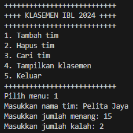
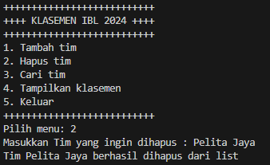
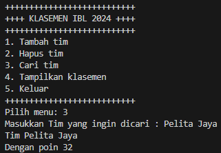
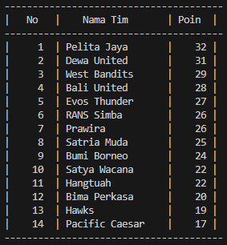

# Laporan Praktikum Pertemuan 10
#### Nama    : Muhammad Rafi Rajendra
#### Kelas   : TI-1H
#### NIM     : 2341720158

## 
KUIS 2

## 
Double Linked Lists 

Kode prgram terdapat pada link dibawah

[Klasemen]()

Output dari kode program:

Menambahkan tim dalam klasemen

Menghapus tim dari klasemen

Mencari tim dalam klasemen

Menampilkan klasemen

