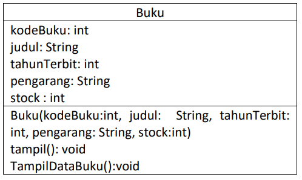
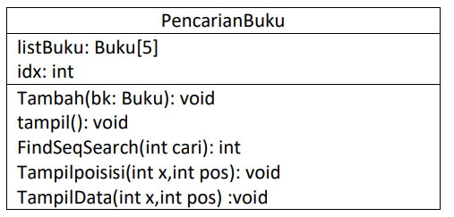

# Laporan Praktikum Pertemuan 6
#### Nama    : Muhammad Rafi Rajendra
#### Kelas   : TI-1H
#### NIM     : 2341720158

## JOBSHEET VI
## SEARCHING
## 6.1. Tujuan Praktikum
Setelah melakukan materi praktikum ini, mahasiswa mampu:
1. Menjelaskan mengenai algoritma Searching.
2. Membuat dan mendeklarasikan struktur algoritma Searching.
3. Menerapkan dan mengimplementasikan algoritma Searching.

## 6.2. Searching / Pencarian Menggunakan Agoritma Sequential Search
Perhatikan diagram class Buku di bawah ini! Diagram class ini yang selanjutnya akan dibuat sebagai acuan dalam membuat kode program class Buku.



Berdasarkan class diagram di atas, akan dibuat class Buku yang berfunsi untuk membuat objek 
buku yang akan dimasukan ke dalam sebuah array. Terdapat sebuah konstruktor berparameter dan 
juga Method tampil() untuk menampilkan semua attribute yang ada.



Selanjutnya class diagram PencarianBuku merupakan representasi dari sebuah class yang 
berfungsi untuk melakukan operasi-operasi dari objek array Buku, misalkan untuk menambahkan 
objek Buku, menampilkan semua data Buku, untuk melakukan pencarian berdasarkan kode Buku 
menggunakan algoritma Sequential Search, menampilkan posisi dari data yang dicari, serta 
menampilkan data Buku yang dicari.


### 6.2.1. Langkah-langkah Percobaan Sequential Search

1. Buatlah Project baru pada dengan nama TestSearching
2. Kemuadian buat packages baru dengan nama P7
3. Buat class BukuNoAbsen, kemudian deklarasikan atribut berikut ini:

```java
public class Buku19 {
    int kodeBuku, tahunTerbit, stock ;
    String judulBuku, pengarang;
}
```

4. Buatlah konstruktor dengan nama Buku dengan parameter (String kodeBuku, String 
judulBuku, int tahunTerbit, String pengarang, int stock) kemudian Isi 
konstruktor tersebut dengan kode berikut! 

```java
    public Buku19(int kodeBuku, int tahunTerbit, int stock, String judulBuku, String pengarang){
        this.judulBuku = judulBuku;
        this.kodeBuku = kodeBuku;
        this.tahunTerbit = tahunTerbit;
        this.stock = stock;
        this.pengarang = pengarang;
    }
```

5. Buatlah method tampilDataBuku bertipe void.

```java
    void tampilDataBuku(){
        System.out.println("===========================");
        System.out.println("Kode Buku: " + kodeBuku);
        System.out.println("Judul Buku: " + judulBuku);
        System.out.println("Tahun Terbit: " + tahunTerbit);
        System.out.println("Pengarang: " + pengarang);
        System.out.println("Stock: " + stock);
    }
```

6. Buat class baru dengan nama PencarianBukuNoAbsen seperti di bawah ini!

```java
public class PencarianBuku19 {
    Buku19 listBk[] = new Buku19[5];
    int idx;
}
```

7. Tambahkan method tambah() di dalam class tersebut! Method tambah() digunakan untuk 
menambahkan objek dari class Buku ke dalam atribut listBk.

```java
    void tambah(Buku19 m){
        if (idx < listBk.length) {
            listBk[idx] = m;
            idx++;
        } else {
            System.out.println("Data sudah penuh");
        }
    }
```

8. Tambahkan method tampil() di dalam class PencarianBukuNoAbsen Method tampil()
digunakan untuk menampilkan semua data buku yang ada di dalam class tersebut! Perhatikan 
penggunaan sintaks for yang menggunakan konsep for-each. Syntax tersebut akan memberikan 
tanda error berupa garis merah, Perbaiki agar tidak ada error!

```java
   void tampil(){
        for(Buku19 m : listBk){
            m.tampilDataBuku();
        }
    }
```

9. Tambahkan method FindSeqSearch bertipe integer dengan parameter cari bertipe int. 
Kemudian Deklarasikan isi method FindSeqSearch dengan algoritma pencarian data 
menggunakan teknik sequential searching.

```java
    public int FindSeqSearch(int cari){
        int posisi = 0;
        for (int j = 0; j < listBk.length; j++) {
            j = posisi;
            break;
        }
        return -1;
    }
```

10. Buatlah method Tampilpoisisi bertipe void dan Deklarasikan isi dari method 
Tampilpoisisi.

```java
    public void Tampilposisi(int x, int pos){
        if (pos != -1) {
            System.out.println("Data : " + x + " ditemukan pada indeks " + pos);
        } else {
            System.out.println("Data : " + x + " tidak ditemukan");
        }
    }
```

11. Buatlah class baru dengan nama BukuMainNoAbsen tambahkan method main. buatlah 
sebuah objek PencarianMhs dan buatlah 5 objek buku kemudian tambahkan semua objek buku
tersebut dengan memanggil fungsi tambah pada objek PencarianBuku.

```java
package p7;

import java.util.Scanner;

public class BukuMain19 {
    public static void main(String[] args) {
        Scanner s = new Scanner(System.in);
        Scanner s1 = new Scanner(System.in);
    
        PencarianBuku19 data = new PencarianBuku19();
        int jumBuku = 5;

        System.out.println("-------------------------------------------------------------------");
        System.out.println("MASUKKAN DATA BUKU SECARA URUT DARI KODE BUKU TERKECIL: ");
        for (int i = 0; i < jumBuku; i++) {
            System.out.println("---------------------");
            System.out.print("Kode Buku \t : ");
            int kodeBuku = s.nextInt();            
            System.out.print("Judul Buku \t : ");
            String judulBuku = s1.nextLine();
            System.out.print("Kode Terbit \t : ");
            int tahunTerbit = s.nextInt();            
            System.out.print("Pengarang \t : ");
            String pengarang = s1.nextLine();            
            System.out.print("Stock \t\t : ");
            int stock = s.nextInt();
            
            Buku19 m = new Buku19(kodeBuku, tahunTerbit, stock, judulBuku, pengarang);
            data.tambah(m);
        }
    }
}        
```

12. Panggil method tampil() untuk melihat semua data yang telah dimasukan.

```java
        System.out.println("-------------------------------------------------------------------");
        System.out.println("DATA KESELURUHAN BUKU : ");
        System.out.println("-------------------------------------------------------------------");
        data.tampil();
```

13. Untuk melakukan pencarian berdasarkan kode buku. Buatlah variable cari yang dapat 
menampung masukan dari keyboard lalu panggil method FindSeqSearch dengan isi 
parameternya adalah variable cari. Untuk menampilkan index data yang dicari panggil method 
TampilPosisi

```java

        System.out.println("--------------------------------------------------------------------");
        System.out.println("--------------------------------------------------------------------");
        System.out.println("PENCARIAN DATA : ");
        System.out.println("Masukkan kode buku yang dicari: ");
        System.out.print("Kode Buku: ");
        int cari = s.nextInt();
        System.out.println("Menggunakan sequential Search");
        int posisi = data.FindSeqSearch(cari);
        data.Tampilposisi(cari, posisi);
```

Verifikasi hasil pencarian :


14. Buatlah method TampilData bertipe void pada class PencarianBukuNoAbsen dan 
tambahkan isi dari method TampilData.

