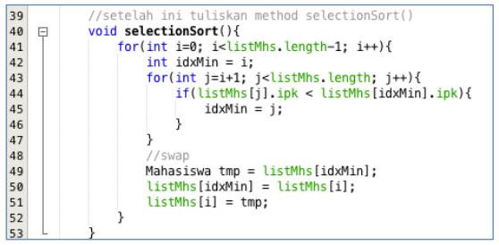

# Laporan Praktikum Pertemuan 6
#### Nama    : Muhammad Rafi Rajendra
#### Kelas   : TI-1H
#### NIM     : 2341720158

## JOBSHEET - 5
## SORTING (BUBBLE, SELECTION, DAN INSERTION SORT)
## 5.1 Tujuan Praktikum
Setelah melakukan praktikum ini diharapkan mahasiswa mampu:

a. Mahasiswa mampu membuat algoritma searching bubble sort, selection sort dan 
insertion sort

b. Mahasiswa mampu menerapkan algoritma searching bubble sort, selection sort 
dan insertion sort pada program

## 5.2 Mengurutkan Data Mahasiswa Berdasarkan IPK Menggunakan Bubble Sort
Waktu : 50 menit
Perhatikan diagram class Mahasiswa di bawah ini! Diagram class ini yang selanjutnya 
akan dibuat sebagai acuan dalam membuat kode program class Mahasiswa.


Berdasarkan class diagram di atas, kita akan membuat sebuah class Mahasiswa yang 
berfunsi untuk membuat objek mahasiswa yang akan dimasukan ke dalam sebuah array. 
Terdapat sebuah konstruktor berparameter dan juga fungsi tampil() untuk menampilkan 
semua attribute yang ada


Selanjutnya class diagram di atas merupakan representasi dari sebuah class yang 
berfungsi untuk melakukan operasi-operasi dari objek array mahasiswa, misalkan untuk 
menambahkan objek mahasiswa, menampilkan semua data mahasiswa, dan juga untuk 
mengurutkan menggunakan Teknik bubble sort berdasarkan nilai IPK mahasiswa.

### 5.2.1 Langkah-langkah Percobaan
1. Buat project baru dengan nama “bubble-selection-insertion”, kemudian buat package 
dengan nama “jobsheet6”.
2. Buatlah sebuah class dengan nama Mahasiswa
3. Sesuaikan class Mahasiswa dengan melihat class diagram di atas dengan menambahkan 
attribute, konstruktor, dan fungsi atau method. Untuk lebih jelasnya class tersebut dapat 
dilihat pada potongan kode di bawah ini

```java
package jobsheet6;

public class Mahasiswa {
    String nama;
    int thnMasuk, umur;
    double ipk;

    Mahasiswa(String n, int t, int u, double i){
        nama = n;
        thnMasuk = t;
        umur = u;
        ipk = i;
    }

    void tampil(){
        System.out.println("Nama = " + nama);
        System.out.println("Tahun Masuk = " + thnMasuk);
        System.out.println("Umur = " + umur);
        System.out.println("IPK = " + ipk);
    }
}
```

4. Buat class DaftarMahasiswaBerprestasi seperti di bawah ini!

```java
package jobsheet6;

public class DaftarMahasiswaBerprestasi {
    Mahasiswa[] listMahasiswa = new Mahasiswa[5];
    int idx;
}
```

5. Tambahkan method tambah() di dalam class tersebut! Method tambah() digunakan 
untuk menambahkan objek dari class Mahasiswa ke dalam atribut listMhs.

```java
    void tambah(Mahasiswa m){
        if (idx < listMahasiswa.length) {
            listMahasiswa[idx] = m;
            idx++;
        } else {
            System.out.println("Data sudah penuh!!");
        }
    }
```

6. Tambahkan method tampil() di dalam class tersebut! Method tampil() digunakan untuk menampilkan semua data mahasiswa-mahasiswa yang ada di dalam class tersebut! Perhatikan penggunaan sintaks for yang agak berbeda dengan for yang telah dipelajari sebelumnya, meskipun secara konsep sebenarnya mirip.

```java
    void tampil(){
        for(Mahasiswa m : listMahasiswa){
            m.tampil();
            System.out.println("------------------------------");
        }
    }
```

7. Tambahkan method bubbleSort() di dalam class tersebut!

```java
    void bubbleSort(){
        for (int i = 0; i < listMahasiswa.length; i++) {
            for (int j = 1; j < listMahasiswa.length-1; j++) {
                if (listMahasiswa[j].ipk > listMahasiswa[j-1].ipk) {
                    Mahasiswa tmp = listMahasiswa[j];
                    listMahasiswa[j] = listMahasiswa[j-1];
                    listMahasiswa[j-1] = tmp;
                }
            }
        }
    }
```

8. Buat class Main dan didalamnya buat method main() seperti di bawah ini!

```java
ackage jobsheet6;

public class Main {
    public static void main(String[] args) {
    }
}
```

9. Di dalam method main(), buatlah sebuah objek DaftarMahasiswaBerprestasi dan 
buatlah 5 objek mahasiswa kemudian tambahkan semua objek mahasiswa tersebut 
dengan memanggil fungsi tambah pada objek DaftarMahasiswaBerprestasi. Silakan 
dipanggil fungsi tampil() untuk melihat semua data yang telah dimasukan, urutkan data 
tersebut dengan memanggil fungsi bubbleSort() dan yang terakhir panggil fungsi tampil 
kembali

```java
package jobsheet6;

public class Main {
    public static void main(String[] args) {
        DaftarMahasiswaBerprestasi list = new DaftarMahasiswaBerprestasi();
        Mahasiswa m1 = new Mahasiswa("Nusa", 2017, 25, 3);
        Mahasiswa m2 = new Mahasiswa("Rara", 2012, 19, 4);
        Mahasiswa m3 = new Mahasiswa("Dompu", 2018, 19, 3.5);
        Mahasiswa m4 = new Mahasiswa("Abdul", 2017, 23, 2);
        Mahasiswa m5 = new Mahasiswa("Ummi", 2019, 21, 3.5);


        list.tambah(m1);
        list.tambah(m2);
        list.tambah(m3);
        list.tambah(m4);
        list.tambah(m5);

        System.out.println("Data mahasiswa sebelum sorting = ");
        list.tampil();

        System.out.println("Data mahasiswa setelah sorting = ");
        list.bubbleSort();
        list.tampil();
    }
}
```

### 5.2.2 Verifikasi Hasil Percobaan
Cocokan hasilnya dengan yang terdapat pada tampilan di bawah ini


### 5.2.3 Pertanyaan
1. Terdapat di method apakah proses bubble sort?

    Jawab : Method proses bubble sort terdapat pada class DaftarMahasiswaBerprestasi

2. Di dalam method bubbleSort(), terdapat baris program seperti di bawah ini:


    Untuk apakah proses tersebut?

    Jawab: Pada method diatas digunakan untuk memproses penukaran array

3. Perhatikan perulangan di dalam bubbleSort() di bawah ini:

    
    a. Apakah perbedaan antara kegunaan perulangan i dan perulangan j? 

    Jawab: Perulangan i mengatur jumlah iterasi total dalam algoritma bubble sort, di mana setiap iterasi akan berjalan sebanyak jumlah elemen dalam array. Sementara itu, perulangan j bertanggung jawab atas perbandingan elemen-elemen dalam setiap iterasi. Perulangan j dimulai dari indeks kedua hingga mencapai batas iterasi i (listMhs.length - i).

    b. Mengapa syarat dari perulangan i adalah i<listMhs.length-1 ?

    Jawab: Ketentuan tersebut diterapkan untuk memastikan bahwa perulangan tidak melampaui panjang array. Perulangan i dihentikan sebelum mencapai indeks terakhir karena elemen terakhir sudah dibandingkan dengan elemen sebelumnya.

    
    c. Mengapa syarat dari perulangan j adalah j<listMhs.length-i ?

    Jawab:  Syarat tersebut berfungsi supaya perulangan tidak membandingkan indeks yang sudah dibandingan pada iterasi sebelumnya.
    
    d. Jika banyak data di dalam listMhs adalah 50, maka berapakali perulangan i akan 
    berlangsung? Dan ada berapa Tahap bubble sort yang ditempuh?

    Jawab: Perulangan i akan berjalan 49 kali

## 5.3 Mengurutkan Data Mahasiswa Berdasarkan IPK Menggunakan Selection Sort
Waktu : 30 menit
Jika pada praktikum yang sebelumnya kita telah mengurutkan data mahasiwa berdasarkan 
IPK menggunakan Bubble Sort secara descending, pada kali ini kita akan mencoba untuk 
menambahkan fungsi pengurutan menggunakan Selection Sort.

### 5.3.1. Langkah-langkah Percobaan.
1. Lihat kembali class DaftarMahasiswaBerprestasi, dan tambahkan method selectionSort() 
di dalamnya! Method ini juga akan melakukan proses sorting secara ascending, tetapi 
menggunakan pendekatan selection sort.

    
2. Setelah itu, buka kembali class Main, dan di dalam method main() tambahkan baris 
program untuk memanggil method selectionSort() tersebut!

    
3. Coba jalankan kembali class Main, dan amati hasilnya! Apakah kini data mahasiswa telah 
tampil urut menaik berdasar ipk?

### 5.3.2. Verifikasi Hasil Percobaan
Pastikan output yang ditampilkan sudah benar seperti di bawah ini


### 5.3.3. Pertanyaan
Di dalam method selection sort, terdapat baris program seperti di bawah ini:


Untuk apakah proses tersebut, jelaskan!

Proses tersebut digunakan untuk pengurutan. Terdapat loop yang mencari elemen terkecil dalam array listMahasiswa mulai dari indeks i sampai indeks listMahasiswa.length - 1. Pada setiap iterasi, dilakukan perbandingan antara elemen di indeks j dengan elemen di indeks idxMin, yang merupakan indeks dari elemen terkecil. Jika nilai ipk pada indeks j lebih kecil dari nilai ipk pada indeks idxMin, maka nilai idxMin diperbarui menjadi j.

## 5.4 Mengurutkan Data Mahasiswa Berdasarkan IPK Menggunakan Insertion Sort
Waktu : 30 menit
Yang terakhir akan diimplementasikan Teknik sorting menggunakan Insertion Sort, dengan 
mengurutkan IPK mahasiswa secara ascending.

### 5.4.1 Langkah-langkah Percobaan
1. Lihat kembali class DaftarMahasiswaBerprestasi, dan tambahkan method insertionSort() 
di dalamnya. Method ini juga akan melakukan proses sorting secara ascending, tetapi 
menggunakan pendekatan Insertion Sort

    
2. Setelah itu, buka kembali class Main, dan di dalam method main() tambahkan baris 
program untuk memanggil method insertionSort() tersebut!

    
3. Coba jalankan kembali class Main, dan amati hasilnya! Apakah kini data mahasiswa telah 
tampil urut menaik berdasar ipk?

### 5.4.2 Verifikasi Hasil Percobaan
Pastikan output yang ditampilkan sudah benar seperti di bawah ini


### 5.4.3 Pertanyaan
Ubahlah fungsi pada InsertionSort sehingga fungsi ini dapat melaksanakan proses sorting 
dengan cara descending

```java
    void insertionSort(){
        for (int i = 1; i < listMahasiswa.length; i++) {
            Mahasiswa tmp = listMahasiswa[i];
            int j = i;
            while (j > 0 && listMahasiswa[j-1].ipk < tmp.ipk) { // ubah operator '>' menjadi '<'
                listMahasiswa[j] = listMahasiswa[j-1];
                j--;
            }
            listMahasiswa[j] = tmp;
        }
    }
```

## 5.5 Latihan Praktikum
Waktu : 90 Menit
Sebuah platform travel yang menyediakan layanan pemesanan kebutuhan travelling sedang 
mengembangkan backend untuk sistem pemesanan/reservasi akomodasi (penginapan), salah 
satu fiturnya adalah menampilkan daftar penginapan yang tersedia berdasarkan pilihan filter 
yang diinginkan user. Daftar penginapan ini harus dapat disorting berdasarkan 
1. Harga dimulai dari harga termurah ke harga tertinggi. 
2. Rating bintang penginapan dari bintang tertinggi (5) ke terendah (1) 
Buatlah proses sorting data untuk kedua filter tersebut dengan menggunakan algoritma 
bubble sort dan selection sort.

    

