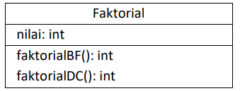
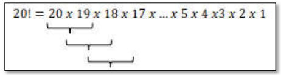
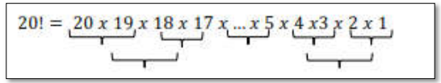

# Laporan Praktikum Pertemuan 3
#### Nama    : Muhammad Rafi Rajendra
#### Kelas   : TI-1H
#### NIM     : 2341720158

## 4.1 Tujuan Praktikum
Setelah melakukan materi praktikum ini, mahasiswa mampu:
1. Mahasiswa mampu membuat algoritma bruteforce dan divide-conquer
2. Mahasiswa mampu menerapkan penggunaan algorima bruteforce dan divide-conquer

## 4.2 Menghitung Nilai Faktorial dengan Algoritma Brute Force dan Divide and Conquer
Perhatikan Diagram Class berikut ini :



Berdasarkan diagram class di atas, akan dibuat program class dalam Java. Untuk menghitung nilai faktorial suatu angka menggunakan 2 jenis algoritma, Brute Force dan Divide and Conquer. Jika digambarkan terdapat perbedaan proses perhitungan 2 jenis algoritma tersebut sebagai berikut :
Tahapan pencarian nilai faktorial dengan algoritma Brute Force :



Tahapan pencarian nilai faktorial dengan algoritma Divide and Conquer :



### 4.2.1 Langkah-langkah Percobaan

1. Buat Project baru, dengan nama “BruteForceDivideConquer”. Buat package dengan nama 
minggu5.
2. Buatlah class baru dengan nama Faktorial
3. Lengkapi class Faktorial dengan atribut dan method yang telah digambarkan di dalam diagram class di atas, sebagai berikut:

    a. Tambahkan atribut nilai

    ```java
    public int nilai;
    ```

    b. Tambahkan method faktorialBF() nilai

    ```java
        int faktorialBF(int n){
        int fakto = 1;
        for (int i = 1; i <= n; i++) {
            fakto = fakto * i;
        }
        return fakto;
    }
    ```
    c. Tambahkan method faktorialDC() nilai

    ```java
        int faktorialDC(int n){
        if (n == 1) {
            return 1;
        } else {
            int fakto = n * faktorialDC(n-1);
            return fakto;
        }
    }
    ```

4. Coba jalankan (Run) class Faktorial dengan membuat class baru MainFaktorial.

    a. Di dalam fungsi main sediakan komunikasi dengan user untuk menginputkan jumlah angka 
yang akan dicari nilai faktorialnya

    ```java
        Scanner sc = new Scanner (System.in);
        System.out.println("-------------");
        System.out.println("Masukkan jumlah elemen: ");
        int iJml = sc.nextInt();
    ```

    b. Buat Array of Objek pada fungsi main, kemudian inputkan beberapa nilai yang akan 
dihitung faktorialnya

    ```java
            Faktorial[] fk = new Faktorial[10];
        for (int i = 0; i < iJml; i++) {
            fk[i] = new Faktorial();
            System.out.println("masukkan nilai data ke-" + (i+1) + ":");
            fk[i].nilai = sc.nextInt();
        }
    ```

    c. Tampilkan hasil pemanggilan method faktorialDC() dan faktorialBF()

    ```java
            System.out.println("HASIL - BRUTE FORCE");
        for (int i = 0; i < iJml; i++) {
            System.out.println("Hasil penghitungan faktorial menggunakan Brute Force adalah " + fk[i].faktorialBF(fk[i].nilai));
        }
        System.out.println("HASIL - DIVIDE AND CONQUER");
        for (int i = 0; i < iJml; i++) {
            System.out.println("Hasil penghitungan faktorial menggunakan Divide And Conquer adalah " + fk[i].faktorialDC(fk[i].nilai));
        }
    ```

### 4.2.2 Verifikasi Hasil Percobaan
Cocokkan hasil compile kode program anda dengan gambar berikut ini.


### 4.2.3 Pertanyaan
1. Pada base line Algoritma Divide Conquer untuk melakukan pencarian nilai faktorial, jelaskan perbedaan bagian kode pada penggunaan if dan else!

    Jawab: pada penggunaan if n == 1 ketika n mencapai 1, rekursi harus berhenti karena faktorial dari 1 adalah 1, sedangkan else jika nilai n != 1 maka nilai dari n akan dibagi menjadi sub-masalah yang lebih kecill. Untuk menghitung n!, metode ini mengalikan n dengan hasil dari (n-1)!.

2. Apakah memungkinkan perulangan pada method faktorialBF() dirubah selain menggunakan for?Buktikan!

    Jawab : Perulangan pada method faktorial BF() dapat dirubah menggunakan while, berikut perulangan menggunakan while:

    ```java
    int faktorialBF(int n){
        int fakto = 1;
        while (n > 0) {
            fakto *= n;
            n--;
        }
        return fakto;
    }
    ```

3. Jelaskan perbedaan antara fakto *= i; dan int fakto = n * faktorialDC(n-1);

    Jawab: untuk fakto *= i bertujuan untuk mengakumulasi hasil perkalian dari  1 hingga n, sehingga fakto akan berisi hasil faktorial dari n. Sedangkan fakto = n * faktorialDC(n-1) hasil perkalian dari n dan semua nilai yang lebih kecil dari n akan menghasilkan faktorial dari n.

## 4.3 Menghitung Hasil Pangkat dengan Algoritma Brute Force dan Divide and Conquer
Pada praktikum ini kita akan membuat program class dalam Java. Untuk menghitung nilai pangkat suatu angka menggunakan 2 jenis algoritma, Brute Force dan Divide and Conquer.

### 4.3.1 Langkah-langkah Percobaan
1. Di dalam paket minggu5, buatlah class baru dengan nama Pangkat. Dan di dalam class Pangkat 
tersebut, buat atribut angka yang akan dipangkatkan sekaligus dengan angka pemangkatnya

```java
public int nilai, pangkat;
```

2. Pada class Pangkat tersebut, tambahkan method PangkatBF()

```java
    int pangkatBF(int a, int n){
        int hasil = 0;
        for (int i = 0; i < n; i++) {
            hasil += a;
        }
        return hasil;
    }
```

3. Pada class Pangkat juga tambahkan method PangkatDC()

```java
    int pangkatDC(int a, int n){
        if (n == 1) {
            return 1;
        } else {
            if (n % 2 == 1) {
                return (pangkatDC(a, n/2) * pangkatDC(a, n/2) * a);
            } else {
                return (pangkatDC(a, n/2) * pangkatDC(a, n/2));
            }
        }
    }
```

4. Perhatikan apakah sudah tidak ada kesalahan yang muncul dalam pembuatan class Pangkat
5. Selanjutnya buat class baru yang di dalamnya terdapat method main. Class tersebut dapat 
dinamakan MainPangkat. Tambahkan kode pada class main untuk menginputkan jumlah nilai yang akan dihitung pangkatnya.

```java
    public static void main(String[] args) {
        Scanner sc = new Scanner(System.in);
        System.out.println("=============================");
        System.out.println("Masukkan jumlah elemen yang dihitung: ");
        int elemen = sc.nextInt();
    }
```

6. Nilai pada tahap 5 selanjutnya digunakan untuk instansiasi array of objek. Di dalam Kode berikut ditambahkan proses pengisian beberapa nilai yang akan dipangkatkan sekaligus dengan pemangkatnya.

```java
        Pangkat[] png = new Pangkat[elemen];
        for (int i = 0; i < elemen; i++) {
            png[i] = new Pangkat();
            System.out.println("Masukkan nilai yang tidak dipangkatkan: ");
            int nilai = sc.nextInt();
            System.out.println("Masukkan nilai pemangkat");
            int pangkat = sc.nextInt();
        }
```

7. Kemudian, panggil hasil nya dengan mengeluarkan return value dari method PangkatBF() dan 
PangkatDC().

```java
        System.out.println("HASIL PANGKAT - BRUTE FORCE");
        for (int i = 0; i < elemen; i++) {
            System.out.println
            ("Hasil dari"
                    + png[i].nilai + " pangkat "
                    + png[i].pangkat + " adalah "
                    + png[i].pangkatBF(png[i].nilai, png[i].pangkat)
            );
        }
```

### 4.3.2 Verifikasi Hasil Percobaan
Pastikan output yang ditampilkan sudah benar seperti di bawah ini.


### 4.3.3 Pertanyaan
1. Jelaskan mengenai perbedaan 2 method yang dibuat yaitu PangkatBF() dan PangkatDC()!
    
    Jawab: pada method PangkatBF() menghitung a^n dengan mengalikan a sebanyak n kali dalam loop. Sedangkan pada PangkatDC() dengan membagi masalah menjadi sub-problem yang lebih kecil. Jika n genap, a^n dipecah menjadi (a^(n/2))^2. Jika n ganjil, itu dipecah menjadi (a^(n/2))^2 * a. 
2. Apakah tahap combine sudah termasuk dalam kode tersebut?Tunjukkan!

    Jawab: tahap combine sudah termasuk dalam kode tersebut yang terdapat pada PangkatDC(). Berikut merupakan tahap combine yang terdapat pada PangkatDC():

    ```java
        return (pangkatDC(a, n/2) * pangkatDC(a, n/2) * a);
        else {
        return (pangkatDC(a, n/2) * pangkatDC(a, n/2));
        }
    ```

3. Modifikasi kode program tersebut, anggap proses pengisian atribut dilakukan dengan konstruktor.

    Jawab: 

    ```java
    public int nilai, pangkat;

    public Pangkat (int nilai, int pangkat){
        this.nilai = nilai;
        this.pangkat = pangkat;
    }

    int pangkatBF(){
        int hasil = 1;
        for (int i = 0; i < pangkat; i++) {
            hasil *= nilai;
        }
        return hasil;
    }

    int pangkatDC(int a, int n){
        if (n == 0) {
            return 1;
        } else {
            if (n % 2 == 1)
            {
                return (pangkatDC(a, n/2) * pangkatDC(a, n/2) * a);
            } else {
                return (pangkatDC(a, n/2) * pangkatDC(a, n/2));
            }
        }
    }
    ```


4. Tambahkan menu agar salah satu method yang terpilih saja yang akan dijalankan menggunakan switch-case!

    Jawab: 

    ```java
        System.out.println("============================");
        System.out.println("Pilih Metode");
        System.out.println("1. Brute Force");
        System.out.println("Divide and Conquer");

        int pilihan = sc.nextInt();

        switch (pilihan) {
            case 1:
                System.out.println("HASIL PANGKAT - BRUTE FORCE ");
                for (int i = 0; i < elemen; i++) {
                    System.out.println(
                            "Hasil dari " + png[i].nilai + " pangkat " + png[i].pangkat + " adalah " + png[i].pangkatBF()
                    );
                }
                break;
            case 2:
                System.out.println("HASIL PANGKAT - DIVIDE AND CONQUER ");
                for (int i = 0; i < elemen; i++) {
                    System.out.println(
                            "Hasil dari " + png[i].nilai + " pangkat " + png[i].pangkat + " adalah " + png[i].pangkatDC(png[i].nilai, png[i].pangkat)
                    );
                }
                break;
            default:
                break;
        }
        sc.close();
    ```
## 4.4 Menghitung Sum Array dengan Algoritma Brute Force dan Divide and Conquer
Di dalam percobaan ini, kita akan mempraktekkan bagaimana proses divide, conquer, dan combine diterapkan pada studi kasus penjumlahan keuntungan suatu perusahaan dalam beberapa bulan.

### 4.4.1 Langkah-langkah Percobaan
1. Pada paket minggu5. Buat class baru yaitu class Sum. DI salam class tersebut terdapat beberapa atribut jumlah elemen array, array, dan juga total. Tambahkan pula konstruktor pada class Sum.
2. Tambahkan method TotalBF() yang akan menghitung total nilai array dengan cara iterative.
3. Tambahkan pula method TotalDC() untuk implementasi perhitungan nilai total array menggunakan algoritma Divide and Conquer
4. Buat class baru yaitu MainSum. Di dalam kelas ini terdapat method main. Pada method ini user dapat menuliskan berapa bulan keuntungan yang akan dihitung. Dalam kelas ini sekaligus dibuat instansiasi objek untuk memanggil atribut ataupun fungsi pada class Sum
5. Karena yang akan dihitung adalah total nilai keuntungan, maka ditambahkan pula pada method main mana array yang akan dihitung. Array tersebut merupakan atribut yang terdapat di class Sum, maka dari itu dibutuhkan pembuatan objek Sum terlebih dahulu.
6. Tampilkan hasil perhitungan melalui objek yang telah dibuat untuk kedua cara yang ada(Brute Force dan Divide and Conquer)

### 4.4.2 Verifikasi Hasil Percobaan
Cocokkan hasil compile kode program anda dengan gambar berikut ini.


### 4.4.3 Pertanyaan
1. Mengapa terdapat formulasi return value berikut?Jelaskan!
2. Kenapa dibutuhkan variable mid pada method TotalDC()?
3. Program perhitungan keuntungan suatu perusahaan ini hanya untuk satu perusahaan saja. Bagaimana cara menghitung sekaligus keuntungan beberapa bulan untuk beberapa perusahaan.(Setiap perusahaan bisa saja memiliki jumlah bulan berbeda-beda)? Buktikan dengan program!
