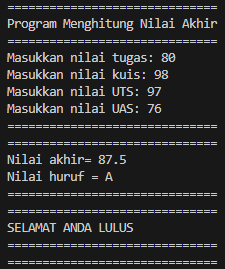
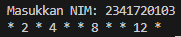
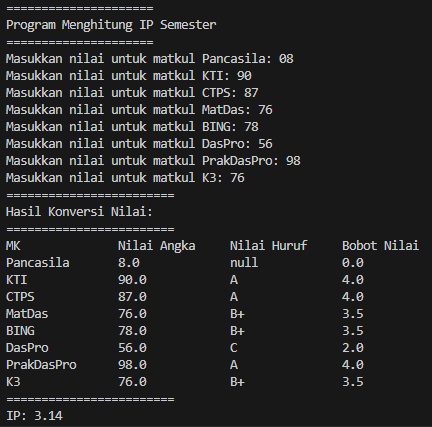

# Laporan Praktikum Pertemuan 1
Nama    : Muhammad Rafi Rajendra

Kelas   : TI-1H

NIM     : 2341720158
## Praktikum Pemilihan
Membuat scanner untuk menginputkan nilai tugas, kuis, uts, uas.

        Scanner input = new Scanner(System.in);

        System.out.println("==============================");
        System.out.println("Program Menghitung Nilai Akhir");
        System.out.println("==============================");

        System.out.print("Masukkan nilai tugas: ");
        float tugas = input.nextFloat();
        
        System.out.print("Masukkan nilai kuis: ");
        float kuis = input.nextFloat();
        
        System.out.print("Masukkan nilai UTS: ");
        float uts = input.nextFloat();
        
        System.out.print("Masukkan nilai UAS: ");
        float uas = input.nextFloat();

        input.close();

Pernyataan kondisional agar nilai yang di inputkan tidak lebih dari 100, jika lebih dari 100 maka akan keluar pernyataan "Tidak Valid".

        if (tugas > 100 || kuis > 100 || uts > 100 || uas > 100) {
            System.out.println("Tidak Valid");
            System.out.println("==============================");
            System.out.println("==============================");
        }

Menentukan nilai huruf berdasarkan nilai angka yang diterima.

            if(total>80&&total<=100){
                System.out.println("Nilai akhir= " +total);
                System.out.println("Nilai huruf = A");
            }else if (total>73&&total>= 80){
                System.out.println("Nilai akhir " +total);
                System.out.println("Nilai huruf = B");
            }else if (total>60&&total>=73){
                System.out.println("Nilai akhir " +total);
                System.out.println("Nilai huruf = B+");
            }else if (total>60&&total>= 65){
                System.out.println("Nilai akhir " +total);
                System.out.println("Nilai Huruf = C+");
            }else if (total>50&&total>= 60){
                System.out.println("Nilai akhir " +total);
                System.out.println("Nilai Huruf = C");
            }else if (total>39&&total>= 50){
                System.out.println("Nilai akhir " +total);
                System.out.println("Nilai huruf = D");
            }else if (total<=39){
                System.out.println("Nilai akhir " +total);
                System.out.println("Nilai huruf = E");
            }

Hasil dari nilai yang di inputkan dan menentukan lulus dan tidak lulus.

            if (total >= 50) {
                System.out.println("==============================");
                System.out.println("==============================");
                System.out.println("SELAMAT ANDA LULUS");
                System.out.println("==============================");
            } else {
                System.out.println("==============================");
                System.out.println("==============================");
                System.out.println("ANDA TIDAK LULUS");
            }
Hasil dari kode program diatas

## Praktikum Perulangan
Scanner untuk menginputkan NIM. 

        Scanner input = new Scanner(System.in);

        System.out.print("Masukkan NIM: ");
        String nim = input.nextLine();

Perulangan untuk angka 1-15 dan melewati angka 6 dan 10. Untuk angka ganjil diganti dengan "* ".

        int n = Integer.parseInt(nim.substring(nim.length() - 2));
        if (n < 10) {
            n += 10;
        }

        for (int i = 1; i <= n; i++) {
            if (i == 6 || i == 10) {
                continue;
            }
            if (i % 2 == 0) {
                System.out.print(i + " ");
            } else {
                System.out.print("* ");
            }
        }

Hasil dari kode program

## Praktikum Array
Array untuk menyimpan daftar mata kuliah dan bobot sks dari masing-masing mata kuliah.

        String[] matkul = {"Pancasila", "KTI", "CTPS", "MatDas", "BING", "DasPro", "PrakDasPro", "K3"};
        int[] bobotsks = {2, 2, 2, 3, 2, 2, 3, 2};

Menginputkan nilai matkul menggunakan loop for dan validasi input.

    for (int i = 0; i < matkul.length; i++) {
            System.out.print("Masukkan nilai untuk matkul " + matkul[i] + ": ");
            
            while (!scanner.hasNextDouble()) {
                System.out.println("Masukkan nilai yang benar.");
                scanner.next();
                System.out.print("Masukkan nilai untuk matkul " + matkul[i] + ": ");
            }

            nilaiMatkul[i] = scanner.nextDouble();
        }

Menentukan nilai huruf dan bobot untuk setiap mata kuliah berdasarkan nilai yang telah diinputkan sebelumnya.

        double totalSKS = 18;
        double totalNilaiBobot = 0;

        String[] nilaiHuruf = new String[matkul.length];
        double[] bobot = new double[matkul.length];

        for (int i = 0; i < matkul.length; i++) {
            if (nilaiMatkul[i] > 80 && nilaiMatkul[i] <= 100) {
                nilaiHuruf[i] = "A";
                bobot[i] = 4;
            } else if (nilaiMatkul[i] > 73 && nilaiMatkul[i] <= 80) {
                nilaiHuruf[i] = "B+";
                bobot[i] = 3.5;
            } else if (nilaiMatkul[i] > 65 && nilaiMatkul[i] <= 73) {
                nilaiHuruf[i] = "B";
                bobot[i] = 3;
            } else if (nilaiMatkul[i] > 60 && nilaiMatkul[i] <= 65) {
                nilaiHuruf[i] = "C+";
                bobot[i]= 2.5;
            } else if (nilaiMatkul[i] > 50 && nilaiMatkul[i] <= 60) {
                nilaiHuruf[i] = "C";
                bobot[i] = 2;
            } else if (nilaiMatkul[i] >= 39 && nilaiMatkul[i] <= 50) {
                nilaiHuruf[i] = "E";
                bobot[i] = 0;
            } else if (nilaiMatkul[i] >= 39) {
                nilaiHuruf[i] = "E";
                bobot[i] = 0;
            }
        }

Menghitung dan menampilkan IP berdasarkan nilai yang telah diinputkan sebelumnya.

        for (int i = 0; i < bobot.length; i++) {
            totalNilaiBobot += bobot[i] * bobotsks[i];
        }

        double IP = totalNilaiBobot / totalSKS;

        System.out.println("========================");
        System.out.println("Hasil Konversi Nilai:");
        System.out.println("========================");
        System.out.printf("%-15s %-15s %-15s %-15s\n", "MK", "Nilai Angka", "Nilai Huruf", "Bobot Nilai");
        for (int i = 0; i < matkul.length; i++) {
            System.out.printf("%-15s %-15s %-15s %-15s\n", matkul[i], nilaiMatkul[i], nilaiHuruf[i], bobot[i]);
        }

        System.out.println("========================");
        System.out.printf("IP: %.2f\n", IP);

Hasil dari kode program

## Praktikum Fungsi
Array untuk menyimpan nama toko, bunga, ,harga, dan stock yang tersedia pada masing-masing toko.

    static String[] cabang = { "RoyalGarden 1", "RoyalGarden 2", "RoyalGarden 3", "RoyalGarden 4" };
    static String[] bunga = { "Aglonema", "Keladi", "Alocasia", "Mawar" };
    static double[] harga = { 75000, 50000, 60000, 10000 };
    static int[][] stokBunga = {
            { 10, 5, 15, 7 },
            { 6, 11, 9, 12 },
            { 2, 10, 10, 5 },
            { 5, 7, 12, 9 }
    };
asdasd

