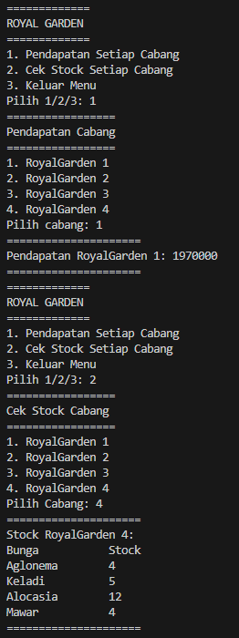
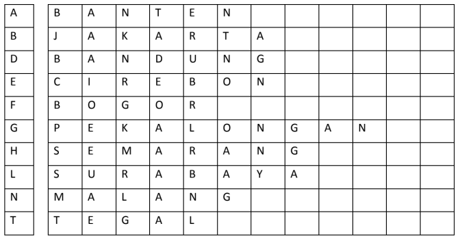
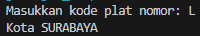
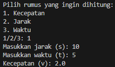

# Laporan Praktikum Pertemuan 1
Nama    : Muhammad Rafi Rajendra

Kelas   : TI-1H

NIM     : 2341720158
## Praktikum Pemilihan
Membuat scanner untuk menginputkan nilai tugas, kuis, uts, uas.

        Scanner input = new Scanner(System.in);

        System.out.println("==============================");
        System.out.println("Program Menghitung Nilai Akhir");
        System.out.println("==============================");

        System.out.print("Masukkan nilai tugas: ");
        float tugas = input.nextFloat();
        
        System.out.print("Masukkan nilai kuis: ");
        float kuis = input.nextFloat();
        
        System.out.print("Masukkan nilai UTS: ");
        float uts = input.nextFloat();
        
        System.out.print("Masukkan nilai UAS: ");
        float uas = input.nextFloat();

        input.close();

Pernyataan kondisional agar nilai yang di inputkan tidak lebih dari 100, jika lebih dari 100 maka akan keluar pernyataan "Tidak Valid".

        if (tugas > 100 || kuis > 100 || uts > 100 || uas > 100) {
            System.out.println("Tidak Valid");
            System.out.println("==============================");
            System.out.println("==============================");
        }

Menentukan nilai huruf berdasarkan nilai angka yang diterima.

            if(total>80&&total<=100){
                System.out.println("Nilai akhir= " +total);
                System.out.println("Nilai huruf = A");
            }else if (total>73&&total>= 80){
                System.out.println("Nilai akhir " +total);
                System.out.println("Nilai huruf = B");
            }else if (total>60&&total>=73){
                System.out.println("Nilai akhir " +total);
                System.out.println("Nilai huruf = B+");
            }else if (total>60&&total>= 65){
                System.out.println("Nilai akhir " +total);
                System.out.println("Nilai Huruf = C+");
            }else if (total>50&&total>= 60){
                System.out.println("Nilai akhir " +total);
                System.out.println("Nilai Huruf = C");
            }else if (total>39&&total>= 50){
                System.out.println("Nilai akhir " +total);
                System.out.println("Nilai huruf = D");
            }else if (total<=39){
                System.out.println("Nilai akhir " +total);
                System.out.println("Nilai huruf = E");
            }

Hasil dari nilai yang di inputkan dan menentukan lulus dan tidak lulus.

            if (total >= 50) {
                System.out.println("==============================");
                System.out.println("==============================");
                System.out.println("SELAMAT ANDA LULUS");
                System.out.println("==============================");
            } else {
                System.out.println("==============================");
                System.out.println("==============================");
                System.out.println("ANDA TIDAK LULUS");
            }
Hasil dari kode program diatas

## Praktikum Perulangan
Scanner untuk menginputkan NIM. 

        Scanner input = new Scanner(System.in);

        System.out.print("Masukkan NIM: ");
        String nim = input.nextLine();

Perulangan untuk angka 1-15 dan melewati angka 6 dan 10. Untuk angka ganjil diganti dengan "* ".

        int n = Integer.parseInt(nim.substring(nim.length() - 2));
        if (n < 10) {
            n += 10;
        }

        for (int i = 1; i <= n; i++) {
            if (i == 6 || i == 10) {
                continue;
            }
            if (i % 2 == 0) {
                System.out.print(i + " ");
            } else {
                System.out.print("* ");
            }
        }

Hasil dari kode program

## Praktikum Array
Array untuk menyimpan daftar mata kuliah dan bobot sks dari masing-masing mata kuliah.

        String[] matkul = {"Pancasila", "KTI", "CTPS", "MatDas", "BING", "DasPro", "PrakDasPro", "K3"};
        int[] bobotsks = {2, 2, 2, 3, 2, 2, 3, 2};

Menginputkan nilai matkul menggunakan loop for dan validasi input.

    for (int i = 0; i < matkul.length; i++) {
            System.out.print("Masukkan nilai untuk matkul " + matkul[i] + ": ");
            
            while (!scanner.hasNextDouble()) {
                System.out.println("Masukkan nilai yang benar.");
                scanner.next();
                System.out.print("Masukkan nilai untuk matkul " + matkul[i] + ": ");
            }

            nilaiMatkul[i] = scanner.nextDouble();
        }

Menentukan nilai huruf dan bobot untuk setiap mata kuliah berdasarkan nilai yang telah diinputkan sebelumnya.

        double totalSKS = 18;
        double totalNilaiBobot = 0;

        String[] nilaiHuruf = new String[matkul.length];
        double[] bobot = new double[matkul.length];

        for (int i = 0; i < matkul.length; i++) {
            if (nilaiMatkul[i] > 80 && nilaiMatkul[i] <= 100) {
                nilaiHuruf[i] = "A";
                bobot[i] = 4;
            } else if (nilaiMatkul[i] > 73 && nilaiMatkul[i] <= 80) {
                nilaiHuruf[i] = "B+";
                bobot[i] = 3.5;
            } else if (nilaiMatkul[i] > 65 && nilaiMatkul[i] <= 73) {
                nilaiHuruf[i] = "B";
                bobot[i] = 3;
            } else if (nilaiMatkul[i] > 60 && nilaiMatkul[i] <= 65) {
                nilaiHuruf[i] = "C+";
                bobot[i]= 2.5;
            } else if (nilaiMatkul[i] > 50 && nilaiMatkul[i] <= 60) {
                nilaiHuruf[i] = "C";
                bobot[i] = 2;
            } else if (nilaiMatkul[i] >= 39 && nilaiMatkul[i] <= 50) {
                nilaiHuruf[i] = "E";
                bobot[i] = 0;
            } else if (nilaiMatkul[i] >= 39) {
                nilaiHuruf[i] = "E";
                bobot[i] = 0;
            }
        }

Menghitung dan menampilkan IP berdasarkan nilai yang telah diinputkan sebelumnya.

        for (int i = 0; i < bobot.length; i++) {
            totalNilaiBobot += bobot[i] * bobotsks[i];
        }

        double IP = totalNilaiBobot / totalSKS;

        System.out.println("========================");
        System.out.println("Hasil Konversi Nilai:");
        System.out.println("========================");
        System.out.printf("%-15s %-15s %-15s %-15s\n", "MK", "Nilai Angka", "Nilai Huruf", "Bobot Nilai");
        for (int i = 0; i < matkul.length; i++) {
            System.out.printf("%-15s %-15s %-15s %-15s\n", matkul[i], nilaiMatkul[i], nilaiHuruf[i], bobot[i]);
        }

        System.out.println("========================");
        System.out.printf("IP: %.2f\n", IP);

Hasil dari kode program

## Praktikum Fungsi
Array untuk menyimpan nama toko, bunga, ,harga, dan stock yang tersedia pada masing-masing toko.

    static String[] cabang = { "RoyalGarden 1", "RoyalGarden 2", "RoyalGarden 3", "RoyalGarden 4" };
    static String[] bunga = { "Aglonema", "Keladi", "Alocasia", "Mawar" };
    static double[] harga = { 75000, 50000, 60000, 10000 };
    static int[][] stokBunga = {
            { 10, 5, 15, 7 },
            { 6, 11, 9, 12 },
            { 2, 10, 10, 5 },
            { 5, 7, 12, 9 }
    };
Fungsi untuk mengecek jumlah stock pada setiap cabang.

    public static void cekStockCabang(int branchIndex, String[] bunga, int[][] stockBunga) {
        System.out.println("Bunga\t\tStock");
        for (int j = 0; j < bunga.length; j++) {
            System.out.printf("%-10s\t%d\n", bunga[j], stockBunga[branchIndex][j]);
        }
    }

Fungsi untuk menghitung penghasilan setiap cabang.

    public static int hitungPendapatanCabang(int branchIndex, String[] bunga, int[] harga, int[][] stockBunga) {
        int totalPendapatan = 0;
        for (int j = 0; j < bunga.length; j++) {
            totalPendapatan += stockBunga[branchIndex][j] * harga[j];
        }
        return totalPendapatan;
    }

Hasil dari kode program

## Tugas
1. Susun program untuk membuat dua buah array berikut isinya sebagai berikut. Array 
pertama adalah array satu dimensi char KODE[10], berisi kode plat mobil. Array kedua, array 
dua dimensi char KOTA[10][12] berisi nama kota yang berpasangan dengan kode plat mobil. 
Ilustrasi tampilan array tersebut adalah sebagai berikut :

Ketika pengguna memberikan input kode plat nomor maka program akan mengeluarkan 
nama kota dari kode plat nomor tersebut.

Kode program

import java.util.Scanner;

public class tugas1 {
    public static void main(String[] args) {
        char[] kode = {'A', 'B', 'D', 'E', 'F', 'G', 'H', 'L', 'N', 'T'};
        char[][] kota = {
            {'B', 'A', 'N', 'T', 'E', 'N'},
            {'J', 'A', 'K', 'A', 'R', 'T', 'A'},
            {'B', 'A', 'N', 'D', 'U', 'N', 'G'},
            {'C', 'I', 'R', 'E', 'B', 'O', 'N'},
            {'B', 'O', 'G', 'O', 'R'},
            {'P', 'E', 'K', 'A', 'L', 'O', 'N', 'G', 'A', 'N'},
            {'S', 'E', 'M', 'A', 'R', 'A', 'N', 'G'},
            {'S', 'U', 'R', 'A', 'B', 'A', 'Y', 'A'},
            {'M', 'A', 'L', 'A', 'N', 'G'},
            {'T', 'E', 'G', 'A', 'L'}
        };

        Scanner input = new Scanner(System.in);
        
        System.out.print("Masukkan kode plat nomor: ");
        char inputKode = input.next().charAt(0);

        int index = -1;
        for (int i = 0; i < kode.length; i++) {
            if (kode[i] == inputKode) {
                index = i;
                break;
            }
        }

        if (index != -1) {
            char[] listKota = kota[index];
            String namaKota = new String(listKota);
            System.out.println("Kota " + namaKota);
        } else {
            System.out.println("Kode plat tidak valid!");
        }
    }
}

Hasil dari kode program

2. Buat program untuk menghitung rumus kecepatan, jarak, dan waktu
Berikut adalah persamaan untuk menghitung rumus tersebut :
Rumus Kecepatan
𝑣 =
𝑠
𝑡
Rumus Jarak
𝑠 = 𝑣.𝑡
Rumus Waktu
𝑡 =
𝑠
𝑣
Keterangan :
𝑣 = 𝑘𝑒𝑐𝑒𝑝𝑎𝑡𝑎𝑛
𝑠 = 𝑗𝑎𝑟𝑎𝑘
𝑡 = 𝑤𝑎𝑘𝑡𝑢
Program yang dibuat memiliki fungsi sebagai berikut:
a. Menu (Untuk memilih rumus yang akan dihitung (kecepatan/jarak/waktu))
b. Menghitung hasil perhitungan Kecepatan
c. Menghitung hasil perhitungan Jarak
d. Menghitung hasil perhitungan Waktu
Panggil fungsi-fungsi tersebut pada fungsi main!

Kode program

import java.util.Scanner;

public class tugas2 {
    public static void main(String[] args) {
        Scanner input = new Scanner(System.in);

        System.out.println("Pilih rumus yang ingin dihitung:");
        System.out.println("1. Kecepatan");
        System.out.println("2. Jarak");
        System.out.println("3. Waktu");
        System.out.print("1/2/3: ");

        int pilihan = input.nextInt();

        switch (pilihan) {
            case 1:
                hitungKecepatan();
                break;
            case 2:
                hitungJarak();
                break;
            case 3:
                hitungWaktu();
                break;
            default:
                System.out.println("Pilihan tidak valid.");
        }
    }

    public static void hitungKecepatan() {
        Scanner input = new Scanner(System.in);

        System.out.print("Masukkan jarak (s): ");
        double jarak = input.nextDouble();

        System.out.print("Masukkan waktu (t): ");
        double waktu = input.nextDouble();

        double kecepatan = jarak / waktu;

        System.out.println("Kecepatan (v): " + kecepatan);
    }

    private static void hitungJarak() {
        Scanner input = new Scanner(System.in);

        System.out.print("Masukkan kecepatan (v): ");
        double kecepatan = input.nextDouble();

        System.out.print("Masukkan waktu (t): ");
        double waktu = input.nextDouble();

        double jarak = kecepatan * waktu;

        System.out.println("Jarak (s): " + jarak);
    }

    private static void hitungWaktu() {
        Scanner input = new Scanner(System.in);

        System.out.print("Masukkan jarak (s): ");
        double jarak = input.nextDouble();

        System.out.print("Masukkan kecepatan (v): ");
        double kecepatan = input.nextDouble();

        double waktu = jarak / kecepatan;

        System.out.println("Waktu (t): " + waktu);
    }
}

Hasil dari kode program

