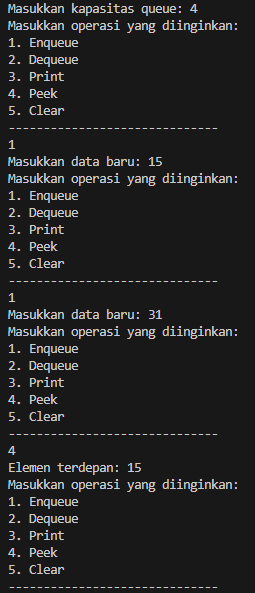
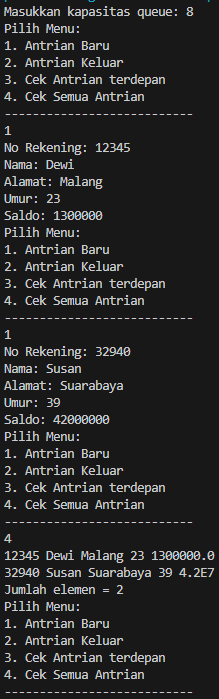

# Laporan Praktikum Pertemuan 10
#### Nama    : Muhammad Rafi Rajendra
#### Kelas   : TI-1H
#### NIM     : 2341720158

## <p align="center">JOBSHEET X</p>
## <p align="center">QUEUE</p>

## 10.1 Tujuan Praktikum
Setelah melakukan materi praktikum ini, mahasiswa mampu:
1. Mengenal struktur data Queue
2. Membuat dan mendeklarasikan struktur data Queue
3. Menerapkan algoritma Queue dengan menggunakan array

## 10.2 Praktikum 1
Waktu percobaan : 45 menit

Pada percobaan ini, kita akan mengimplementasikan penggunaan class Queue.

### 10.2.1 Langkah-langkah Percobaan
1. Perhatikan Diagram Class Queue berikut ini:

    

    Berdasarkan diagram class tersebut, akan dibuat program class Queue dalam Java.

2. Buat package dengan nama Praktikum1, kemudian buat class baru dengan nama Queue.
3. Tambahkan atribut-atribut Queue sesuai diagram class, kemudian tambahkan pula 
konstruktornya seperti gambar berikut ini.

    ```java
    int[] data;
    int front;
    int rear;
    int size;
    int max;

    public queue(int n){
        max = n;
        data = new int[max];
        size = 0;
        front = rear = -1;        
    }
    ```
4. Buat method IsEmpty bertipe boolean yang digunakan untuk mengecek apakah queue kosong.
    
    ```java
    public boolean isEmpty(){
        if (size == 0) {
            return true;
        } else {
            return false;            
        }
    }
    ```
5. Buat method IsFull bertipe boolean yang digunakan untuk mengecek apakah queue sudah penuh.

    ```java
    public boolean isFull(){
        if (size == max) {
            return true;
        } else {
            return false;
        }
    }
    ```
6. Buat method peek bertipe void untuk menampilkan elemen queue pada posisi paling depan.

    ```java
    public void peek(){
        if (!isEmpty()) {
            System.out.println("Elemen terdepan: " + data[front]);
        } else {
            System.out.println("Queue masih kosong");
        }
    }
    ```
7. Buat method print bertipe void untuk menampilkan seluruh elemen pada queue mulai dari posisi front sampai dengan posisi rear.
    ```java
    public void print(){
        if (isEmpty()) {
            System.out.println("Queue masih kosong");
        } else {
            int i = front;
            while (i != rear) {
                System.out.println(data[i] + " ");
                i = (i + 1) % max;
            }
            System.out.println(data[i] + " ");
            System.out.println("Jumlah elemen = " + size);
        }
    }
    ```
8. Buat method clear bertipe void untuk menghapus semua elemen pada queue
    
    ```java
    public void clear(){
        if (!isEmpty()) {
            front = rear = -1;
            size = 0;
            System.out.println("Queue berhasil dikosongkan");
        } else {
            System.out.println("Queue masih kosong");
        }
    }
    ```
9. Buat method Enqueue bertipe void untuk menambahkan isi queue dengan parameter dt yang bertipe integer

    ```java
    public void enqueue(int dt){
        if (isFull()) {
            System.out.println("Queue sudah penuh");
        } else {
            if (isEmpty()) {
                front = rear = 0;
            } else {
                if (rear == max - 1) {
                    rear = 0;
                } else {
                    rear++;
                }
            }
            data[rear] = dt;
            size++;
        }
    }
    ```
10. Buat method Dequeue bertipe int untuk mengeluarkan data pada queue di posisi belakang

    ```java
    public int dequeue(){
        int dt = 0;
        if (isEmpty()) {
            System.out.println("Queue masih kosong");
        } else {
            dt = data[front];
            size--;
            if (isEmpty()) {
                front = rear = -1;
            } else {
                if (front == max - 1) {
                    front = 0;
                } else {
                    front++;
                }
            }
        }
        return dt;
    }
    ```
11. Selanjutnya, buat class baru dengan nama QueueMain tetap pada package Praktikum1. Buat method menu bertipe void untuk memilih menu program pada saat dijalankan.
    
    ```java
    public static void menu(){
        System.out.println("Masukkan operasi yang diinginkan:");
        System.out.println("1. Enqueue");
        System.out.println("2. Dequeue");
        System.out.println("3. Print");
        System.out.println("4. Peek");
        System.out.println("5. Clear");
        System.out.println("------------------------------");
    }
    ```
12. Buat fungsi main, kemudian deklarasikan Scanner dengan nama sc.
13. Buat variabel n untuk menampung masukan berupa jumlah maksimal elemen yang dapat disimpan pada queue.
    
    ```java
    System.out.print("Masukkan kapasitas queue: ");
    int n = sc.nextInt();
    ```
14. Lakukan instansiasi objek Queue dengan nama Q dengan mengirimkan parameter n sebagai 
kapasitas elemen queue

    ```java
    queue Q = new queue(n);
    ```
15. Deklarasikan variabel dengan nama pilih bertipe integer untuk menampung pilih menu dari pengguna.
16. Lakukan perulangan menggunakan do-while untuk menjalankan program secara terus menerus sesuai masukan yang diberikan. Di dalam perulangan tersebut, terdapat pemilihan kondisi menggunakan switch-case untuk menjalankan operasi queue sesuai dengan masukan pengguna.

    ```java
        do {
            menu();
            pilih = sc.nextInt();
            switch (pilih) {
                case 1:
                    System.out.print("Masukkan data baru: ");
                    int dataMasuk = sc.nextInt();
                    Q.enqueue(dataMasuk);
                    break;
                case 2:
                    int dataKeluar = sc.nextInt();
                    if (dataKeluar != 0) {
                        System.out.println("Data yang diekeluarkan: " + dataKeluar);
                    }
                    break;
                case 3:
                    Q.print();
                    break;
                case 4:
                    Q.peek();
                    break;
                case 5:
                    Q.clear();
                    break;
            }
        } while (pilih == 1 || pilih == 2 || pilih == 3 || pilih == 3 || pilih == 4 || pilih == 5);
    ```
17. Compile dan jalankan class QueueMain, kemudian amati hasilnya.

### 10.2.2 Verifikasi Hasil Percobaan


### 10.2.3 Pertanyaan
1. Pada konstruktor, mengapa nilai awal atribut front dan rear bernilai -1, sementara atribut size bernilai 0?

    jawab: pada konstruktor, nilai awal atribut front dan rear bernilai -1 serta size bernilai 0 karena pada awalnya antrian (queue) tersebut kosong. Menetapkan front dan rear ke -1 menunjukkan bahwa tidak ada elemen dalam antrian tersebut. size diinisialisasi menjadi 0 untuk menandakan bahwa jumlah elemen dalam queue adalah nol.
2. Pada method Enqueue, jelaskan maksud dan kegunaan dari potongan kode berikut!
    ```java
    if (rear == max -1){
        rear = 0;
    }
    ```

    jawab: jika rear mencapai nilai maksimum (akhir array), ia akan disetel kembali ke 0.
3. Pada method Dequeue, jelaskan maksud dan kegunaan dari potongan kode berikut!
     ```java
    if (front == max -1){
        front = 0;
    }
    ```

    jawab: Jika front berada di akhir array, maka setelah elemen di posisi tersebut dikeluarkan, front disetel ke 0 untuk melanjutkan pengambilan (dequeuing) dari awal array.
4. Pada method print, mengapa pada proses perulangan variabel i tidak dimulai dari 0 (int i=0), melainkan int i=front?

    jawab: pada method print, variabel i tidak dimulai dari 0 melainkan dari front karena antrian sirkular bisa dimulai dari posisi mana pun dalam array, tergantung di mana elemen pertama (front) berada setelah beberapa operasi enqueue dan dequeue.
5. Perhatikan kembali method print, jelaskan maksud dari potongan kode berikut!
    ```java
    i = (i + 1) % max;
    ```

    jawab: maksud dari potongan kode diatas adalah untuk memajukan indeks i dan kembali ke awal array jika sudah mencapai akhir.
6. Tunjukkan potongan kode program yang merupakan queue overflow!

    jawab: berikut potongan kode program yang merupakan queue overlflow

        ```java
        if (isFull()) {
            System.out.println("Queue sudah penuh");
        }

        ```
7. Pada saat terjadi queue overflow dan queue underflow, program tersebut tetap dapat berjalan dan hanya menampilkan teks informasi. Lakukan modifikasi program sehingga pada saat terjadi queue overflow dan queue underflow, program dihentikan!

    jawab: 

    ```java
    public void enqueue(int dt){
        if (isFull()) {
            System.out.println("Queue sudah penuh");
            System.exit(0); //menghentikan program
        } else {
            if (isEmpty()) {
                front = rear = 0;
            } else {
                if (rear == max - 1) {
                    rear = 0;
                } else {
                    rear++;
                }
            }
            data[rear] = dt;
            size++;
        }
    }

    public nasabah dequeue(){
        int dt = 0;
        if (isEmpty()) {
            System.out.println("Queue masih kosong");
            System.exit(0); //menghentikan program
        } else {
            dt = data[front];
            size--;
            if (isEmpty()) {
                front = rear = -1;
            } else {
                if (front == max - 1) {
                    front = 0;
                } else {
                    front++;
                }
            }
        }
        return dt;
    }
    ```

## 10.3 Praktikum 2
Waktu percobaan : 45 menit
Pada percobaan ini, kita akan membuat program yang mengilustrasikan teller di bank dalam 
melayani nasabah.

### 10.3.1 Langkah-langkah Percobaan

1. Perhatikan Diagram Class berikut ini:
    
2. Buat package dengan nama Praktikum2, kemudian buat class baru dengan nama Nasabah.
3. Tambahkan atribut-atribut Nasabah seperti pada Class Diagram, kemudian tambahkan pula 
konstruktornya seperti gambar berikut ini.

    ```java
    nasabah(String norek, String nama, String alamat, int umur, double saldo){
        this.norek = norek;
        this.nama = nama;
        this.alamat = alamat;
        this.umur = umur;
        this.saldo = saldo;
    }
    ```
4. Salin kode program class Queue pada Praktikum 1 untuk digunakan kembali pada Praktikum 2
ini. Karena pada Praktikum 1, data yang disimpan pada queue hanya berupa array bertipe 
integer, sedangkan pada Praktikum 2 data yang digunakan adalah object, maka perlu dilakukan 
modifikasi pada class Queue tersebut.
5. Lakukan modifikasi pada class Queue dengan mengubah tipe int[] data menjadi Nasabah[] data
karena pada kasus ini data yang akan disimpan pada queue berupa object Nasabah. Modifikasi 
perlu dilakukan pada atribut, method Enqueue, dan method Dequeue.

    ```java
    nasabah[] data;
    int front;
    int rear;
    int size;
    int max;

    public queueNasabah(int n){
        max = n;
        data = new nasabah[max];
        size = 0;
        front = rear = -1;        
    }

    public void enqueue(nasabah dt){
        if (isFull()) {
            System.out.println("Queue sudah penuh");
        } else {
            if (isEmpty()) {
                front = rear = 0;
            } else {
                if (rear == max - 1) {
                    rear = 0;
                } else {
                    rear++;
                }
            }
            data[rear] = dt;
            size++;
        }
    }

    public nasabah dequeue(){
        nasabah dt = new nasabah();
        if (isEmpty()) {
            System.out.println("Queue masih kosong");
        } else {
            dt = data[front];
            size--;
            if (isEmpty()) {
                front = rear = -1;
            } else {
                if (front == max - 1) {
                    front = 0;
                } else {
                    front++;
                }
            }
        }
        return dt;
    }
    ```

    Baris program Nasabah dt = new Nasabah(); akan ditandai sebagai error, untuk mengatasinya, tambahkan konstruktor default di dalam class Nasabah.

    ```java
    nasabah(){
        
    }
    ```

6. Karena satu elemen queue terdiri dari beberapa informasi (norek, nama, alamat, umur, dan saldo), maka ketika mencetak data juga perlu ditampilkan semua informasi tersebut,sehingga meodifikasi perlu dilakukan pada method peek dan method print.

    ```java
    public void peek(){
        if (!isEmpty()) {
            System.out.println("Elemen terdepan: " + data[front].norek + " " + data[front].nama + " " + data[front].alamat + " " + data[front].umur + " " + data[front].saldo);
        } else {
            System.out.println("Queue masih kosong");
        }
    }

    public void print(){
        if (isEmpty()) {
            System.out.println("Queue masih kosong");
        } else {
            int i = front;
            while (i != rear) {
                System.out.println(data[i].norek + " " + data[i].nama + " " + data[i].alamat + " " + data[i].umur + " " + data[i].saldo);
                i = (i + 1) % max;
            }
            System.out.println(data[i].norek + " " + data[i].nama + " " + data[i].alamat + " " + data[i].umur + " " + data[i].saldo);
            System.out.println("Jumlah elemen = " + size);
        }
    }
    ```

7. Selanjutnya, buat class baru dengan nama QueueMain tetap pada package Praktikum2. Buat 
method menu untuk mengakomodasi pilihan menu dari masukan pengguna

    ```java
    public static void menu() {
        System.out.println("Pilih Menu: ");
        System.out.println("1. Antrian Baru");
        System.out.println("2. Antrian Keluar");
        System.out.println("3. Cek Antrian terdepan");
        System.out.println("4. Cek Semua Antrian");
        System.out.println("---------------------------");
    }
    ```

8. Buat fungsi main, deklarasikan Scanner dengan nama sc
9. Buat variabel max untuk menampung kapasitas elemen pada queue. Kemudian lakukan 
instansiasi objek queue dengan nama antri dan nilai parameternya adalah variabel jumlah.

    ```java
    System.out.print("Masukkan kapasitas queue: ");
    int jumlah = sc.nextInt();
    queueNasabah antri = new queueNasabah(jumlah);
    ```

10. Deklarasikan variabel dengan nama pilih bertipe integer untuk menampung pilih menu dari pengguna.
11. Tambahkan kode berikut untuk melakukan perulangan menu sesuai dengan masukan yang 
diberikan oleh pengguna.

    ```java
        int pilih;

        do {
            menu();
            pilih = sc.nextInt();
            sc.nextLine();
            switch (pilih) {
                case 1:
                    System.out.print("No Rekening: ");
                    String norek = sc.nextLine();
                    System.out.print("Nama: ");
                    String nama = sc.nextLine();
                    System.out.print("Alamat: ");
                    String alamat = sc.nextLine();
                    System.out.print("Umur: ");
                    int umur = sc.nextInt();
                    System.out.print("Saldo: ");
                    double saldo = sc.nextDouble();
                    nasabah nb = new nasabah(norek, nama, alamat, umur, saldo);
                    sc.nextLine();
                    antri.enqueue(nb);
                    break;

                case 2:
                    nasabah data = antri.dequeue();
                    if (!"".equals(data.norek) && !"".equals(data.nama) && !"".equals(data.alamat) && data.umur != 0 && data.saldo != 0) {
                        System.out.println("Antrian yang keluar: " + data.norek + " " + data.nama + " " + data.alamat + " " + data.umur + " " + data.saldo);
                        break;
                    }

                case 3:
                    antri.peek();
                    break;
                
                case 4:
                    antri.print();
                    break;
            }
        } while (pilih == 1 || pilih == 2 || pilih == 3 || pilih == 4);
    ```

12. Compile dan jalankan class QueueMain, kemudian amati hasilnya.

### 10.3.2 Verifikasi Hasil Percobaan



### 10.3.3 Pertanyaan
1. Pada class QueueMain, jelaskan fungsi IF pada potongan kode program berikut!

    ```java
     if (!"".equals(data.norek) && !"".equals(data.nama) && !"".equals(data.alamat) && data.umur != 0 && data.saldo != 0) {
        System.out.println("Antrian yang keluar: " + data.norek + " " + data.nama + " " + data.alamat + " " + data.umur + " " + data.saldo);
        break;
    }
    ```

    jawab: fungsi IF dalam potongan kode program Java di atas digunakan untuk melakukan pemeriksaan kondisi. Dalam hal ini, pernyataan IF mengevaluasi beberapa kondisi sekaligus yang terkait dengan objek data. Dengan demikian pernyataan IF ini digunakan untuk memvalidasi dan memastikan bahwa semua data penting telah diisi sebelum melakukan operasi lebih lanjut seperti mencetak data dan keluar dari loop.

2. Lakukan modifikasi program dengan menambahkan method baru bernama peekRear pada class 
Queue yang digunakan untuk mengecek antrian yang berada di posisi belakang! Tambahkan pula daftar menu 5. Cek Antrian paling belakang pada class QueueMain sehingga method peekRear dapat dipanggil!

    jawab: 