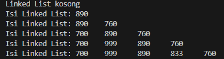
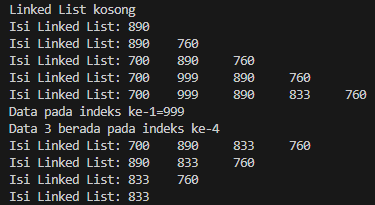
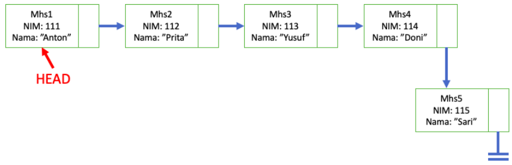
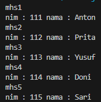
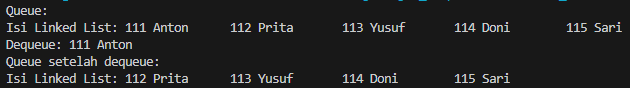

# Laporan Praktikum Pertemuan 10
#### Nama    : Muhammad Rafi Rajendra
#### Kelas   : TI-1H
#### NIM     : 2341720158

## <p align="center">JOBSHEET XI</p>
## <p align="center">LINKED LIST</p>

## 1. Tujuan Praktikum
Setelah melakukan materi praktikum ini, mahasiswa mampu:
1. Membuat struktur data linked list
2. Membuat linked list pada program
3. Membedakan permasalahan apa yang dapat diselesaikan menggunakan linked list

## 2. Praktikum
### 2.1 Pembuatan Single Linked List
**Waktu percobaan : 30 menit**

Didalam praktikum ini, kita akan mempraktekkan bagaimana membuat Single Linked List dengan 
representasi data berupa Node, pengaksesan linked list dan metode penambahan data.
1. Pada Project StrukturData yang sudah dibuat pada Minggu sebelumnya, buat package dengan 
nama minggu11
2. Tambahkan class-class berikut:
a. Node.java
b. SingleLinkedList.java
c. SLLMain.java
3. Implementasi class Node
    ```java
    Node (int nilai, Node berikutnya){
        data = nilai;
        next = berikutnya;
    }
    ```
4. Tambahkan atribut pada class SingleLinkedList
    ```java
    Node head, tail;
    ```
5. Sebagai langkah berikutnya, akan diimplementasikan method-method yang terdapat pada 
SingleLinkedList.
6. Tambahkan method isEmpty().
    ```java
    boolean isEmpty() {
        return head == null;
    }
    ```
7. Implementasi method untuk mencetak dengan menggunakan proses traverse.
    ```java
    void print() {
        if (!isEmpty()) {
            Node tmp = head;
            System.out.print("Isi Linked List: ");
            while (tmp != null) {
                System.out.print(tmp.data + "\t");
                tmp = tmp.next;
            }
            System.out.println(" ");
        } else {
            System.out.println("Linked List kosong");
        }
    }
    ```
8. Implementasikan method addFirst().
    ```java
    void addFirst(int input) {
        Node ndInput = new Node(input, head);
        if (isEmpty()) {
            head = ndInput;
            tail = ndInput;
        } else {
            head = ndInput;
        }
    }
    ```
9. Implementasikan method addLast().
    ```java
    void addLast(int input) {
        Node ndInput = new Node(input, null);
        if (isEmpty()) {
            head = ndInput;
        } else {
            tail.next = ndInput;
        }
        tail = ndInput;
    }
    ```
10. Implementasikan method insertAfter, untuk memasukkan node yang memiliki data 
input setelah node yang memiliki data key.
    ```java
    void insertAfter(int key, int input) {
        Node ndInput = new Node(input, head);
        Node temp = head;
        while (temp != null) {
            if (temp.data == key) {
                ndInput.next = temp.next;
                temp.next = ndInput;
                if (ndInput.next == null) {
                    tail = ndInput;
                }
                break; 
            }
            temp = temp.next;
        }        
    }
    ```
11. Tambahkan method penambahan node pada indeks tertentu.
    ```java
    void insertAt(int index, int input) {
        if (index < 0) {
            System.out.println("index harus >= 0");
            return;
        }
        if (index == 0) {
            addFirst(input);
            return;
        }
        Node temp = head;
        for (int i = 1; i < index && temp.next != null; i++) {
            temp = temp.next;
        }
        Node ndInput = new Node(input, temp.next);
        temp.next = ndInput;
        if (ndInput.next == null) {
            tail = ndInput; 
        }
    }
    ```
12. Pada class SLLMain, buatlah fungsi main, kemudian buat object dari class SingleLinkedList.
    ```java
    public class SLLMain {
        public static void main(String[] args) {
            SingleLinkList singLL = new SingleLinkList();
        }
    }
    ```
13. Tambahkan Method penambahan data dan pencetakan data di setiap penambahannya agar terlihat perubahannya.
    ```java
        singLL.print();
        singLL.addFirst(890);
        singLL.print();
        singLL.addLast(760);
        singLL.print();
        singLL.addFirst(700);
        singLL.print();
        singLL.insertAfter(700, 999);
        singLL.print();
        singLL.insertAt(3, 833);
        singLL.print();
    ```
### 2.1.1 Verifikasi Hasil Percobaan


### 2.2.3 Pertanyaan
1. Mengapa hasil compile kode program di baris pertama menghasilkan “Linked List Kosong”?
    
    jawab: karena pada saat metode print() pertama kali dipanggil, linked list masih belum memiliki elemen apa pun. Pada saat itu, linked list baru saja diinisiasi dan belum ada node yang ditambahkan ke dalamnya.
2. Jelaskan kegunaan variable temp secara umum pada setiap method!

    jawab:  
    1. Method print()
    Peran temp: Digunakan untuk bergerak dari satu node ke node berikutnya secara berurutan. Ini memastikan bahwa semua data dalam linked list dapat dicetak tanpa mengubah referensi head, yang penting untuk menjaga struktur linked list tetap utuh.
    2. Method addFirst(int input)
    Peran temp: Dalam metode ini, temp tidak disebutkan, tetapi head yang lama (sebelum penambahan) akan menjadi next dari node baru. Ini mirip dengan peran yang dimainkan oleh temp dalam menjaga node lama saat menambah node baru di depannya.
    3. Method insertAfter(int key, int input)
    Peran temp: temp digunakan untuk menemukan node yang data-nya sama dengan key. Setelah node ini ditemukan, node baru disisipkan setelahnya. Jika temp.next menjadi null setelah penyisipan, ini menandakan bahwa node baru menjadi tail baru, yang harus diperbarui.
    4. Method inserAt(int index, int input)
    Peran temp: temp digunakan untuk bergerak sepanjang linked list sampai mencapai posisi yang tepat sebelum index yang dimaksud. Ini penting untuk memastikan bahwa penyisipan berada di posisi yang benar dan integritas linked list tetap terjaga.
3. Perhatikan class SingleLinkedList, pada method insertAt Jelaskan kegunaan kode berikut
    ```java
    if (temp.next.next == null) tail = temp.next;
    ```
    jawab: digunakan untuk memperbarui referensi tail dari linked list jika node yang akan disisipkan akan menjadi node terakhir (yaitu, jika index yang dimasukkan setara dengan panjang linked list saat ini).

## 2.2 Modifikasi Elemen pada Single Linked List
**Waktu percobaan : 30 menit**
    
    Didalam praktikum ini, kita akan mempraktekkan bagaimana mengakses elemen, mendapatkan indeks dan melakukan penghapusan data pada Single Linked List.

### 2.2.1 Langkah-langkah Percobaan
1. Implementasikan method untuk mengakses data dan indeks pada linked list
2. Tambahkan method untuk mendapatkan data pada indeks tertentu pada class Single 
Linked List
    ```java
    int getData(int index) {
        if (index < 0) {
            System.out.println("Indeks tidak valid");
            return -1;
        }
        Node tmp = head;
        for (int i = 0; i < index && tmp != null; i++) {
            tmp = tmp.next;
        }
        if (tmp != null) {
            return tmp.data;
        } else {
            System.out.println("Indeks melebihi panjang linked list");
            return -1;
        }
    }
    ```
3. Implementasikan method indexOf.
    ```java
    int indexOf(int key){
        Node tmp = head;
        int index = 0;
        while (tmp != null && tmp.data != key) {
            tmp = tmp.next;
            index++;
        }
        if (tmp != null) {
            return index;
        } else {
            return index;
        }
    }
    ```
4. Tambahkan method removeFirst pada class SingleLinkedList
    ```java
    void removeFirst() {
        if (isEmpty()) {
            System.out.println("Linked list masih kosong, " + "tidak dapat dihapus");
        } else if (head == tail) {
            head = tail = null;
        } else {
            head = head.next;
        }
    }
    ```
5. Tambahkan method untuk menghapus data pada bagian belakang pada class SingleLinkedList
    ```java
    void removeLast(){
        if (isEmpty()) {
            System.out.println("Linked list masih kosong, " + "tidak dapat dihapus");
        } else if(head == tail){
            head = tail = null;
        } else {
            Node temp = head;
            while (temp.next != tail) {
                temp = temp.next;
            }
            temp.next = null;
            tail = temp;
        } 
    }
    ```
6. Sebagai langkah berikutnya, akan diimplementasikan method remove
    ```java
    void remove(int key) {
        if (!isEmpty()) {
            Node temp = head;
            while (temp != null) {
                if (temp.data == key) {
                    if (temp == head) {
                        removeFirst();
                    } else {
                        Node prev = head;
                        while (prev.next != temp) {
                            prev = prev.next;
                        }
                        prev.next = temp.next;
                        if (temp == tail) {
                            tail = prev;
                        }
                    }
                    break;
                }
                temp = temp.next;
            }
        } else {
            System.out.println("Linked list masih kosong, tidak dapat dihapus");
        }
    }
    ```
7. Implementasi method untuk menghapus node dengan menggunakan index.
    ```java
    public void removeAt(int index) {
        if (index < 0) {
            System.out.println("Indeks tidak valid");
            return;
        }
        if (index == 0) {
            removeFirst();
        } else {
            Node temp = head;
            for (int i = 0; i < index - 1 && temp != null; i++) {
                temp = temp.next;
            }
            if (temp == null || temp.next == null) {
                System.out.println("Indeks melebihi panjang linked list");
                return;
            }
            temp.next = temp.next.next;
            if (temp.next == null) {
                tail = temp;
            }
        }
    }
    ```
8. Kemudian, coba lakukan pengaksesan dan penghapusan data di method main pada class SLLMain dengan menambahkan kode berikut
    ```java
    System.out.println("Data pada indeks ke-1=" + singLL.getData(1));
    System.out.println("Data 3 berada pada indeks ke-" + singLL.indexOf(760));

    singLL.remove (999) ;
    singLL.print ();
    singLL.removeAt(0);
    singLL.print ();
    singLL.removeFirst ();
    singLL.print ();
    singLL.removeLast();
    singLL.print ();
    ```
9. Method SLLMain menjadi:
    ```java
    package p11;

    public class SLLMain {
        public static void main(String[] args) {
            SingleLinkList singLL = new SingleLinkList();
            singLL.print();
            singLL.addFirst(890);
            singLL.print();
            singLL.addLast(760);
            singLL.print();
            singLL.addFirst(700);
            singLL.print();
            singLL.insertAfter(700, 999);
            singLL.print();
            singLL.insertAt(3, 833);
            singLL.print();

            System.out.println("Data pada indeks ke-1=" + singLL.getData(1));
            System.out.println("Data 3 berada pada indeks ke-" + singLL.indexOf(760));
            
            singLL.remove (999) ;
            singLL.print ();
            singLL.removeAt(0);
            singLL.print ();
            singLL.removeFirst ();
            singLL.print ();
            singLL.removeLast();
            singLL.print ();
        }
    }
    ```
10. Jalankan class SLLMain 

### 2.2.2 Verifikasi Hasil Percobaan


### 2.2.3 Pertanyaan
1. Mengapa digunakan keyword break pada fungsi remove? Jelaskan!
    
    jawab: Keyword break digunakan dalam fungsi remove untuk menghentikan iterasi melalui linked list setelah sebuah node dengan nilai key ditemukan dan dihapus. Ini berfungsi untuk menghindari iterasi yang tidak perlu setelah operasi penghapusan dilakukan.
2. Jelaskan kegunaan kode dibawah pada method remove
    ```java
    else if(temp.next.data == key){
        temp.next = temp.next.next;
    }
    ```
    jawab: node diatas digunakan untuk menangani node yang akan dihapus adalah node yang berada setelah temp.

## 3. Tugas
**Waktu pengerjaan : 50 menit**
1. Implementasikan ilustrasi Linked List Berikut. Gunakan 4 macam penambahan data yang telah 
dipelajari sebelumnya untuk menginputkan data.

    

    jawab: terdapat 3 class yang saya buat yaitu node, SingleLinkList, mahasiswaMain. Berikut kode program dari masing-masing class.

    Class Node
    ```java
    public class node {
        int nim;
        String nama;
        node next;

        node (int nim, String nama, node berikutnya){
            this.nim = nim;
            this.nama = nama;
            next = berikutnya;
        }
    }
    ```
    Class SingleLinkList
    ```java
    public class SingleLinkList {
        node head, tail;

        boolean isEmpty(){
            return head == null;
        } 

        void print(){
            if (!isEmpty()) {
                node tmp = head;
                int count = 1; 
                while (tmp != null) {
                    System.out.println("mhs" + count + " \nnim : " + tmp.nim + " nama : " + tmp.nama);
                    tmp = tmp.next;
                    count++; 
                }
            } else {
                System.out.println("Linked List Kosong");
            }
        }

        void addFirst(int nim, String nama){
            node ndInput = new node(nim, nama);
            if (isEmpty()) {
                head = ndInput;
                tail = ndInput;
            } else {
                head = ndInput;
            }
        }

        void addLast(int nim, String nama) {
            node ndInput = new node(nim, nama);
            if (isEmpty()) {
                head = ndInput;
                tail = ndInput;
            } else {
                tail.next = ndInput;
                tail = ndInput;
            }
        }

        void insertAfter(int key, int nim, String nama) {
            node ndInput = new node(nim, nama);
            node temp = head;
            while (temp != null) {
                if (temp.nim == key) {
                    ndInput.next = temp.next;
                    temp.next = ndInput;
                    if (ndInput.next == null) {
                        tail = ndInput;
                    }
                    break;
                }
                temp = temp.next;
            }
        }

        void insertAt(int index, int nim, String nama) {
            if (index < 0) {
                System.out.println("index harus >= 0");
                return;
            }
            if (index == 0) {
                addFirst(nim, nama);
                return;
            }
            node temp = head;
            for (int i = 1; i < index && temp.next != null; i++) {
                temp = temp.next;
            }
            node ndInput = new node(nim, nama);
            temp.next = ndInput;
            if (ndInput.next == null) {
                tail = ndInput;
            }
        }
    }
    ```
    Class mahasiswaMain
    ```java
    public class mahasiswaMain {
        public static void main(String[] args) {
            SingleLinkList sll = new SingleLinkList();

            sll.addFirst(111, "Anton");
            sll.addLast(112, "Prita");
            sll.addLast(113, "Yusuf");
            sll.addLast(114, "Doni");
            sll.addLast(115, "Sari");
            sll.print();
        }
    }
    ```
    Output dari kode program diatas

    
2. Buatlah implementasi program antrian layanan unit kemahasiswaan sesuai dengan kondisi yang 
ditunjukkan pada soal nomor 1! Ketentuan
    - a. Implementasi antrian menggunakan Queue berbasis Linked List!
    - b. Program merupakan proyek baru, bukan modifikasi dari soal nomor 1!

    jawab: terdapat 3 class yang saya buat yaitu node, linkedListQueue, Main. Berikut kode program dari masing-masing class.

    Class node
    ```java
    public class node {
        int nim;
        String nama;
        node next;

        public node(int nim, String nama) {
            this.nim = nim;
            this.nama = nama;
            this.next = null;
        }
    }
    ```
    Class linkedListQueue
    ```java
    public class linkedListQueue {
        node head, tail;
        
        public linkedListQueue(){
            this.head = null;
            this.tail = null;
        }

        boolean isEmpty(){
            return head == null;
        }

        public void enqueue(int nim, String nama){
        node newNode = new node(nim, nama);
        if (tail == null) {
                head = tail = newNode;
                return;
        }
        tail.next = newNode;
        tail = newNode;
        }

        public void dequeue(){
            if (isEmpty()) {
                System.out.println("Linked list masih kosong, " + "tidak dapat dihapus");
            } else {
                System.out.println("Dequeue: " + head.nim + " " + head.nama);
                head = head.next;
                if (head == null) {
                    tail = null; 
                }
            }
        }

        public void print(){
            if (!isEmpty()) {
                node tmp = head;
                System.out.print("Isi Linked List: ");
                while (tmp != null) {
                    System.out.print(tmp.nim + " " + tmp.nama + "\t");
                    tmp = tmp.next;
                }
                System.out.println(" ");
            } else {
                System.out.println("Linked List kosong");
            }
        }
    }
    ```
    Class Main
    ```java
    public class Main {
        public static void main(String[] args) {
            linkedListQueue queue = new linkedListQueue();

            // Enqueue beberapa mahasiswa
            queue.enqueue(111, "Anton");
            queue.enqueue(112, "Prita");
            queue.enqueue(113, "Yusuf");
            queue.enqueue(114, "Doni");
            queue.enqueue(115, "Sari");

            // Menampilkan antrian mahasiswa
            System.out.println("Queue:");
            queue.print();

            // Dequeue satu mahasiswa
            queue.dequeue();

            // Menampilkan antrian setelah satu mahasiswa dikeluarkan
            System.out.println("Queue setelah dequeue:");
            queue.print();
        }
    }
    ```
    Output dari kode program diatas

    