# Laporan Praktikum Pertemuan 10
#### Nama    : Muhammad Rafi Rajendra
#### Kelas   : TI-1H
#### NIM     : 2341720158

## <p align="center">JOBSHEET X</p>
## <p align="center">Double Linked Lists </p>

## 12.1 Tujuan Praktikum 
Setelah melakukan praktikum ini, mahasiswa mampu: 
1. memahami algoritma double linked lists; 
2. membuat dan mendeklarasikan struktur algoritma double linked lists; 
3. menerapkan algoritma double linked lists dalam beberapa study case.

## 12.2 Kegiatan Praktikum 1 
Waktu : 90 Menit

### 12.2.1 Percobaan 1 
Pada percobaan 1 ini akan dibuat class Node dan class DoubleLinkedLists yang didalamnya terdapat operasi-operasi untuk menambahkan data dengan beberapa cara (dari bagian depan linked list, belakang ataupun indeks tertentu pada linked list). 
1. Perhatikan diagram class Node dan class DoublelinkedLists di bawah ini! Diagram class ini yang selanjutnya akan dibuat sebagai acuan dalam membuat kode program DoubleLinkedLists. 

    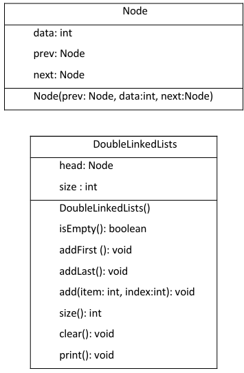
2. Buat paket baru dengan nama doublelinkedlists 
3. Buat class di dalam paket tersebut dengan nama Node
    ```java
    package p13;

    public class Node {
      
    }
    ```
4. Di dalam class tersebut, deklarasikan atribut sesuai dengan diagram class di atas. 
    ```java
    int data;
    Node prev, next;
    ```
5. Selanjutnya tambahkan konstruktor default pada class Node sesuai diagram di atas.
    ```java
    Node (Node prev, int data, Node next){
            this.prev = prev;
            this.data = data;
            this.next = next;
        }
    ```
6. Buatlah sebuah class baru bernama DoubleLinkedLists pada package yang sama dengan node seperti gambar berikut:
    ```java
    package p13;
    public class DoubleLinkedLists {
    
    }
    ```
7. Pada class DoubleLinkedLists tersebut, deklarasikan atribut sesuai dengan diagram class di atas.
    ```java
    Node head;
    int size;
    ```
8. Selajuntnya, buat konstruktor pada class DoubleLinkedLists sesuai gambar berikut.
    ```java
        public DoubleLinkedLists(){
        head = null;
        size = 0;
    }
    ```
9. Buat method isEmpty(). Method ini digunakan untuk memastikan kondisi linked list kosong.
    ```java
        public boolean isEmpty(){
        return head == null;
    }
    ```
10. Kemudian, buat method addFirst(). Method ini akan menjalankan penambahan data di bagian depan linked list. 
    ```java
        public void addFirst(int item){
        if (isEmpty()) {
            head = new Node(null, item, null);
        } else {
            Node newNode = new Node(null, item, head);
            head.prev = newNode;
            head = newNode;
        }
        size ++;
    }
    ```
11. Selain itu pembuatan method addLast() akan menambahkan data pada bagian belakang linked list. 
    ```java
        public void addLast(int item){
        if (isEmpty()) {
            addFirst(item);
        } else {
            Node current = head;
            while (current.next != null) {
                current = current.next;
            }
            Node newNode = new Node(current, item, null);
            current.next = newNode;
            size ++;
        }
    }
    ```
12. Untuk menambahkan data pada posisi yang telah ditentukan dengan indeks, dapat dibuat dengan method add(int item, int index) 
    ```java
        public void add(int item, int index) throws Exception{
        if (isEmpty()) {
            addFirst(item);
        } else if (index < 0 || index > size) {
            throw new Exception("Nilai indeks di luar batas");
        } else {
            Node current = head;
            int i = 0;
            while (i < index) {
                current = current.next;
                i++;
            }
            if (current.prev == null) {
                Node newNode = new Node(null, item, current);
                current.prev = newNode;
                head = newNode;
            } else {
                Node newNode = new Node(current.prev, item, current);
                newNode.prev = current.prev;
                newNode.next = current;
                current.prev.next = newNode;
                current.prev = newNode;
            }
        }
        size++;
    }
    ```
13. Jumlah data yang ada di dalam linked lists akan diperbarui secara otomatis, sehingga dapat dibuat method size() untuk mendapatkan nilai dari size.
    ```java
        public int size(){
        return size;
    }
    ```
14. Selanjutnya dibuat method clear() untuk menghapus semua isi linked lists, sehingga linked lists dalam kondisi kosong.
    ```java
        public void clear(){
        head = null;
        size = 0;
    }
    ```
15. Untuk mencetak isi dari linked lists dibuat method print(). Method ini akan mencetak isi linked lists berapapun size-nya. Jika kosong akan dimunculkan suatu pemberitahuan bahwa linked lists dalam kondisi kosong. 
    ```java
        public void print(){
        if (!isEmpty()) {
            Node tmp = head;
            while (tmp != null) {
                System.out.print(tmp.data + "\t");
                tmp = tmp.next;
            }
            System.out.println("\nBerhasil diisi");
        } else {
            System.out.println("Linked List kosong");
        }
    }
    ```
16. Selanjutya dibuat class Main DoubleLinkedListsMain untuk mengeksekusi semua method yang ada pada class DoubleLinkedLists.
    ```java
    package p13;

    public class MainDoubleLinkedLists {
        public static void main(String[] args) throws Exception {
        
        }
    }
    ```
17. Pada main class pada langkah 16 di atas buatlah object dari class DoubleLinkedLists kemudian eksekusi potongan program berikut ini.
    ```java
    package p13;
    public class MainDoubleLinkedLists {
        public static void main(String[] args) throws Exception {
            DoubleLinkedLists dll = new DoubleLinkedLists();
            dll.print();
            System.out.println("Size : " + dll.size());
            System.out.println("============================");
            dll.addFirst(3);
            dll.addLast(4);
            dll.addFirst(7);
            dll.print();
            System.out.println("Size : " + dll.size());
            System.out.println("============================");
            dll.add(40, 1);
            dll.print();
            System.out.println("Size : " + dll.size());
            System.out.println("============================");
            dll.clear();
            dll.print();
            System.out.println("Size : " + dll.size());
        }
    }
    ```
### 12.2.2 Verifikasi Hasil Percobaan 
Verifikasi hasil kompilasi kode program Anda dengan gambar berikut ini.

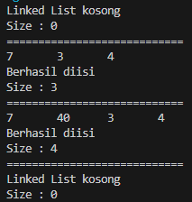

### 12.2.3 Pertanyaan Percobaan 
1. Jelaskan perbedaan antara single linked list dengan double linked lists!
    
    jawab: 
    1. Single Linked List:
        - Setiap node dalam single linked list menyimpan data dan referensi ke node selanjutnya dalam list.
        - Hanya memiliki satu pointer yang menunjuk ke node berikutnya.
        - Tidak memiliki pointer yang menunjuk ke node sebelumnya.
        - Operasi traversal dari depan ke belakang (head ke tail) lebih cepat.
        - Membutuhkan lebih sedikit ruang penyimpanan untuk setiap node karena hanya menyimpan satu pointer.
    2. Double Linked List:
        - Setiap node dalam double linked list menyimpan data, referensi ke node sebelumnya, dan referensi ke node selanjutnya.
        - Memiliki dua pointer: satu untuk node sebelumnya dan satu untuk node selanjutnya.
        - Memungkinkan traversal dari depan ke belakang (head ke tail) dan sebaliknya (tail ke head).
        - Membutuhkan sedikit lebih banyak ruang penyimpanan untuk setiap node karena menyimpan dua pointer.
2. Perhatikan class Node, di dalamnya terdapat atribut next dan prev. Untuk apakah atribut tersebut?
    
    jawab: Atribut prev dan next dalam class Node menunjukkan bahwa class tersebut merupakan bagian dari struktur data linked list dengan referensi ke node sebelumnya (prev) dan node selanjutnya (next).
3. Perhatikan konstruktor pada class DoubleLinkedLists. Apa kegunaan inisialisasi atribut head dan size seperti pada gambar berikut ini?
    ```java
    public DoubleLinkedLists(){
        head = null;
        size = 0;
    }
    ```

    jawab: Konstruktor pada class DoubleLinkedLists yang menginisialisasi atribut head menjadi null dan size menjadi 0 memiliki beberapa kegunaan: Inisialisasi linked list kosong, memudahkan penambahan node pertama, dan menghindari kesalahan referensi.
4. Pada method addFirst(), kenapa dalam pembuatan object dari konstruktor class Node prev dianggap sama dengan null? 
    ```java
    Node newNode = new Node(null, item, head);
    ```

    jawab: Dalam pembuatan objek baru dari konstruktor class Node, parameter prev dianggap sama dengan null dalam pemanggilan new Node(null, item, head) karena kita ingin membuat node baru sebagai node pertama dalam linked list.
5. Perhatikan pada method addFirst().  Apakah arti statement head.prev = newNode ? 
    
    jawab: Dalam statement head.prev = newNode, kita mengatur atribut prev dari node head menjadi referensi ke node baru yang baru saja dibuat.
6. Perhatikan isi method addLast(), apa arti dari pembuatan object Node dengan mengisikan parameter prev dengan current, dan next dengan null? 
    ```java
    Node newNode = new Node(current, item, null); 
    ```

    jawab: kita menghubungkan node baru ke node terakhir dalam linked list (yang disimpan dalam variabel current) sebagai node sebelumnya, dan menunjukkan bahwa node baru ini akan menjadi node terakhir dengan mengatur atribut next menjadi null.
7. Pada method add(), terdapat potongan kode program sebagai berikut:
    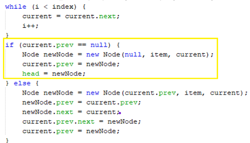

    jelaskan maksud dari bagian yang ditandai dengan kotak kuning. 

    jawab: Jika current.prev bernilai null, artinya current adalah node pertama dalam linked list. Ketika current.prev bernilai null, kita ingin menambahkan node baru sebagai node pertama dalam linked list. Dalam hal ini, kita membuat objek baru dari class Node dengan parameter konstruktor null, item, dan current.

## 12.3 Kegiatan Praktikum 2 
Waktu : 60 Menit

### 12.3.1 Tahapan Percobaan 
Pada praktikum 2 ini akan dibuat beberapa method untuk menghapus isi LinkedLists pada class DoubleLinkedLists. Penghapusan dilakukan dalam tiga cara di bagian paling depan, paling belakang, dan sesuai indeks yang ditentukan pada linkedLists. Method tambahan tersebut akan ditambahkan sesuai pada diagram class berikut ini.

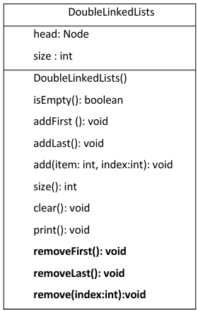

1. Buatlah method removeFirst() di dalam class DoubleLinkedLists.
    ```java
    public void removeFirst() throws Exception{
        if (isEmpty()) {
            throw new Exception("Linked list masih kosong, " + "tidak dapat dihapus!");
        } else if( size == 1 ) {
            removeLast();
        } else {
            head = head.next;
            head.prev = null;
            size--;
        }
    }
    ```
2. Tambahkan method removeLast() di dalam class DoubleLinkedLists. 
    ```java
    public void removeLast() throws Exception{
        if (isEmpty()) {
            throw new Exception("Linked list masih kosong, " + "tidak dapat dihapus!");
        } else if (head.next == null) {
            head = null;
            size--;
            return;
        }
        Node current = head;
        while (current.next.next != null) {
            current = current.next;
        } 
        current.next = null;
        size--;
    }
    ```
3. Tambahkan pula method remove(int index) pada class DoubleLinkedLists dan amati hasilnya.
    ```java
    public void remove(int index) throws Exception{
        if (isEmpty() || index >= size) {
            throw new Exception("Nilai indeks diluar batas");
        } else if (index == 0) {
            removeFirst();
        } else if(index == 0) {
            removeFirst();
        } else {
            Node current = head;
            int i = 0;
            while (i < index) {
                current = current.next;
                i++;
            }
            if (current.next == null) {
                current.prev.next = null;
            } else if(current.prev == null){
                current = current.next;
                current.prev = null;
                head = current;
            } else {
                current.prev.next = current.next;
                current.next.prev = current.prev;
            }
            size--;
        } 
    }
    ```
4. Untuk mengeksekusi method yang baru saja dibuat, tambahkan potongan kode program 
berikut pada main class. 
    ```java
        dll.addLast(50);
        dll.addLast(40);
        dll.addLast(10);
        dll.addLast(20);
        dll.print();
        System.out.println("Size : " + dll.size());
        System.out.println("============================");
        dll.removeFirst();
        dll.print();
        System.out.println("Size : " + dll.size());
        System.out.println("============================");
        dll.removeLast();
        dll.print();
        System.out.println("Size : " + dll.size());
        System.out.println("============================");
        dll.remove(1);
        dll.print();
        System.out.println("Size : " + dll.size());
    ```

### 12.3.2 Verifikasi Hasil Percobaan 
Verifikasi hasil kompilasi kode program Anda dengan gambar berikut ini.

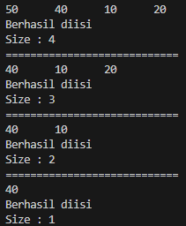

### 12.3.3 Pertanyaan Percobaan 
1. Apakah maksud statement berikut pada method removeFirst()? 
    ```java
    head = head.next; 
    head.prev = null; 
    ```
    jawab: Dalam statement head = head.next; dan head.prev = null;, kita menghapus node pertama dari linked list. Pada method removeFirst(), kita memeriksa apakah linked list masih kosong atau hanya memiliki satu node. Jika linked list masih kosong, kita melempar exception. Jika linked list hanya memiliki satu node, kita memanggil method removeLast() untuk menghapus node tersebut.
2. Bagaimana cara mendeteksi posisi data ada pada bagian akhir pada method removeLast()?
    
    jawab: 
    1. Pertama, kita memeriksa apakah linked list masih kosong atau hanya memiliki satu node. Jika linked list masih kosong, kita melempar exception. Jika linked list hanya memiliki satu node, kita mengatur head menjadi null dan mengurangi ukuran linked list.
    2. Jika linked list memiliki lebih dari satu node, kita perlu menelusuri linked list dari node pertama hingga node terakhir. Kita menggunakan variabel current untuk mencatat node saat ini selama perulangan.
    3. Dalam perulangan, kita mengecek apakah current.next bernilai null. Jika current.next bernilai null, artinya kita mencapai node terakhir dalam linked list.
    4. Jika kita mencapai node terakhir, kita mengatur current.next menjadi null untuk menghapus node terakhir dari linked list.
    5. Setelah menghapus node terakhir, kita mengurangi ukuran linked list.
3. Jelaskan alasan potongan kode program di bawah ini tidak cocok untuk perintah remove!
    ```java
    Node tmp = head.next;

    head.next = tmp.next;
    tmp.next.prev = head;
    ```
    jawab: Pada potongan kode ini, kita menghubungkan head.next ke node setelah node yang akan dihapus. Tetapi, tidak mengatur tmp.next menjadi null, sehingga masih ada referensi ke node yang akan dihapus dari linked list. Dalam penghapusan node, kita harus memastikan bahwa atribut prev dari node setelah node yang dihapus juga diperbarui dengan benar.
4. Jelaskan fungsi kode program berikut ini pada fungsi remove!
    ```java
    current.prev.next = current.next;
    current.next.prev = current.prev;
    ```
    jawab: Potongan kode program berikut digunakan dalam fungsi remove untuk menghapus node current dari linked list

## 12.4 Kegiatan Praktikum 3 
Waktu : 50 Menit

### 12.4.1 Tahapan Percobaan 
Pada praktikum 3 ini dilakukan uji coba untuk mengambil data pada linked list dalam 3 kondisi, yaitu mengambil data paling awal, paling akhir dan data pada indeks tertentu dalam linked list. Method mengambil data dinamakan dengan get. Ada 3 method get yang dibuat pada praktikum ini sesuai dengan diagram class DoubleLinkedLists.

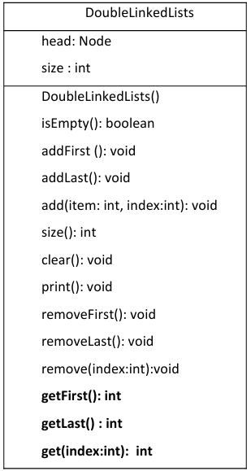

1. Buatlah method getFirst() di dalam class DoubleLinkedLists untuk mendapatkan data pada awal linked lists. 
    ```java
    public int getFirst() throws Exception {
        if (isEmpty()) {
            throw new Exception("Linked list masih kosong");
        }
        return head.data;
    }
    ```
2. Selanjutnya, buatlah method getLast() untuk mendapat data pada akhir linked lists. 
    ```java
    public int getLast() throws Exception {
        if (isEmpty()) {
            throw new Exception("Linked list masih kosong");
        }
        Node tmp = head;
        while (tmp.next != null) {
            tmp = tmp.next;
        }
        return tmp.data;
    }
    ```
3. Method get(int index) dibuat untuk mendapatkan data pada indeks tertentu
    ```java
    public int get(int index) throws Exception {
        if (isEmpty() || index >= size) {
            throw new Exception("Nilai indeks diluar batas");
        }
        Node tmp = head;
        for (int i = 0; i < index; i++) {
            tmp = tmp.next;
        }
        return tmp.data;
    }
    ```
4. Pada main class tambahkan potongan program berikut dan amati hasilnya!

### 12.4.2 Verifikasi Hasil Percobaan 
Verifikasi hasil kompilasi kode program Anda dengan gambar berikut ini.

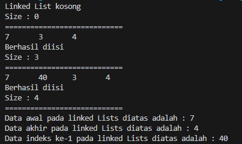

### 12.4.3 Pertanyaan Percobaan 
1. Jelaskan method size() pada class DoubleLinkedLists! 

    jawab: Method size() pada class DoubleLinkedLists digunakan untuk mengembalikan jumlah elemen (size) pada linked lists.
2. Jelaskan cara mengatur indeks pada double linked lists supaya dapat dimulai dari indeks ke- 1! 

    jawab: agar mengatur indeks dapaat dimulai dari indeks ke-1 maka melakukan perubahan pada method get, perubahan yang saya lakukan sebagai berikut:
    
    ```java
    public int get(int index) throws Exception {
        if (isEmpty() || index > size || index < 1) {
            throw new Exception("Nilai indeks diluar batas");
        }
        Node tmp = head;
        for (int i = 1; i <= index; i++) {
            tmp = tmp.next;
        }
        return tmp.data;
    }
    ```
3. Jelaskan perbedaan karakteristik fungsi Add pada Double Linked Lists dan Single Linked Lists!  

    jawab: 
    1. Double Linked Lists: 
    - Fungsi add pada Double Linked Lists memiliki dua versi yaitu addFirst dan addLast.
    - addFirst digunakan untuk menambahkan elemen baru pada awal Double Linked Lists.
    - addLast digunakan untuk menambahkan elemen baru pada akhir Double Linked Lists.
    - Saat menambahkan elemen pada awal atau akhir Double Linked Lists, perlu diperbarui referensi next dan prev pada elemen sebelumnya dan elemen baru yang ditambahkan.

    2. Single Linked Lists:
    - Fungsi add pada Single Linked Lists hanya memiliki satu versi yaitu addLast.
    - addLast digunakan untuk menambahkan elemen baru pada akhir Single Linked Lists.
    - Saat menambahkan elemen pada akhir Single Linked Lists, perlu diperbarui referensi next pada elemen terakhir dan elemen baru yang ditambahkan.
4. Jelaskan perbedaan logika dari kedua kode program di bawah ini! 
-   ```java
    public boolean isEmpty(){
        if (size == 0){
            return true;
        } else {
            return false;
        }
    }
    ```

-   ```java
    public boolean isEmpty{
        return head == null;
    }
    ```
    jawab: 
    1. Kode program pertama menggunakan variabel size untuk mengecek apakah Double Linked Lists kosong atau tidak. Kode program ini mengecek apakah size sama dengan 0, dan jika ya, maka mengembalikan true, yang berarti Double Linked Lists kosong. Jika tidak, maka mengembalikan false, yang berarti Double Linked Lists tidak kosong.

    2. Kode program kedua menggunakan variabel head untuk mengecek apakah Single Linked Lists kosong atau tidak. Kode program ini hanya mengembalikan true jika head bernilai null, yang berarti Single Linked Lists kosong. Jika head tidak bernilai null, maka mengembalikan false, yang berarti Single Linked Lists tidak kosong.

## 12.5 Tugas Praktikum 
Waktu : 100 Menit 

1. Buat program antrian vaksinasi menggunakan queue berbasis double linked list sesuai ilustrasi 
dan menu di bawah ini! **(counter jumlah antrian tersisa di menu cetak(3) dan data orang yang telah divaksinasi di menu Hapus Data(2) harus ada)**  
**Contoh Ilustrasi Program**

    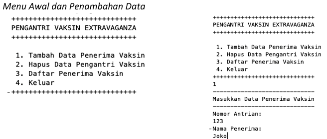

    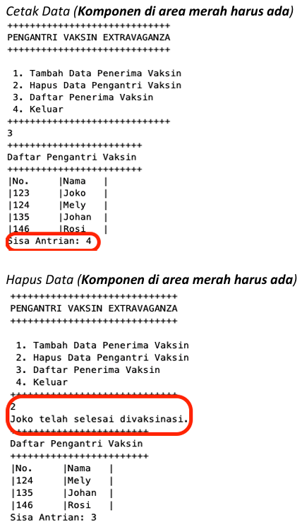

    jawab: 

    kode program:

    [Tugas No 1](D:\prakstrukturdata\p13\tugas_no1)

    output kode program:

    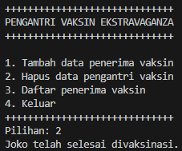

    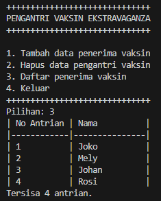

2. Buatlah program daftar film yang terdiri dari id, judul dan rating menggunakan double linked lists, bentuk program memiliki fitur pencarian melalui ID Film dan pengurutan Rating secara descending. Class Film wajib diimplementasikan dalam soal ini. 
**Contoh Ilustrasi Program** 

    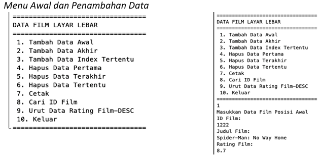

    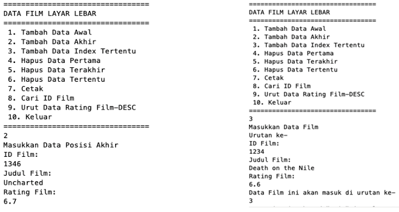

    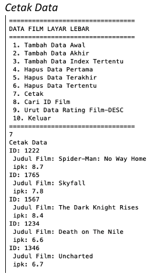

    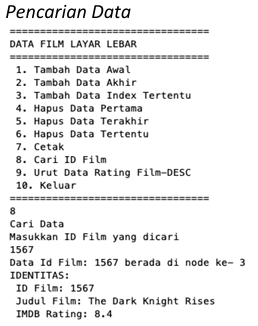

    jawab: 

    kode program:

    [Tugas No 2](D:\prakstrukturdata\p13\tugas_no2)

    output kode program:

    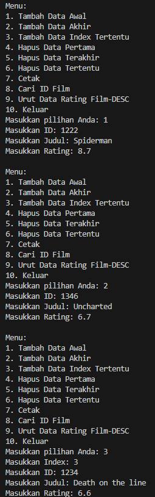

    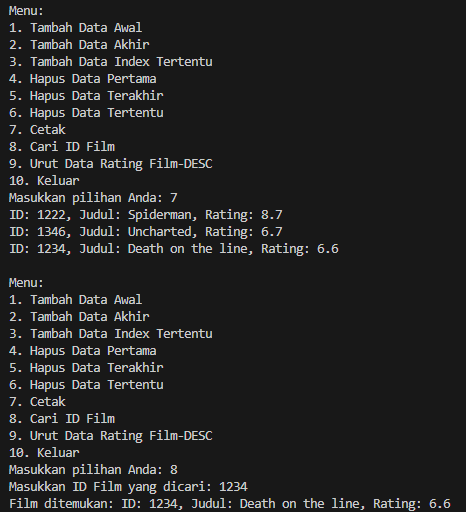