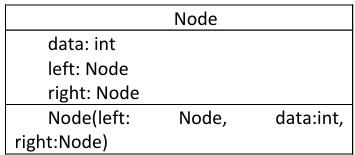
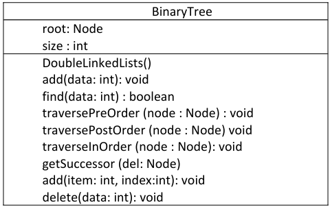
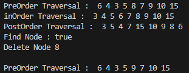
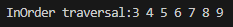

# Laporan Praktikum Pertemuan 10
#### Nama    : Muhammad Rafi Rajendra
#### Kelas   : TI-1H
#### NIM     : 2341720158

## <p align="center">JOBSHEET 13</p>
## <p align="center">TREE</p>

## 13.2 Kegiatan Praktikum 1  
**Implementasi Binary Search Tree menggunakan Linked List (45 Menit)**
### 13.2.1 Percobaan 1
Pada percobaan ini akan diimplementasikan Binary Search Tree dengan operasi dasar, dengan menggunakan array (praktikum 2) dan linked list (praktikum 1). Sebelumnya, akan dibuat class Node, dan Class BinaryTree





1. Buatlah class NodeNoAbsen, BinaryTreeNoAbsen dan BinaryTreeMainNoAbsen 
2. Di dalam class Node, tambahkan atribut data, left dan right, serta konstruktor default dan 
berparameter.

    ```java
    package p15;

    public class Node19 {
        int data;
        Node19 left;
        Node19 right;

        public Node19(){

        }

        public Node19(int data){
            this.data = data;
            this.left = null;
            this.right = null;
        }
    }
    ```

3. Di dalam class BinaryTreeNoAbsen, tambahkan atribut root.

    ```java
    public class BinaryTree19 {
        Node19 root;
    }
    ```
4. Tambahkan konstruktor default dan method isEmpty() di dalam class BinaryTreeNoAbsen 

    ```java
    public BinaryTree19(){
        root = null;
    }


    boolean isEmpty() {
        return root == null;
    }
    ```
5. Tambahkan method add() di dalam class BinaryTreeNoAbsen. Di bawah ini proses penambahan node tidak dilakukan secara rekursif, agar lebih mudah dilihat alur proses penambahan node dalam tree. Sebenarnya, jika dilakukan dengan proses rekursif, penulisan kode akan lebih efisien.

    ```java
    void add(int data) {
        if (isEmpty()) {
            root = new Node19(data);
        } else {
            Node19 current = root;
            while (true) {
                if (data < current.data) {
                    if (current.left == null) {
                        current.left = new Node19(data);
                        break;
                    } else {
                        current = current.left;
                    }
                } else if (data > current.data) {
                    if (current.right == null) {
                        current.right = new Node19(data);
                        break;
                    } else {
                        current = current.right;
                    }
                } else {
                    // Data already exists
                    break;
                }
            }
        }
    }
    ```

6. Tambahkan method find() 

    ```java
    boolean find (int data){
        Node19 current = root;
        while (current != null) {
            if (current.data == data) {
                return true;
            } else if (data < current.data) {
                current = current.left;
            } else {
                current = current.right;
            }
        }
        return false;
    }
    ```

7. Tambahkan method traversePreOrder(), traverseInOrder() dan traversePostOrder(). Method traverse digunakan untuk mengunjungi dan menampilkan node-node dalam tree, baik dalam mode pre-order, in-order maupun post-order. 

    ```java
    void taversePreOrder(Node19 node){
        if (node != null) {
            System.out.print(" " + node.data);
            taversePreOrder(node.left);
            taversePreOrder(node.right);
        }
    }

    void taversePostOrder(Node19 node) {
        if (node != null) {
            taversePostOrder(node.left);
            taversePostOrder(node.right);
            System.out.print(" " + node.data);
        }
    }

    void taverseInOrder(Node19 node){
        if (node != null) {
            taverseInOrder(node.left);
            System.out.print(" " + node.data);
            taverseInOrder(node.right);
        }
    }
    ```

8. Tambahkan method getSuccessor(). Method ini akan digunakan ketika proses penghapusan node yang memiliki 2 child.

    ```java
    Node19 getSuccessor(Node19 del){
        Node19 successor = del.right;
        Node19 successorParent = del;
        while (successor.left != null) {
            successorParent = successor;
            successor = successor.left;
        }
        if (successor != del.right) {
            successorParent.left = successor.right;
            successor.right = del.right;
        }
        return successor;
    }
    ```

9. Tambahkan method delete(). Di dalam method delete tambahkan pengecekan apakah tree kosong, dan jika tidak cari posisi node yang akan di hapus.

    ```java
    void delete (int data){
        if (isEmpty()) {
            System.out.println("Tree is empty!");
            return;
        }
        //find node (current) that will be deleted
        Node19 parent = root;
        Node19 current = root;
        boolean isLeftChild = false;
        while (current != null) {
            if (current.data == data) {
                break;
            } else if (data < current.data) {
                parent = current;
                current = current.left;
                isLeftChild = true;
            } else if (data > current.data) {
                parent = current;
                current = current.right;
                isLeftChild = false;
            }
        }
        //deletion
        if (current == null) {
            System.out.println("Couldn't find data!");
            return;
        } else {
            //if there is no child, simply delete it
            if (current.left == null && current.right == null) {
                if (current == root) {
                    root = null;
                } else {
                    if (isLeftChild) {
                        parent.left = null;
                    } else {
                        parent.right = null;
                    }
                }
            } else if (current.left == null) {//if there is 1 child (right)
                if (current == root) {
                    root = current.right;
                } else {
                    if (isLeftChild) {
                        parent.left = current.right;
                    } else {
                        parent.right = current.right;
                    }
                }                
            } else if (current.right == null) {//if there is 1 child (left)
                if (current == root) {
                    root = current.left;
                } else {
                    if (isLeftChild) {
                        parent.left = current.left;
                    } else {
                        parent.right = current.left;
                    }
                }
            } else {//if rhere is 2 childs
                Node19 successor = getSuccessor(current);
                if (current == root) {
                    root = successor;
                } else {
                    if (isLeftChild) {
                        parent.left = successor;
                    } else {
                        parent.right = successor;
                    }
                }
                successor.left = current.left;
            }
        }
    }
    ```

11. Buka class BinaryTreeMainNoAbsen dan tambahkan method main() kemudian tambahkan kode berikut ini 

    ```java
        BinaryTree19 bt = new BinaryTree19();
        bt.add(6);
        bt.add(4);
        bt.add(8);
        bt.add(3);
        bt.add(5);
        bt.add(7);
        bt.add(9);
        bt.add(10);
        bt.add(15);
        System.out.print("PreOrder Traversal : ");
        bt.taversePreOrder(bt.root);
        System.out.println("");
        System.out.print("inOrder Traversal : ");
        bt.taverseInOrder(bt.root);
        System.out.println("");
        System.out.print("PostOrder Traversal : ");
        bt.taversePostOrder(bt.root);
        System.out.println("");
        System.out.println("Find Node : " + bt.find(5));
        System.out.println("Delete Node 8");
        bt.delete(8);
        System.out.println("");
        System.out.print("PreOrder Traversal : ");
        bt.taversePreOrder(bt.root);
        System.out.println("");
    ```

12. Compile dan jalankan class BinaryTreeMain untuk mendapatkan simulasi jalannya program tree yang telah dibuat. 

13. Amati hasil running tersebut.
    

### 13.2.2 Pertanyaan Percobaan 
1. Mengapa dalam binary search tree proses pencarian data bisa lebih efektif dilakukan dibanding binary tree biasa? 

    jawab: Dalam binary search tree (BST), setiap node memiliki properti dimana semua nilai di sub-tree kiri lebih kecil dari nilai di node, dan semua nilai di sub-tree kanan lebih besar. Struktur ini memungkinkan proses pencarian menjadi lebih efisien karena kita dapat memutuskan arah pencarian (kiri atau kanan) pada setiap langkah berdasarkan nilai yang dicari
2. Untuk apakah di class Node, kegunaan dari atribut left dan right?

    jawab: Dalam class Node, atribut left dan right digunakan untuk menunjuk ke anak kiri dan anak kanan dari node tersebut.
3. - a. Untuk apakah kegunaan dari atribut root di dalam class BinaryTree?
    
        jawab: Atribut root di dalam class BinaryTree digunakan sebagai titik awal atau node utama dari pohon biner. 
    - b. Ketika objek tree pertama kali dibuat, apakah nilai dari root?

        jawab: Ketika objek tree pertama kali dibuat, nilai dari root adalah null, menandakan bahwa pohon tersebut masih kosong dan belum memiliki node apapun.
4. Ketika tree masih kosong, dan akan ditambahkan sebuah node baru, proses apa yang akan terjadi?

    jawab: Ketika tree masih kosong dan sebuah node baru akan ditambahkan, node baru tersebut akan menjadi root dari pohon. Ini terjadi karena root saat ini adalah null, sehingga node baru diinisialisasi dan ditetapkan sebagai root.
5. Perhatikan method add(), di dalamnya terdapat baris program seperti di bawah ini. Jelaskan secara detil untuk apa baris program tersebut?

    ```java
    if(data < current.data>){
        if(current.left != null){
        current = current.left;
        } else {
            current.left = new Node(data);
            break;
        }
    }
    ```
    jawab: Baris program ini bertujuan untuk menambahkan node baru ke dalam binary search tree. Jika nilai data lebih kecil dari nilai node saat ini (current), program akan mengecek apakah anak kiri dari node saat ini ada. Jika ada, pencarian dilanjutkan ke anak kiri. Jika tidak ada, node baru akan ditambahkan sebagai anak kiri dari node saat ini, dan proses penambahan selesai dengan keluar dari loop.
## 13.3 Kegiatan Praktikum 2  
**Implementasi binary tree dengan array (45 Menit)**
### 13.3.1 Tahapan Percobaan
1. Di dalam percobaan implementasi binary tree dengan array ini, data tree disimpan dalam array dan langsung dimasukan dari method main(), dan selanjutnya akan disimulasikan proses traversal secara inOrder. 
2. Buatlah class BinaryTreeArrayNoAbsen dan BinaryTreeArrayMainNoAbsen 
3. Buat atribut data dan idxLast di dalam class BinaryTreeArrayNoAbsen. Buat juga method populateData() dan traverseInOrder(). 

    ```java
    public class BinaryTreeArray19 {
        int[] data;
        int idxLast;

        public BinaryTreeArray19(){
            data = new int[10];
        }

        void populateData(int data[], int idxLast){
            this.data = data;
            this.idxLast = idxLast;
        }

        void traverseInOrder(int idxStart){
            if (idxStart <= idxLast) {
                traverseInOrder(2*idxStart+1);
                System.out.print(data[idxStart] + " ");
                traverseInOrder(2*idxStart+2);
            }
        }
    }
    ```

4. Kemudian dalam class BinaryTreeArrayMainNoAbsen buat method main() dan tambahkan kode seperti gambar berikut ini di dalam method Main

    ```java
    public class BinaryTreeArrayMain19 {
        public static void main(String[] args) {
            BinaryTreeArray19 bta = new BinaryTreeArray19();
            int[] data = {6,4,8,3,5,7,9,0,0,0};
            int idxLast = 6;
            bta.populateData(data, idxLast);
            System.out.print("\nInOrder traversal:");
            bta.traverseInOrder(0);
            System.out.println("\n");
        }
    }
    ```

5. Jalankan class BinaryTreeArrayMain dan amati hasilnya!

    

### 13.3.2 Pertanyaan Percobaan
1. Apakah kegunaan dari atribut data dan idxLast yang ada di class BinaryTreeArray? 

    jawab: 
    - data: Atribut ini adalah sebuah array yang digunakan untuk menyimpan elemen-elemen dari binary tree. Binary tree diimplementasikan menggunakan array, di mana setiap indeks array merepresentasikan posisi dari node dalam tree.
    - idxLast: Atribut ini digunakan untuk menyimpan indeks dari elemen terakhir dalam binary tree. Ini membantu dalam membatasi traversal tree hanya sampai elemen terakhir yang valid.
2. Apakah kegunaan dari method populateData()?

    jawab: Method ini digunakan untuk mengisi array data dengan elemen-elemen yang diberikan dan mengatur nilai idxLast.
3. Apakah kegunaan dari method traverseInOrder()?

    jawab: Method ini digunakan untuk melakukan traversal in-order pada binary tree yang diimplementasikan dalam array. Traversal in-order adalah proses mengunjungi node dari tree dalam urutan "left subtree, root, right subtree".
4. Jika suatu node binary tree disimpan dalam array indeks 2, maka di indeks berapakah posisi left child dan rigth child masin-masing?

    jawab: 
    - Left child dari node yang disimpan pada indeks i dalam array berada pada indeks 2*i + 1.
    - Right child dari node yang disimpan pada indeks i dalam array berada pada indeks 2*i + 2.
    
    Jadi, jika node berada pada indeks 2:
    - Left child: 2*2 + 1 = 5
    - Right child: 2*2 + 2 = 6
5. Apa kegunaan statement int idxLast = 6 pada praktikum 2 percobaan nomor 4?

    jawab: Kegunaan dari statement int idxLast = 6; pada kode di atas adalah untuk menentukan indeks terakhir dari elemen yang valid dalam array data. Dalam konteks binary tree yang diimplementasikan menggunakan array.
## 13.4 Tugas Praktikum  
**Waktu pengerjaan: 90 menit**
1. Buat method di dalam class BinaryTree yang akan menambahkan node dengan cara 
rekursif. 

    ```java
    //Method menambahkan node dengan cara rekursif
        public Node19 addRecursive(Node19 current, int data) {
        if (current == null) {
            return new Node19(data);
        }
    
        if (data < current.data) {
            current.left = addRecursive(current.left, data);
        } else if (data > current.data) {
            current.right = addRecursive(current.right, data);
        } else {
            // Data already exists
            return current;
        }
    
        return current;
    }
    ```
2. Buat method di dalam class BinaryTree untuk menampilkan nilai paling kecil dan yang 
paling besar yang ada di dalam tree. 

    ```java
    //Menampilkan nilai paling kecil dan yang paling besar yang ada di dalam tree
    public int findMin() {
        if (root == null) {
            throw new IllegalStateException("Tree is empty");
        }
        return findMinRecursive(root);
    }
    
    public int findMinRecursive(Node19 current) {
        return current.left == null ? current.data : findMinRecursive(current.left);
    }
    
    public int findMax() {
        if (root == null) {
            throw new IllegalStateException("Tree is empty");
        }
        return findMaxRecursive(root);
    }
    
    public int findMaxRecursive(Node19 current) {
        return current.right == null ? current.data : findMaxRecursive(current.right);
    }

    //Menampilkan data yang ada di leaf
    public void displayLeaves() {
        displayLeavesRecursive(root);
    }
    
    public void displayLeavesRecursive(Node19 node) {
        if (node != null) {
            if (node.left == null && node.right == null) {
                System.out.print(" " + node.data);
            }
            displayLeavesRecursive(node.left);
            displayLeavesRecursive(node.right);
        }
    }
    ```
3. Buat method di dalam class BinaryTree untuk menampilkan data yang ada di leaf. 

    ```java
    //Menampilkan data yang ada di leaf
    public void displayLeaves() {
        displayLeavesRecursive(root);
    }
    
    public void displayLeavesRecursive(Node19 node) {
        if (node != null) {
            if (node.left == null && node.right == null) {
                System.out.print(" " + node.data);
            }
            displayLeavesRecursive(node.left);
            displayLeavesRecursive(node.right);
        }
    }
    ```
4. Buat method di dalam class BinaryTree untuk menampilkan berapa jumlah leaf yang ada 
di dalam tree. 

    ```java
    //menampilkan berapa jumlah leaf yang ada di dalam tree
    public int countLeaves() {
        return countLeavesRecursive(root);
    }
    
    public int countLeavesRecursive(Node19 node) {
        if (node == null) {
            return 0;
        }
        if (node.left == null && node.right == null) {
            return 1;
        }
        return countLeavesRecursive(node.left) + countLeavesRecursive(node.right);
    }    
    ```
5. Modifikasi class BinaryTreeArray, dan tambahkan :  
• method add(int data) untuk memasukan data ke dalam tree  
• method traversePreOrder() dan traversePostOrder() 

    ```java
    //method add(int data) untuk memasukan data ke dalam tree 
    void add(int value) {
        if (idxLast == data.length - 1) {
            System.out.println("The tree is full");
            return;
        }
        data[++idxLast] = value;
    }
    ```

    ```java
    //method traversePreOrder() dan traversePostOrder() 
    void traversePreOrder(int idxStart){
        if (idxStart <= idxLast) {
            System.out.print(data[idxStart] + " ");
            traversePreOrder(2 * idxStart + 1);
            traversePreOrder(2 * idxStart + 2);
        }
    }

    void traversePostOrder(int idxStart){
        if (idxStart <= idxLast) {
            traversePostOrder(2 * idxStart + 1);
            traversePostOrder(2 * idxStart + 2);
            System.out.print(data[idxStart] + " ");
        }
    }
    ```