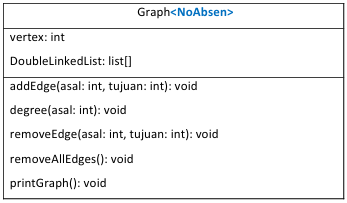
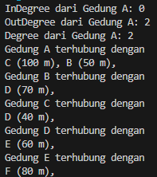
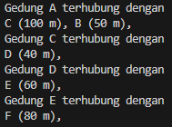
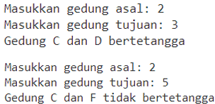
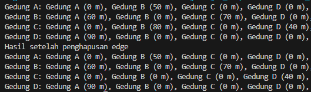

# Laporan Praktikum Pertemuan 10
#### Nama    : Muhammad Rafi Rajendra
#### Kelas   : TI-1H
#### NIM     : 2341720158

# <p align="center">JOBSHEET 15</p>
# <p align="center">GRAPH</p>

# 1. Tujuan Praktikum

Setelah melakukan praktikum ini, mahasiswa mampu: 
    1. memahami model graph 
    2. membuat dan mendeklarasikan struktur algoritma graph 
    3. menerapkan algoritma dasar graph dalam beberapa studi kasus 

# 2. Praktikum

## 2.1  Percobaan 1: Implementasi Graph menggunakan Linked List**

Sebuah universitas membuat program untuk memodelkan graf **berarah berbobot** yang mewakili gedung-gedung dan jarak antar gedung tersebut menggunakan Linked List. Setiap gedung dihubungkan dengan jalan yang memiliki jarak tertentu (dalam meter). Perhatikan class diagram Graph berikut ini. 



### 2.1.1 Langkah-langkah Percobaan 
**Waktu percobaan (90 menit)**

1. Buka text editor. Buat class Node<NoAbsen>.java dan DoubleLinkedList<NoAbsen>.java sesuai dengan praktikum Double Linked List.  
    **A. Class Node**

    Kode program yang terdapat pada class Node belum dapat mengakomodasi kebutuhan 
    pembuatan graf berbobot, sehingga diperlukan sedikit modifikasi. Setelah Anda menyalin 
    kode program dari class Node pada praktikum Double Linked List, tambahkan atribut jarak 
    bertipe int untuk menyimpan bobot graf.

    ```java
    int data;
    Node19 prev, next;
    int jarak;

    Node19(Node19 prev, int data, int jarak, Node19 next){
        this.prev = prev;
        this.data = data;
        this.next = next;
        this.jarak = jarak;
    }
    ```
    **B. Class DoubleLinkedList**

    Setelah Anda menyalin kode program dari class DoubleLinkedList pada praktikum Double 
    Linked List, lakukan modifikasi pada method addFirst agar dapat menerima parameter jarak 
    dan digunakan saat instansiasi Node

    ```java
    public void addFirst(int item, int jarak){
        if (isEmpty()) {
            head = new Node19(null, item, jarak, null);
        } else {
            Node19 newNode = new Node19(null, item, jarak, head);
            head.prev = newNode;
            head = newNode;
        }
        size++;
    }
    ```
    Selanjutnya buat method getJarak (hampir sama seperti method get) yang digunakan untuk mendapatkan nilai jarak edge antara dua node.

    ```java
    public int getJarak(int index)throws Exception{
        if (isEmpty() || index >= size) {
            throw new Exception("NIlai index di luar batas");
        }
        Node19 tmp = head;
        for (int i = 0; i < index; i++) {
            tmp = tmp.next;
        }
        return tmp.jarak;
    }
    ```

    Modifikasi method remove agar dapat melakukan penghapusan edge sesuai dengan node asal dan tujuan pada graf. Pada praktikum Double Linked List, parameter index digunakan untuk menghapus data sesuai posisi pada indeks tertentu, sedangkan pada Graf ini, penghapusan didasarkan pada data node tujuan, sehingga modifikasi kode diperlukan untuk menghindari index out of bound.

    ```java
    public void remove(int index){
        if (isEmpty() || index >= size) {
            System.out.println("Nilai index di luar batas");
        } else if (index == 0) {
            head = head.next;
            head.prev = null;
        } else {
            Node19 current = head;
            for (int i = 0; i < index; i++) {
                current = current.next;
            }
            current.prev.next = current.next;
            if (current.next != null) {
                current.next.prev = current.prev;
            }
        }
        size--;
    }
    ```
    **C. Class Graph**

    2. Buat file baru, beri nama Graph<NoAbsen>.java 
    3. Lengkapi class Graph dengan atribut yang telah digambarkan di dalam pada class diagram, yang terdiri dari atribut vertex dan DoubleLinkedList

    ```java
    int vertex;
    DoubleLinkedLists list[];
    ```
    4. Tambahkan konstruktor default untuk menginisialisasi variabel vertex dan menambahkan perulangan jumlah vertex sesuai dengan panjang array yang telah ditentukan.

    ```java
    public Graph19(int v){
        vertex = v;
        list = new DoubleLinkedLists[v];
        for (int i = 0; i < v; i++) {
            list[i] = new DoubleLinkedLists();
        }
    }
    ```
    5. Tambahkan method addEdge() untuk menghubungkan dua node. Baris kode program berikut digunakan untuk graf berarah (directed). 

    ```java
    public void addEdge(int asal, int tujuan, int jarak){
        list[asal].addFirst(tujuan, jarak);
    }
    ```
    Apabila graf yang dibuat adalah undirected graph, maka tambahkan kode berikut. 
    ```java
    list[tujuan].addFirst(asal, jarak);
    ```
    6. Tambahkan method degree() untuk menampilkan jumlah derajat lintasan pada setiap vertex. Kode program berikut digunakan untuk menghitung degree pada graf berarah

    ```java
    public void degree(int asal) throws Exception{
        int k, totalIn = 0, totalOut = 0;
        for (int i = 0; i < vertex; i++) {
            //inDegree
            for (int j = 0; j < list[i].size(); j++) {
                if (list[i].get(j) == asal) {
                    ++totalIn;
                }
            }
            //outDegree
            for (k = 0; k < list[asal].size(); k++) {
                list[asal].get(k);
            }
            totalOut = k;
        }
        System.out.println("InDegree dari Gedung " + (char) ('A' +asal) + ": " + totalIn);
        System.out.println("OutDegree dari Gedung " + (char) ('A' +asal) + ": " + totalOut);
        System.out.println("Degree dari Gedung " + (char) ('A' +asal) + ": " + (totalIn + totalOut));
    }
    ```
    Apabila graf yang dibuat adalah undirected graph, maka cukup gunakan kode berikut. 

    ```java
    System.out.println("Degree dari Gedung " + (char) ('A' + asal) + ": " + list[asal].size());
    ```

    7. Tambahkan method removeEdge() untuk menghapus lintasan pada suatu graph. Penghapusan membutuhkan 2 parameter yaitu node asal dan tujuan.

    ```java
    public void removeEdge(int asal, int tujuan) throws Exception{
        for (int i = 0; i < vertex; i++) {
            if (i == tujuan) {
                list[asal].remove(tujuan);
            }
        }
    }
    ```
    8. Tambahkan method removeAllEdges() untuk menghapus semua vertex yang ada di dalam  graf.
    
    ```java
    public void removeAllEdge(){
        for (int i = 0; i < vertex; i++) {
            list[i].clear();
        }
    }
    ```
    9. Tambahkan method printGraph() untuk mencetak graf.
    
    ```java
    public void printGraph()throws Exception{
        for (int i = 0; i < vertex; i++) {
            if (list[i].size() > 0) {
                System.out.println("Gedung " + (char) ('A' + i) + " terhubung dengan ");
                for (int j = 0; j < list[i].size(); j++) {
                    System.out.print((char) ('A' + list[i].get(j)) + " (" + list[i].getJarak(j) + " m), ");
                }
                System.out.println("");
            }
        }
        System.out.println("");
    }
    ```

    **D. Class Utama**

    10. Buat file baru, beri nama GraphMain<NoAbsen>.java 
    11. Tuliskan struktur dasar bahasa pemrograman Java yang terdiri dari fungsi main 
    12. Di dalam fungsi main, lakukan instansiasi object Graph bernama gedung dengan nilai parameternya adalah 6. 
    
    ```java
    Graph19 gedung = new Graph19(6);
    ```
    13. Tambahkan beberapa edge pada graf, tampilkan degree salah satu node, kemudian tampilkan grafnya. 

    ```java
        Graph19 gedung = new Graph19(6);
        gedung.addEdge(0, 1, 50);
        gedung.addEdge(0, 2, 100);
        gedung.addEdge(1, 3, 70);
        gedung.addEdge(2, 3, 40);
        gedung.addEdge(3, 4, 60);
        gedung.addEdge(4, 5, 80);
        gedung.degree(0);
        gedung.printGraph();
    ```

    14. Compile dan run program. 
        Catatan: Degree harus disesuaikan dengan jenis graf yang digunakan. Pada kasus ini, digunakan directed weighted graph 
    15. Tambahkan pemanggilan method removeEdge(), kemudian tampilkan kembali graf tersebut. 

    ```java
    gedung.remove(1, 3);
    gedung.printGraph();
    ```
    16. Commit dan push kode program ke Github 
    17. Compile dan run program. 


### 2.1.2 Verifikasi Hasil Percobaan 
Verifikasi hasil kompilasi kode program Anda dengan gambar berikut ini.

**Hasil running pada langkah 14**



**Hasil running pada langkah 17**



### 2.1.3 Pertanyaan 
1. Perbaiki kode program Anda apabila terdapat error atau hasil kompilasi kode tidak sesuai!
2. Pada class Graph, terdapat atribut list[] bertipe DoubleLinkedList. Sebutkan tujuan pembuatan variabel tersebut!

    jawab: Dalam class Graph19, atribut list[] berfungsi untuk menyimpan daftar tetangga atau hubungan (edges) dari setiap simpul (vertex) dalam graf
3. Jelaskan alur kerja dari method removeEdge!
    
    jawab: 

    Alur Kerja
    1. Pengecekan Simpul Tujuan:

    - Method removeEdge menerima dua parameter: asal dan tujuan, yang masing-masing merupakan indeks dari simpul asal dan simpul tujuan dari edge yang ingin dihapus.
    - Method ini menggunakan loop for untuk melakukan iterasi sebanyak jumlah vertex dalam graf.
    
    2. Loop Melalui Vertex:

    - Dalam loop for yang beriterasi dari 0 hingga vertex - 1, pengecekan dilakukan pada setiap iterasi untuk menentukan apakah indeks i sama dengan tujuan.
    - Catatan: Loop ini sebenarnya tidak perlu untuk mengecek semua vertex, karena tujuan hanya untuk memeriksa tujuan dan langsung menghapus edge dari asal ke tujuan. Jadi, loop ini dapat dianggap berlebihan.
    
    3. Menghapus Edge:

    - Jika kondisi if (i == tujuan) terpenuhi, maka method remove pada linked list yang terletak di list[asal] dipanggil untuk menghapus elemen yang menyimpan tujuan.
    - Method remove pada linked list bertugas untuk menemukan dan menghapus node yang berisi nilai tujuan.

4. Apakah alasan pemanggilan method addFirst() untuk menambahkan data, bukan method add jenis lain saat digunakan pada method addEdge pada class Graph?

    jawab: karena method addFirst() menambahkan elemen baru di awal linked list, menambahkan elemen di awal linked list tidak memerlukan pengecekan atau iterasi untuk menemukan posisi akhir list. Kenapa tidak menggunakan addLast() atau lainnya karena method addLast() merupakan penambahan di akhir list mungkin memerlukan iterasi sampai ke elemen terakhir, yang bisa membuat operasi lebih lambat dibandingkan addFirst(), terutama jika list sangat panjang.
5. Modifikasi kode program sehingga dapat dilakukan pengecekan apakah terdapat jalur antara suatu node dengan node lainnya, seperti contoh berikut (Anda dapat memanfaatkan Scanner).

    

## 2.2 Percobaan 2: Implementasi Graph menggunakan Matriks 
Dengan menggunakan kasus yang sama dengan Percobaan 1, pada percobaan ini implementasi graf dilakukan dengan menggunakan matriks dua dimensi.

###  Langkah-langkah Percobaan 
**Waktu percobaan: 60 menit**
1. Buat file baru, beri nama GraphMatriks<NoAbsen>.java 
2. Lengkapi class GraphMatriks dengan atribut vertex dan matriks

    ```java
    int vertex;
    int[][] matriks;
    ```
3. Tambahkan konstruktor default untuk menginisialisasi variabel vertex dan menginstansiasi panjang array dua dimensi yang telah ditentukan. 

    ```java
    public GraphMatriks19(int v){
        vertex = v;
        matriks = new int[v][v];
    }
    ```
4. Untuk membuat suatu lintasan yang menghubungkan dua node, maka dibuat method makeEdge() sebagai berikut. 

    ```java
    public void makeEdge(int asal, int tujuan, int jarak){
        matriks[asal][tujuan] = jarak;
    }
    ```
5. Tambahkan method removeEdge() untuk menghapus lintasan pada suatu graf.

    ```java
    public void removeEdge(int asal, int tujuan){
        matriks[asal][tujuan] = 0;
    }
    ```
6. Tambahkan method printGraph() untuk mencetak graf.
    
    ```java
    public void printGraph() {
        for (int i = 0; i < vertex; i++) {
            System.out.print("Gedung " + (char) ('A' + i) + ": ");
            for (int j = 0; j < vertex; j++) {
                if (matriks[i][j] != -1) {
                    System.out.print("Gedung " + (char) ('A' + j) + " (" + matriks[i][j] + " m), ");
                }
            }
            System.out.println();
        }
    }
    ```
7. Tambahkan kode berikut pada file GraphMain<NoAbsen>.java yang sudah dibuat pada Percobaan 1. 
    
    ```java
    GraphMatriks19 gdg = new GraphMatriks19(4);
    gdg.makeEdge(0, 1, 50);
    gdg.makeEdge(1, 0, 60);
    gdg.makeEdge(1, 2, 70);
    gdg.makeEdge(2, 1, 80);
    gdg.makeEdge(2, 3, 40);
    gdg.makeEdge(3, 0, 90);
    gdg.printGraph();
    System.out.println("Hasil setelah penghapusan edge");
    gdg.removeEdge(2, 1);
    gdg.printGraph();
    ```
8. Commit dan push kode program ke Github 
9. Compile dan run program. 

### 2.2.2 Verifikasi Hasil Percobaan
Verifikasi hasil kompilasi kode program Anda dengan gambar berikut ini.



### 2.2.3 Pertanyaan
1. Perbaiki kode program Anda apabila terdapat error atau hasil kompilasi kode tidak sesuai! 
2. Apa jenis graph yang digunakan pada Percobaan 2? 

    jawab: Pada percobaan di atas, jenis graf yang digunakan adalah directed graph
3. Apa maksud dari dua baris kode berikut?

    ```java
    gdg.makeEdge(1, 2, 70);
    gdg.makeEdge(2, 1, 80);
    ```

    jawab: Maksud dari dua baris kode diatas adalah menunjukkan bahwa dua edge dibuat dalam graf yang ada
4. Modifikasi kode program sehingga terdapat method untuk menghitung degree, termasuk 
inDegree dan outDegree!

    jawab: 

    ```java
    public int outDegree(int v) {
        int degree = 0;
        for (int i = 0; i < vertex; i++) {
            if (matriks[v][i] != -1) {
                degree++;
            }
        }
        return degree;
    }

    public int inDegree(int v) {
        int degree = 0;
        for (int i = 0; i < vertex; i++) {
            if (matriks[i][v] != -1) {
                degree++;
            }
        }
        return degree;
    }

    public int totalDegree(int v) {
        return inDegree(v) + outDegree(v);
    }

    public void printDegrees() {
        for (int i = 0; i < vertex; i++) {
            System.out.println("Gedung " + (char) ('A' + i) + ": inDegree = " + inDegree(i) + ", outDegree = " + outDegree(i) + ", totalDegree = " + totalDegree(i));
        }
    }
    ```

## 3. Latihan Praktikum 
**Waktu percobaan: 90 menit** 
1. Modifikasi kode program pada class GraphMain sehingga terdapat menu program yang bersifat dinamis, setidaknya terdiri dari: 
   - a) Add Edge 
   - b) Remove Edge 
   - c) Degree 
   - d) Print Graph 
   - e) Cek Edge

    Pengguna dapat memilih menu program melalui input Scanner 

    jawab: 

    ```java
    public static void main(String[] args) throws Exception {
        Scanner scanner = new Scanner(System.in);
        Graph19 gedung = new Graph19(6);

        boolean running = true;
        while (running) {
            System.out.println("Menu:");
            System.out.println("a) Tambah Edge");
            System.out.println("b) Hapus Edge");
            System.out.println("c) Degree");
            System.out.println("d) Cetak Graph");
            System.out.println("e) Cek Edge");
            System.out.println("f) Update Jarak");
            System.out.println("g) Keluar");
            System.out.print("Pilih opsi: ");
            char choice = scanner.next().charAt(0);

            switch (choice) {
                case 'a':
                    System.out.print("Masukkan asal, tujuan, dan jarak (misal: 0 1 50): ");
                    int asal = scanner.nextInt();
                    int tujuan = scanner.nextInt();
                    int jarak = scanner.nextInt();
                    gedung.addEdge(asal, tujuan, jarak);
                    break;
                case 'b':
                    System.out.print("Masukkan asal dan tujuan untuk menghapus edge (misal: 1 3): ");
                    asal = scanner.nextInt();
                    tujuan = scanner.nextInt();
                    gedung.removeEdge(asal, tujuan);
                    break;
                case 'c':
                    System.out.print("Masukkan vertex untuk mencari degree (misal: 0): ");
                    asal = scanner.nextInt();
                    gedung.degree(asal);
                    break;
                case 'd':
                    gedung.printGraph();
                    break;
                case 'e':
                    System.out.print("Masukkan asal dan tujuan untuk mengecek edge (misal: 0 1): ");
                    asal = scanner.nextInt();
                    tujuan = scanner.nextInt();
                    boolean exists = gedung.checkEdge(asal, tujuan);
                    System.out.println("Edge ada: " + exists);
                    break;
                case 'f':
                    System.out.print("Masukkan asal, tujuan, dan jarak baru (misal: 0 1 75): ");
                    asal = scanner.nextInt();
                    tujuan = scanner.nextInt();
                    jarak = scanner.nextInt();
                    gedung.updateJarak(asal, tujuan, jarak);
                    break;
                case 'g':
                    running = false;
                    break;
                default:
                    System.out.println("Opsi tidak valid, silakan coba lagi.");
            }
            System.out.println();
        }
        scanner.close();
    }
    ```
2. Tambahkan method updateJarak pada Percobaan 1 yang digunakan untuk mengubah jarak antara dua node asal dan tujuan!

    jawab:

    ```java
    public void updateJarak(int asal, int tujuan, int jarakBaru) throws Exception {
        list[asal].updateJarak(tujuan, jarakBaru);
    }
    ```
3. Tambahkan method hitungEdge untuk menghitung banyaknya edge yang terdapat di dalam graf!

    jawab: 

    ```java
    public int hitungEdge() {
        int totalEdges = 0;
        for (int i = 0; i < vertex; i++) {
            totalEdges += list[i].size();  // Menambahkan jumlah node (edge) dari setiap linked list
        }
        return totalEdges;
    }    
    ```