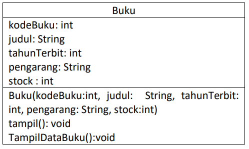
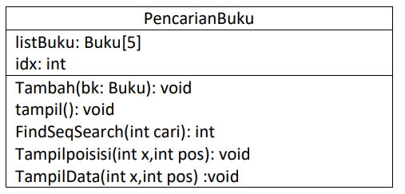

# Laporan Praktikum Pertemuan 6
#### Nama    : Muhammad Rafi Rajendra
#### Kelas   : TI-1H
#### NIM     : 2341720158

## JOBSHEET VI
## SEARCHING
## 6.1. Tujuan Praktikum
Setelah melakukan materi praktikum ini, mahasiswa mampu:
1. Menjelaskan mengenai algoritma Searching.
2. Membuat dan mendeklarasikan struktur algoritma Searching.
3. Menerapkan dan mengimplementasikan algoritma Searching.

## 6.2. Searching / Pencarian Menggunakan Agoritma Sequential Search
Perhatikan diagram class Buku di bawah ini! Diagram class ini yang selanjutnya akan dibuat sebagai acuan dalam membuat kode program class Buku.



Berdasarkan class diagram di atas, akan dibuat class Buku yang berfunsi untuk membuat objek 
buku yang akan dimasukan ke dalam sebuah array. Terdapat sebuah konstruktor berparameter dan 
juga Method tampil() untuk menampilkan semua attribute yang ada.



Selanjutnya class diagram PencarianBuku merupakan representasi dari sebuah class yang 
berfungsi untuk melakukan operasi-operasi dari objek array Buku, misalkan untuk menambahkan 
objek Buku, menampilkan semua data Buku, untuk melakukan pencarian berdasarkan kode Buku 
menggunakan algoritma Sequential Search, menampilkan posisi dari data yang dicari, serta 
menampilkan data Buku yang dicari.


### 6.2.1. Langkah-langkah Percobaan Sequential Search

1. Buatlah Project baru pada dengan nama TestSearching
2. Kemuadian buat packages baru dengan nama P7
3. Buat class BukuNoAbsen, kemudian deklarasikan atribut berikut ini:

```java
public class Buku19 {
    int kodeBuku, tahunTerbit, stock ;
    String judulBuku, pengarang;
}
```

4. Buatlah konstruktor dengan nama Buku dengan parameter (String kodeBuku, String 
judulBuku, int tahunTerbit, String pengarang, int stock) kemudian Isi 
konstruktor tersebut dengan kode berikut! 

```java
    public Buku19(int kodeBuku, int tahunTerbit, int stock, String judulBuku, String pengarang){
        this.judulBuku = judulBuku;
        this.kodeBuku = kodeBuku;
        this.tahunTerbit = tahunTerbit;
        this.stock = stock;
        this.pengarang = pengarang;
    }
```

5. Buatlah method tampilDataBuku bertipe void.

```java
    void tampilDataBuku(){
        System.out.println("===========================");
        System.out.println("Kode Buku: " + kodeBuku);
        System.out.println("Judul Buku: " + judulBuku);
        System.out.println("Tahun Terbit: " + tahunTerbit);
        System.out.println("Pengarang: " + pengarang);
        System.out.println("Stock: " + stock);
    }
```

6. Buat class baru dengan nama PencarianBukuNoAbsen seperti di bawah ini!

```java
public class PencarianBuku19 {
    Buku19 listBk[] = new Buku19[5];
    int idx;
}
```

7. Tambahkan method tambah() di dalam class tersebut! Method tambah() digunakan untuk 
menambahkan objek dari class Buku ke dalam atribut listBk.

```java
    void tambah(Buku19 m){
        if (idx < listBk.length) {
            listBk[idx] = m;
            idx++;
        } else {
            System.out.println("Data sudah penuh");
        }
    }
```

8. Tambahkan method tampil() di dalam class PencarianBukuNoAbsen Method tampil()
digunakan untuk menampilkan semua data buku yang ada di dalam class tersebut! Perhatikan 
penggunaan sintaks for yang menggunakan konsep for-each. Syntax tersebut akan memberikan 
tanda error berupa garis merah, Perbaiki agar tidak ada error!

```java
   void tampil(){
        for(Buku19 m : listBk){
            m.tampilDataBuku();
        }
    }
```

9. Tambahkan method FindSeqSearch bertipe integer dengan parameter cari bertipe int. 
Kemudian Deklarasikan isi method FindSeqSearch dengan algoritma pencarian data 
menggunakan teknik sequential searching.

```java
    public int FindSeqSearch(int cari){
        int posisi = 0;
        for (int j = 0; j < listBk.length; j++) {
            j = posisi;
            break;
        }
        return -1;
    }
```

10. Buatlah method Tampilpoisisi bertipe void dan Deklarasikan isi dari method 
Tampilpoisisi.

```java
    public void Tampilposisi(int x, int pos){
        if (pos != -1) {
            System.out.println("Data : " + x + " ditemukan pada indeks " + pos);
        } else {
            System.out.println("Data : " + x + " tidak ditemukan");
        }
    }
```

11. Buatlah class baru dengan nama BukuMainNoAbsen tambahkan method main. buatlah 
sebuah objek PencarianMhs dan buatlah 5 objek buku kemudian tambahkan semua objek buku
tersebut dengan memanggil fungsi tambah pada objek PencarianBuku.

```java
package p7;

import java.util.Scanner;

public class BukuMain19 {
    public static void main(String[] args) {
        Scanner s = new Scanner(System.in);
        Scanner s1 = new Scanner(System.in);
    
        PencarianBuku19 data = new PencarianBuku19();
        int jumBuku = 5;

        System.out.println("-------------------------------------------------------------------");
        System.out.println("MASUKKAN DATA BUKU SECARA URUT DARI KODE BUKU TERKECIL: ");
        for (int i = 0; i < jumBuku; i++) {
            System.out.println("---------------------");
            System.out.print("Kode Buku \t : ");
            int kodeBuku = s.nextInt();            
            System.out.print("Judul Buku \t : ");
            String judulBuku = s1.nextLine();
            System.out.print("Kode Terbit \t : ");
            int tahunTerbit = s.nextInt();            
            System.out.print("Pengarang \t : ");
            String pengarang = s1.nextLine();            
            System.out.print("Stock \t\t : ");
            int stock = s.nextInt();
            
            Buku19 m = new Buku19(kodeBuku, tahunTerbit, stock, judulBuku, pengarang);
            data.tambah(m);
        }
    }
}        
```

12. Panggil method tampil() untuk melihat semua data yang telah dimasukan.

```java
        System.out.println("-------------------------------------------------------------------");
        System.out.println("DATA KESELURUHAN BUKU : ");
        System.out.println("-------------------------------------------------------------------");
        data.tampil();
```

13. Untuk melakukan pencarian berdasarkan kode buku. Buatlah variable cari yang dapat 
menampung masukan dari keyboard lalu panggil method FindSeqSearch dengan isi 
parameternya adalah variable cari. Untuk menampilkan index data yang dicari panggil method 
TampilPosisi

```java

        System.out.println("--------------------------------------------------------------------");
        System.out.println("--------------------------------------------------------------------");
        System.out.println("PENCARIAN DATA : ");
        System.out.println("Masukkan kode buku yang dicari: ");
        System.out.print("Kode Buku: ");
        int cari = s.nextInt();
        System.out.println("Menggunakan sequential Search");
        int posisi = data.FindSeqSearch(cari);
        data.Tampilposisi(cari, posisi);
```

Verifikasi hasil pencarian :


14. Buatlah method TampilData bertipe void pada class PencarianBukuNoAbsen dan 
tambahkan isi dari method TampilData.

```java
    public void TampilData(int x, int pos){
        if (pos != -1) {
            System.out.println("Kode Buku \t : " + x);
            System.out.println("Judul \t\t : " + listBk[pos].judulBuku);
            System.out.println("Tahun Terbit \t : " + listBk[pos].tahunTerbit);
            System.out.println("Pengarang \t : " + listBk[pos].pengarang);
            System.out.println("Stock \t\t : " + listBk[pos].stock);
        } else {
            System.out.println("data  " + x + " tidak ditemukan");
        }
    }
```

15. Di dalam method main(), Lakukan pemanggilan method TampilData dari class 
PencarianMhs.

```java
data.TampilData(cari, posisi);
```

16. Jalankan dan amati hasilnya.

### 6.2.2. Verifikasi Hasil Percobaan

Cocokkan hasil kode program anda dengan gambar berikut ini. Jika hasil belum cocok, perbaiki kode 
program Anda!

Jika data ditemukan:


Jika data tidak ditemukan :


### 6.2.3. Pertanyaan
1. Jelaskan fungsi break yang ada pada method FindSeqSearch!
    
    Jawab: Fungsi break yang terdapat pada method FindSeqSearch berfungsi untuk menghentikan perulangan for apabila elemen yang dicari sudah ditemukan dan memastikan nilai yang dikembalikan adalah posisi elemen yang dicari atau -1 elemen tidak ditemukan.
2. Jika Data Kode Buku yang dimasukkan tidak terurut dari kecil ke besar. Apakah program masih dapat berjalan? Apakah hasil yang dikeluarkan benar? Tunjukkan hasil screenshoot untuk bukti dengan kode Buku yang acak. Jelaskan Mengapa hal tersebut bisa terjadi?

    Jawab: Program masih dapat berjalan hal ini terjadi dikarenakan proses seqeuential search tidak memerlukan data yang terurut.

    

    

    


3. Buat method baru dengan nama FindBuku menggunakan konsep sequential search dengan tipe 
method dari FindBuku adalah BukuNoAbsen. Sehingga Anda bisa memanggil method 
tersebut pada class BukuMain seperti gambar berikut :

    

    ```java
        public Buku19 FindBuku(int cari){
        for (int j = 0; j < listBk.length; j++) {
            if (listBk[j].kodeBuku == cari) {
                return listBk[j];
            }
        }
        return null;
    }
    ```

## 6.3. Searching / Pencarian Menggunakan Binary Search
### 6.3.1. Langkah-langkah Percobaan Binary Search
1. Pada percobaan 6.2.1 (sequential search) tambahkan method FindBinarySearch bertipe 
integer pada class PencarianBukuNoAbsen. Kemudian Deklarasikan isi method 
FindBinarySearch dengan algoritma pencarian data menggunakan teknik binary searching.

    ```java
        public int FindBinarySearch(int cari, int left, int right){
        int mid;

        if (left <= right) {
            mid = (left + right) / 2;
            if (cari == listBk[mid].kodeBuku) {
                return mid;
            } else if (listBk[mid].kodeBuku > cari) {
                return FindBinarySearch(cari, left, mid-1);
            } else {
                return FindBinarySearch(cari, mid+1, right);
            }
        } else {
            return -1;
        }
    }
    ```

2. Panggil method FindBinarySearch di kelas BukuMainNoAbsen. Kemudia panggil
method tampilposisi dan tampilData

    ```java
        System.out.println("==============================");
        System.out.println("MENGGUNAKAN BINARY SEARCH");
        posisi = data.FindBinarySearch(cari, 0, jumBuku - 1);
        data.Tampilposisi(cari, posisi);
        data.TampilData(cari, posisi);
    ```
    
3. Jalankan dan amati hasilnya.

### 6.3.2. Verifikasi Hasil Percobaan
Cocokkan hasil kode program anda dengan gambar berikut ini. Jika hasil belum cocok, perbaiki kode program Anda! hasil kode yang ditampilkan berikut ini adalah hasil pencarian dengan menampilkan index dan data yang dicari. Hasil running penambahan data dan menampilkan data dapat anda lakukan seperti pada percobaan 6.2.1 langkah Nomor 13.


### 6.3.3. Pertanyaan
1. Tunjukkan pada kode program yang mana proses divide dijalankan!

    Jawab: proses divide dijalankan pada kode program berikut ditunjukkan pada mid = (left + right) / 2

    ```java
    if (left <= right) {
            mid = (left + right) / 2;
            if (cari == listBk[mid].kodeBuku) {
                return mid;
            } else if (listBk[mid].kodeBuku > cari) {
                return FindBinarySearch(cari, left, mid-1);
            } else {
                return FindBinarySearch(cari, mid+1, right);
            }
        } else {
            return -1;
        }
    ```

2. Tunjukkan pada kode program yang mana proses conquer dijalankan!
    
    Jawab: proses conquer dijalankan pada kode program berikut ditunjukkan pada


    ```java
            if (cari == listBk[mid].kodeBuku) {
                return mid;
            } else if (listBk[mid].kodeBuku > cari) {
                return FindBinarySearch(cari, left, mid-1);
            } else {
                return FindBinarySearch(cari, mid+1, right);
            }
    ```

3. Jika data Kode Buku yang dimasukkan tidak urut. Apakah program masih dapat berjalan? Mengapa demikian! Tunjukkan hasil screenshoot untuk bukti dengan kode Buku yang acak. Jelaskan Mengapa hal tersebut bisa terjadi? 

    Jawab: jika memasukkan data kode buku secara tidak urut program akan berjalan tetapi pada proses binary search tidak bisa berjalan karena pada proses binary search dibutuhkan data yang sudah terurut.

    
4. Jika Kode Buku yang dimasukkan dari Kode Buku terbesar ke terkecil (missal : 20215, 20214, 
20212, 20211, 20210) dan elemen yang dicari adalah 20210. Bagaimana hasil dari binary search? 
Apakah sesuai? Jika tidak sesuai maka ubahlah kode program binary seach agar hasilnya sesuai!

    Jawab: hasil pada binary search tidak sesuai

    

    Kode program yang diubah pada class PencarianBuku19

    ```java
     public int FindBinarySearch(int cari, int left, int right) {
        bubbleSortBuku();
        int mid;
        if (right >= left) {
            mid = (left + right) / 2;
            if (listBk[mid].kodeBuku == cari) {
                return mid;
            } else if (listBk[mid].kodeBuku > cari) {
                return FindBinarySearch(cari, left, mid - 1);
            } else {
                return FindBinarySearch(cari, mid + 1, right);
            }
        }
        return -1;
    }

    void bubbleSortBuku() {
        for (int i = 0; i < listBk.length - 1; i++) {
            for (int j = 1; j < listBk.length - i; j++) {
                if (listBk[j].kodeBuku < listBk[j - 1].kodeBuku) {
                    Buku19 tmp = listBk[j];
                    listBk[j] = listBk[j - 1];
                    listBk[j - 1] = tmp;
                }
            }
        }
    }
    ```
    Kode program yang diubah pada class BukuMain19

    ```java
            System.out.println("==============================");
        System.out.println("MENGGUNAKAN BINARY SEARCH");
        data.bubbleSortBuku();
        posisi = data.FindBinarySearch(cari, 0, jumBuku - 1);
        data.Tampilposisi(cari, posisi);
        data.TampilData(cari, posisi);
    ```

    Output setelah kode program diubah

    

    Setelah mengubah kode program pada class PencarianBuku19 dan BukuMain19 maka hasilnya sudah sesuai.

## 6.4. Percobaan Pengayaan Divide and Conquer
### 6.4.1. Langkah-langkah Percobaan Merge Sort
1. Buatlah Package baru didalam package P5 dengan nama MergeSortTest
2. Tambahkan class MergeSortingNoAbsen pada package tersebut
3. Pada class MergeSortingNoAbsen buatlah method mergeSort yang menerima parameter 
data array yang akan diurutkan

    ```java
        public void mergeSort(int[] data) {
        sort(data, 0, data.length - 1);
    }
    ```

4. Buatlah method merge untuk melakukan proses penggabungan data dari bagian kiri dan kanan.

    ```java
    public void merge(int[] data, int left, int middle, int right) {
    }
    ```

5. Implementasikan proses merge sebagai berikut. 

    ```java
        public void merge(int[] data, int left, int middle, int right) {
        int[] temp = new int[data.length];
        for (int i = left; i <= right; i++) {
            temp[i] = data[i];
        }
        int a = left;
        int b = middle + 1;
        int c = left;

        while (a <= middle && b <= right) {
            if (temp[a] < temp[b]) {
                data[c] = temp[a];
                a++;
            } else {
                data[c] = temp[b];
                b++;
            }
            c++;
        }

        int s = middle - a;
        for (int i = 0; i <= s; i++) {
            data[c + i] = temp[a + i];
        }
    }
    ```

6. Buatlah method sort

    ```java
    public void sort(int data[], int left, int right) {
    }
    ```

7. Implementasikan kode berikut pada method sort

    ```java
        public void sort(int data[], int left, int right) {
        if (left < right) {
            int middle = (left + right) / 2;
            sort(data, left, middle);
            sort(data, middle + 1, right);
            merge(data, left, middle, right);
        }
    }
    ```

8. Pada method mergeSort, panggil method sort dengan parameter data yang ingin diurutkan 
serta range data awal sampai dengan akhir.

9. Tambahkan method printArray

    ```java
        public void printArray(int arr[]) {
        for (int i = 0; i < arr.length; i++) {
            System.out.print(arr[i] + " ");
        }
        System.out.println();
    }
    ```

10. Sebagai langkah terakhir, deklarasikan data yang akan diurutkan kemudian panggil proses 
sorting pada class MergeSortMainNoAbsen. Tambahkan fungsi main pada kelas tersebut, 
kemudian tuliskan kode berikut didalam fungsi main.

    ```java
        public static void main(String[] args) {
        int data[] = {10,40,30,50,70,20,100,90};
        System.out.println("sorting dengan merge sort");
        MergeSorting19 mSort = new MergeSorting19();
        System.out.println("data awal");
        mSort.printArray(data);
        mSort.mergeSort(data);
        System.out.println("setelah diurutkan");
        mSort.printArray(data);
    }
    ```

### 6.4.2. Verifikasi Hasil Percobaan
Cocokkan hasil compile kode program anda dengan gambar berikut ini. 


## 6.5. Latihan Praktikum
1. Modifikasi percobaan searching diatas dengan ketentuan berikut ini
- Ubah tipe data dari kode Buku yang awalnya int menjadi String
- Tambahkan method untuk pencarian kode Buku (bertipe data String) dengan menggunakan 
sequential search dan binary search.

    Jawab: dalam memodifikasi percobaan searching maka saya telah mengubah kode program pada class Buku19, PencarianBuku19 dan juga pada main kode program BukuMain19. Berikut merupakan kode program dari masing-masing class dan juga pada main kode program.

    Class Buku19

    ```java
    package p7.TestSearching;

    public class Buku19 {
        static Buku19[] listBuku = new Buku19[5]; 
        static int jumlahBuku = 0;
        int tahunTerbit, stock;
        String judulBuku, pengarang, kodeBuku;

        public Buku19(String kodeBuku, int tahunTerbit, int stock, String judulBuku, String pengarang) {
            this.judulBuku = judulBuku;
            this.kodeBuku = kodeBuku;
            this.tahunTerbit = tahunTerbit;
            this.stock = stock;
            this.pengarang = pengarang;
            Buku19.listBuku[jumlahBuku] = this; 
            jumlahBuku++;
        }

        void tampilDataBuku() {
            System.out.println("===========================");
            System.out.println("Kode Buku: " + kodeBuku);
            System.out.println("Judul Buku: " + judulBuku);
            System.out.println("Tahun Terbit: " + tahunTerbit);
            System.out.println("Pengarang: " + pengarang);
            System.out.println("Stock: " + stock);
        }
    }
    ```

    Class PencarianBuku19

    ```java
    package p7.TestSearching;

    public class PencarianBuku19 {
        Buku19 listBk[] = new Buku19[5];
        int idx;

        void tambah(Buku19 m){
            if (idx < listBk.length) {
                listBk[idx] = m;
                idx++;
            } else {
                System.out.println("Data sudah penuh");
            }
        }

        void tampil(){
            for(Buku19 m : listBk){
                m.tampilDataBuku();
            }
        }

        public int FindSeqSearch(int cari){
            int posisi = -1;
            for (int j = 0; j < listBk.length; j++) {
                if (Integer.parseInt(listBk[j].kodeBuku) == cari) {
                    posisi = j;
                    break;
                }
            } 
            return posisi;
        }

        public void Tampilposisi(int x, int pos){
            if (pos != -1) {
                System.out.println("Data : " + x + " ditemukan pada indeks " + pos);
            } else {
                System.out.println("Data : " + x + " tidak ditemukan");
            }
        }

        public void TampilData(int x, int pos){
            if (pos != -1) {
                System.out.println("Kode Buku \t : " + x);
                System.out.println("Judul \t\t : " + listBk[pos].judulBuku);
                System.out.println("Tahun Terbit \t : " + listBk[pos].tahunTerbit);
                System.out.println("Pengarang \t : " + listBk[pos].pengarang);
                System.out.println("Stock \t\t : " + listBk[pos].stock);
            } else {
                System.out.println("data  " + x + " tidak ditemukan");
            }
        }

        public int FindBinarySearch(int cari, int left, int right) {
            bubbleSortBuku();
            int mid;
            if (right >= left) {
                mid = (left + right) / 2;
                if (Integer.parseInt(listBk[mid].kodeBuku) == cari) {
                    return mid;
                } else if (Integer.parseInt(listBk[mid].kodeBuku) > cari) {
                    return FindBinarySearch(cari, left, mid - 1);
                } else {
                    return FindBinarySearch(cari, mid + 1, right);
                }
            }
            return -1;
        }

        void bubbleSortBuku() {
            for (int i = 0; i < listBk.length - 1; i++) {
                for (int j = 1; j < listBk.length - i; j++) {
                    if (Integer.parseInt(listBk[j].kodeBuku) < Integer.parseInt(listBk[j - 1].kodeBuku)) {
                        Buku19 tmp = listBk[j];
                        listBk[j] = listBk[j - 1];
                        listBk[j - 1] = tmp;
                    }
                }
            }
        }    
        public Buku19 FindBuku(int cari){
            for (int j = 0; j < listBk.length; j++) {
                if (Integer.parseInt(listBk[j].kodeBuku) == cari) {
                    return listBk[j];
                }
            }
            return null;
        }
    }
    ```

    Main kode program BukuMain19

    ```java
    package p7.TestSearching;

    import java.util.Scanner;

    public class BukuMain19 {
        public static void main(String[] args) {
            Scanner s = new Scanner(System.in);
            Scanner s1 = new Scanner(System.in);
            
            
            PencarianBuku19 data = new PencarianBuku19();
            int jumBuku = 5;
            
            
            System.out.println("-------------------------------------------------------------------");
            System.out.println("MASUKKAN DATA BUKU SECARA URUT DARI KODE BUKU TERKECIL: ");
            for (int i = 0; i < jumBuku; i++) {
                System.out.println("---------------------");
                System.out.print("Kode Buku \t : ");
                String kodeBuku = s1.nextLine();            
                System.out.print("Judul Buku \t : ");
                String judulBuku = s1.nextLine();
                System.out.print("Tahun Terbit \t : ");
                int tahunTerbit = s.nextInt();            
                System.out.print("Pengarang \t : ");
                String pengarang = s1.nextLine();            
                System.out.print("Stock \t\t : ");
                int stock = s.nextInt();
                
                Buku19 m = new Buku19(kodeBuku, tahunTerbit, stock, judulBuku, pengarang);
                data.tambah(m);
            }
            
            
            System.out.println("-------------------------------------------------------------------");
            System.out.println("DATA KESELURUHAN BUKU : ");
            System.out.println("-------------------------------------------------------------------");
            data.tampil();
            System.out.println("--------------------------------------------------------------------");
            System.out.println("--------------------------------------------------------------------");
            System.out.println("PENCARIAN DATA : ");
            System.out.println("Masukkan kode buku yang dicari: ");
            System.out.print("Kode Buku: ");
            int cari = s.nextInt();
            Buku19 dataBuku19 = data.FindBuku(cari);
            dataBuku19.tampilDataBuku();
            System.out.println("Menggunakan sequential Search");
            int posisi = data.FindSeqSearch(cari);
            data.Tampilposisi(cari, posisi);
            data.TampilData(cari, posisi);

            s.close();
            s1.close();

            System.out.println("==============================");
            System.out.println("MENGGUNAKAN BINARY SEARCH");
            data.bubbleSortBuku();
            posisi = data.FindBinarySearch(cari, 0, jumBuku - 1);
            data.Tampilposisi(cari, posisi);
            data.TampilData(cari, posisi);
        }
    }
    ```

    Berikut merupakan output dari kode program yang sudah dimodifikasi

    
    
    

2. Modifikasi percobaan searching diatas dengan ketentuan berikut ini
- Tambahkan method pencarian judul buku menggunakan sequential search dan binary 
search. Sebelum dilakukan searching dengan binary search data harus dilakukan pengurutan 
dengan menggunakan algoritma Sorting (bebas pilih algoritma sorting apapun)! Sehingga 
ketika input data acak, maka algoritma searching akan tetap berjalan
- Buat aturan untuk mendeteksi hasil pencarian judul buku yang lebih dari 1 hasil dalam 
bentuk kalimat peringatan! Pastikan algoritma yang diterapkan sesuai dengan kasus yang 
diberikan!

    Jawab: dengan memodifikasi percobaan searching diatas maka saya melakukan perubahan pada class PencarianBuku19 dengan manambahbahkan method public void TampilPosisiByJudulBuku(String judul, int posisi), public void TampilDataByJudulBuku(String judul, int posisi), public int findSeqSearchByJudulBuku(String judulBuku), public int findBinarySearchByJudulBuku(String judulBuku), public void insertionSortJudulBuku(). Saya juga merubah pada BukuMain19 dengan menambahkan menu untuk memilih antara mencari buku dengan kode atau dengan judul dengan menambahan switch case. Berikut merupakan kode program pada Class PencarianBuku19 dan pada BukuMain19

    PencarianBuku19

    ```java
    package p7.TestSearching;

    public class PencarianBuku19 {
        Buku19 listBk[] = new Buku19[5];
        int idx;

        void tambah(Buku19 m){
            if (idx < listBk.length) {
                listBk[idx] = m;
                idx++;
            } else {
                System.out.println("Data sudah penuh");
            }
        }

        void tampil(){
            for(Buku19 m : listBk){
                m.tampilDataBuku();
            }
        }

        public int FindSeqSearch(int cari){
            int posisi = -1;
            for (int j = 0; j < listBk.length; j++) {
                if (Integer.parseInt(listBk[j].kodeBuku) == cari) {
                    posisi = j;
                    break;
                }
            } 
            return posisi;
        }

        public void Tampilposisi(int x, int pos){
            if (pos != -1) {
                System.out.println("Data : " + x + " ditemukan pada indeks " + pos);
            } else {
                System.out.println("Data : " + x + " tidak ditemukan");
            }
        }

        public void TampilData(int x, int pos){
            if (pos != -1) {
                System.out.println("Kode Buku \t : " + x);
                System.out.println("Judul \t\t : " + listBk[pos].judulBuku);
                System.out.println("Tahun Terbit \t : " + listBk[pos].tahunTerbit);
                System.out.println("Pengarang \t : " + listBk[pos].pengarang);
                System.out.println("Stock \t\t : " + listBk[pos].stock);
            } else {
                System.out.println("data  " + x + " tidak ditemukan");
            }
        }

        public int FindBinarySearch(int cari, int left, int right) {
            bubbleSortBuku();
            int mid;
            if (right >= left) {
                mid = (left + right) / 2;
                if (Integer.parseInt(listBk[mid].kodeBuku) == cari) {
                    return mid;
                } else if (Integer.parseInt(listBk[mid].kodeBuku) > cari) {
                    return FindBinarySearch(cari, left, mid - 1);
                } else {
                    return FindBinarySearch(cari, mid + 1, right);
                }
            }
            return -1;
        }

        void bubbleSortBuku() {
            for (int i = 0; i < listBk.length - 1; i++) {
                for (int j = 1; j < listBk.length - i; j++) {
                    if (Integer.parseInt(listBk[j].kodeBuku) < Integer.parseInt(listBk[j - 1].kodeBuku)) {
                        Buku19 tmp = listBk[j];
                        listBk[j] = listBk[j - 1];
                        listBk[j - 1] = tmp;
                    }
                }
            }
        }    
        public Buku19 FindBuku(int cari){
            for (int j = 0; j < listBk.length; j++) {
                if (Integer.parseInt(listBk[j].kodeBuku) == cari) {
                    return listBk[j];
                }
            }
            return null;
        }

        public void TampilPosisiByJudulBuku(String judul, int posisi) {
            if (posisi != -1) {
                System.out.println("Data buku dengan judul '" + judul + "' ditemukan pada indeks " + posisi);
            } else {
                System.out.println("Buku dengan judul '" + judul + "' tidak ditemukan.");
            }
        }

        public void TampilDataByJudulBuku(String judul, int posisi) {
            if (posisi != -1) {
                System.out.println("Kode Buku: " + listBk[posisi].kodeBuku);
                System.out.println("Judul Buku: " + listBk[posisi].judulBuku);
                System.out.println("Tahun Terbit: " + listBk[posisi].tahunTerbit);
                System.out.println("Pengarang: " + listBk[posisi].pengarang);
                System.out.println("Stock: " + listBk[posisi].stock);
            } else {
                System.out.println("Buku dengan judul '" + judul + "' tidak ditemukan.");
            }
        }
        public int findSeqSearchByJudulBuku(String judulBuku) {
            int posisi = -1;
            int count = 0;
            for (int j = 0; j < idx; j++) {
                if (listBk[j].judulBuku.equalsIgnoreCase(judulBuku)) {
                    posisi = j;
                    count++;
                }
            }
            if (count > 1) {
                System.out.println("Ditemukan " + count + " buku dengan judul \"" + judulBuku + "\".");
                System.out.println("Berikut daftar kode bukunya:");
                for (int j = 0; j < idx; j++) {
                    if (listBk[j].judulBuku.equalsIgnoreCase(judulBuku)) {
                        System.out.println("Data: " + listBk[j].kodeBuku);
                    }
                }
            }

            return posisi;
        }
        public int findBinarySearchByJudulBuku(String judulBuku) {
            insertionSortJudulBuku();

            int left = 0;
            int right = idx - 1;
            int posisi = -1;

            while (left <= right) {
                int mid = (left + right) / 2;
                if (listBk[mid].judulBuku.equalsIgnoreCase(judulBuku)) {
                    posisi = mid;
                    break;
                } else if (listBk[mid].judulBuku.compareToIgnoreCase(judulBuku) > 0) {
                    right = mid - 1;
                } else {
                    left = mid + 1;
                }
            }
            return posisi;
        }
        public void insertionSortJudulBuku() {
            for (int i = 1; i < idx; i++) {
                Buku19 temp = listBk[i];
                int j = i - 1;
                while (j >= 0 && listBk[j].judulBuku.compareToIgnoreCase(temp.judulBuku) > 0) {
                    listBk[j + 1] = listBk[j];
                    j--;
                }
                listBk[j + 1] = temp;
            }
        }    
    }
    ```

    BukuMain19

    ```java
    package p7.TestSearching;

    import java.util.Scanner;

    public class BukuMain19 {
        public static void main(String[] args) {
            Scanner s = new Scanner(System.in);
            Scanner s1 = new Scanner(System.in);
            
            
            PencarianBuku19 data = new PencarianBuku19();
            int jumBuku = 5;
            
            
            System.out.println("-------------------------------------------------------------------");
            System.out.println("MASUKKAN DATA BUKU SECARA URUT DARI KODE BUKU TERKECIL: ");
            System.out.println("-------------------------------------------------------------------");
            for (int i = 0; i < jumBuku; i++) {
                System.out.println("---------------------");
                System.out.print("Kode Buku \t : ");
                String kodeBuku = s1.nextLine();            
                System.out.print("Judul Buku \t : ");
                String judulBuku = s1.nextLine();
                System.out.print("Tahun Terbit \t : ");
                int tahunTerbit = s.nextInt();            
                System.out.print("Pengarang \t : ");
                String pengarang = s1.nextLine();            
                System.out.print("Stock \t\t : ");
                int stock = s.nextInt();
                
                Buku19 m = new Buku19(kodeBuku, tahunTerbit, stock, judulBuku, pengarang);
                data.tambah(m);
            }
            
            
            System.out.println("-------------------------------------------------------------------");
            System.out.println("DATA KESELURUHAN BUKU : ");
            System.out.println("-------------------------------------------------------------------");
            data.tampil();

            int pilihan = 0;
            do {
                System.out.println("----------------------------------------------------------");
                System.out.println("Menu Pilihan : ");
                System.out.println("----------------------------------------------------------");
                System.out.println("1. Cari Data Buku Berdasarkan Kode Buku");
                System.out.println("2. Cari Data Buku Berdasarkan Judul Buku");
                System.out.println("3. Exit");
                System.out.print("Pilihan: ");
                pilihan = s.nextInt();

                switch (pilihan) {
                    case 1:
                        System.out.println("----------------------------------------------------------");
                        System.out.println("----------------------------------------------------------");
                        System.out.println("Pencarian Data : ");
                        System.out.println("Masukkan kode buku yang dicari: ");
                        System.out.print("Kode Buku : ");
                        int cari = s1.nextInt();
                        System.out.println("Menggunakan sequential Search");
                        int posisi = data.FindSeqSearch(cari);
                        data.Tampilposisi(cari, posisi);
                        data.TampilData(cari, posisi);

                        Buku19 dataBuku = data.FindBuku(cari);
                        if (dataBuku != null) {
                            dataBuku.tampilDataBuku();
                        } else {
                            System.out.println("Buku dengan kode " + cari + " tidak ditemukan.");
                        }

                        System.out.println("=========================================================");
                        System.out.println("Menggunakan binary search");
                        data.bubbleSortBuku();
                        posisi = data.FindBinarySearch(cari, 0, jumBuku - 1);
                        data.Tampilposisi(cari, posisi);
                        data.TampilData(cari, posisi);
                        break;

                    case 2:
                        System.out.println("----------------------------------------------------------");
                        System.out.println("----------------------------------------------------------");
                        System.out.println("Pencarian Data : ");
                        System.out.println("Masukkan judul buku yang dicari: ");
                        System.out.print("Judul Buku : ");
                        String cariJudul = s1.nextLine();
                        System.out.println();

                        System.out.println("Menggunakan sequential Search");
                        int posisiJudul = data.findSeqSearchByJudulBuku(cariJudul);
                        data.TampilPosisiByJudulBuku(cariJudul, posisiJudul);

                        System.out.println("=========================================================");
                        System.out.println("Menggunakan binary search");
                        data.insertionSortJudulBuku();
                        posisiJudul = data.findBinarySearchByJudulBuku(cariJudul);
                        data.TampilPosisiByJudulBuku(cariJudul, posisiJudul);
                        data.TampilDataByJudulBuku(cariJudul, posisiJudul);
                        break;

                    case 3:
                        System.out.println("----------------------------------------------------------");
                        System.out.println("----------------------------------------------------------");
                        System.out.println("EXIT");
                        break;

                    default:
                        System.out.println("Inputan tidak Valid");
                        break;
                }
            } while (pilihan != 3);
        }
    }
    ```

    Berikut merupakan output dari kode program yang telah dimodifikasi

    