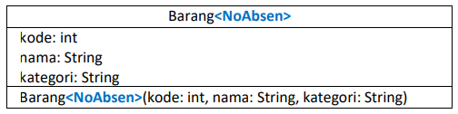
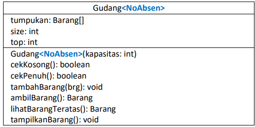
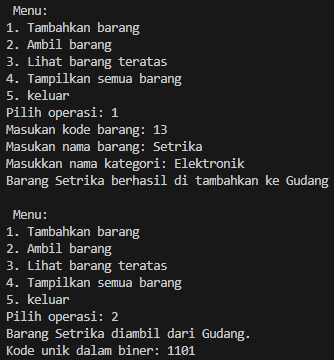
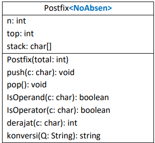
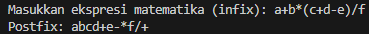

# Laporan Praktikum Pertemuan 6
#### Nama    : Muhammad Rafi Rajendra
#### Kelas   : TI-1H
#### NIM     : 2341720158

## JOBSHEET VII
## STACK
1. Tujuan Praktikum 

    Setelah melakukan materi praktikum ini, mahasiswa mampu:
    1. Membuat struktur data Stack
    2. Menerapkan algoritma Stack ke dalam program
2. Praktikum
## 2.1 Percobaan 1: Penyimpanan Tumpukan Barang dalam Gudang
Waktu Percobaan : 90 Menit
Sejumlah barang akan disimpan ke dalam gudang secara bertumpuk dengan menerapkan prinsip 
Stack. Perhatikan Class Diagram Barang berikut ini:



Selanjutnya, untuk menyimpan barang di dalam gudang, diperlukan class Gudang yang berperan 
sebagai Stack tempat penyimpanan data barang. Atribut dan method yang terdapat di dalam class 
Gudang merepresentasikan pengolahan data menggunakan struktur Stack. Perhatikan Class Diagram 
Gudang berikut ini:



Catatan: Tipe data pada variabel tumpukan menyesuaikan dengan data yang akan disimpan di 
dalam Stack. Pada percobaan ini, data yang akan disimpan merupakan array of object dari Barang, 
sehingga tipe data yang digunakan adalah Barang.

Berdasarkan dua class diagram tersebut, program menggunakan bahasa Java

### 2.1.1 Langkah-langkah Percobaan

        1. Class Barang
1. Buka text editor. Buat file baru, beri nama Barang<NoAbsen>.java
2. Lengkapi class Barang dengan atribut yang telah digambarkan di dalam class diagram Barang, 
yang terdiri dari atribut kode, nama, dan kategori
3. Tambahkan konstruktor berparameter pada class Barang sesuai dengan class diagram Barang

        2. Class Gudang
4. Setelah membuat class Barang, selanjutnya perlu dibuat class Gudang<NoAbsen>.java sebagai 
tempat untuk mengelola tumpukan barang. Class Gudang merupakan penerapan dari Stack
5. Lengkapi class Gudang dengan atribut yang telah digambarkan di dalam class diagram Gudang, 
yang terdiri dari atribut tumpukan, size, dan top

    ```java
    barang19[] tumpukan;
    int size, top;
    ```
6. Tambahkan konstruktor berparameter pada class Gudang untuk melakukan inisialisasi kapasitas 
maksimum data barang yang dapat disimpan di dalam stack, serta mengeset indeks awal dari 
pointer top

    ```java
    public gudang19(int kapasitas){
        size = kapasitas;
        tumpukan = new barang19[size];
        top = -1;
    }
    ```
7. Pada class Gudang, buat method cekKosong bertipe boolean untuk mengecek apakah tumpukan 
barang di dalam gudang masih kosong

    ```java
    public boolean cekKosong(){
        if (top == -1) {
            return true;
        } else {
            return false;
        }
    }
    ```
8. Selanjutnya, buat method cekPenuh bertipe boolean untuk mengecek apakah tumpukan barang 
di dalam gudang sudah terisi penuh sesuai kapasitas

    ```java
    boolean cekPenuh(){
        if (top == size -1) {
            return true;
        } else {
            return false;
        }
    }
    ```
9. Untuk dapat menambahkan barang ke dalam tumpukan di gudang, maka buat method 
tambahBarang yang merepresentasikan push. Method ini menerima parameter brg yang berupa 
object Barang

    ```java
    public void tambangBarang(barang19 barang){
        if (!cekPenuh()) {
            top++;
            tumpukan[top] = barang;
            System.out.println("Barang " + barang.nama + " berhasil di tambahkan ke Gudang");
        } else {
            System.out.println("Gagal! Tumpukan barang di Gudang sudah penuh");
        }
    }
    ```
10. Pengambilan barang dari tumpukan di gudang dilakukan dengan menggunakan method 
ambilBarang yang merepresentasikan pop. Method ini tidak menerima parameter apapun karena 
barang yang diambil atau dikeluarkan pasti berada di posisi teratas

    ```java
    public barang19 ambilBarang(){
        if (!cekKosong()) {
            barang19 delete = tumpukan[top];
            top--;
            System.out.println("Barang " + delete.nama + " diambil dari Gudang.");
            return delete;
        } else {
            System.out.println("Tumpukan barang kosong");
            return null;
        }
    }
    ```
    Catatan: Apabila diperlukan informasi mengenai data barang yang diambil, maka tipe kembalian 
    harus berupa object Barang. Sebaliknya, tipe kembalian void dapat digunakan jika data barang 
    yang dikeluarkan tidak akan diolah atau digunakan lagi

11. Buat method lihatBarangTeratas yang merepresentasikan peek untuk dapat mengecek 
tumpukan barang di posisi paling atas

    ```java
    public barang19 lihatBarangTeratas(){
        if (!cekKosong()) {
            barang19 barangTeratas = tumpukan[top];
            System.out.println("Barang teratas: " + barangTeratas.nama);
            return barangTeratas;
        } else {
            System.out.println("Tumpukan barang kosong.");
            return null;
        }
    }
    ```
12. Tambahkan method tampilkanBarang untuk dapat menampilkan semua rincian tumpukan 
barang di gudang

    ```java
    public void tampilkanBarang(){
        if (!cekKosong()) {
            System.out.println("Rincian tumpukan barang di Gudang.");
            //for (int i = top; i > 0; i--){}
            for (int i = top; i >= 0; i--) {
                System.out.printf("Kode %d: %s (Kategori %s)\n" , tumpukan[i].kode, tumpukan[i].nama, tumpukan[i].kategori);
            }
        } else {
            System.out.println("Tumpukan barang kosong.");
        }
    }
    ```
        3. Class Utama
13. Buat file baru, beri nama Utama<NoAbsen>.java
14. Tuliskan struktur dasar bahasa pemrograman Java yang terdiri dari fungsi main
15. Di dalam fungsi main, lakukan instansiasi object Gudang bernama gudang dengan nilai 
parameternya adalah 7.

    ```java
    gudang19 gudang = new gudang19(7);
    ```
16. Deklarasikan Scanner dengan nama variabel scanner
17. Tambahkan menu untuk memfasilitasi pengguna dalam memilih operasi Stack dalam mengelola 
data barang di gudang menggunakan struktur perulangan While

    ```java
    while (true) {
        System.out.println("\n Menu: ");
        System.out.println("1. Tambahkan barang");
        System.out.println("2. Ambil barang");
        System.out.println("3. Tampilkan semua barang");
        System.out.println("4. keluar");
        System.out.print("Pilih operasi: ");
        int pilihan = scanner.nextInt();
        scanner.nextLine();

        switch (pilihan) {
            case 1:
                System.out.print("Masukan kode barang: ");
                int kode = scanner.nextInt();
                scanner.nextLine();
                System.out.print("Masukan nama barang: ");
                String nama = scanner.nextLine();
                System.out.print("Masukkan nama kategori: ");
                String kategori = scanner.nextLine();
                barang19 barangBaru = new barang19(kode, nama, kategori);
                gudang.tambangBarang(barangBaru);
                break;

            case 2:
                gudang.ambilBarang();
                break;
            case 3:
                gudang.tampilkanBarang();
                break;
            case 4:
                break;
            default:
                System.out.println("Pilihan tidak valid. Silakan coba lagi.");
        }
    }
    ```
18. Commit dan push kode program ke Github
19. Compile dan run program.

### 2.1.2 Verifikasi Hasil Percobaan


### 2.1.3 Pertanyaan
1. Lakukan perbaikan pada kode program, sehingga keluaran yang dihasilkan sama dengan verifikasi hasil percobaan! Bagian mana saja yang perlu diperbaiki?

    jawab: bagian yang diperlu diperbaiki yaitu pada class barang19.java dan gudang19.java. Untuk class barang19.java menambahkan paramater this. Untuk class gudang19 perbaikan pada method tampilkan barang yaitu merubah pada perulangan yang awalnya 

    ```java
    for(int i = 0; i <= top; i++>)
    ```

    menjadi

    ```java
    for(int i = top; i >= 0; i--)
    ```

2. Berapa banyak data barang yang dapat ditampung di dalam tumpukan? Tunjukkan potongan kode programnya!

    jawab: jumlah maksimum data barang yang dapat disimpan dalam tumpukan ditentukan oleh parameter size yang dilewatkan saat membuat objek baru. Parameter size mengatur kapasitas dari array yang menyimpan barang-barang tersebut. Berikut adalah potongan kode dari konstruktor gudang19 di mana ukuran array tumpukan ditentukan:

    ```java
    public gudang19(int kapasitas){
    size = kapasitas;
    tumpukan = new barang19[size];
    top = -1;
    }
    ```
    Pada konstruktor ini, kapasitas adalah parameter yang menentukan berapa banyak item yang dapat ditampung oleh tumpukan (stack). Sebagai contoh, dalam kelas utama utama19, sebuah gudang19 baru dengan kapasitas 7 dibuat:

    ```java
    gudang19 gudang = new gudang19(7);
    ```
3. Mengapa perlu pengecekan kondisi !cekKosong() pada method tampilkanBarang? Kalau kondisi tersebut dihapus, apa dampaknya?

    jawab: pengecekan kondisi !cekKosong() pada method tampilkanBarang() diperlukan untuk memastikan bahwa tumpukan (tumpukan) tidak kosong sebelum mencoba menampilkan barang-barang di dalamnya. Jika kondidi !cekKosong() dihilangkan yang terjadi adalah akan muncul NullPointerException karena mencoba mengakses properti dari objek null.
4. Modifikasi kode program pada class Utama sehingga pengguna juga dapat memilih operasi lihat barang teratas, serta dapat secara bebas menentukan kapasitas gudang!

    jawab: 

    menambahkan opsi untuk melihat barang teratas

    ```java
       while (true) {
            System.out.println("\n Menu: ");
            System.out.println("1. Tambahkan barang");
            System.out.println("2. Ambil barang");
            System.out.println("3. Lihat barang teratas");
            System.out.println("4. Tampilkan semua barang");
            System.out.println("5. keluar");
            System.out.print("Pilih operasi: ");
            int pilihan = scanner.nextInt();
            scanner.nextLine();

            switch (pilihan) {
                case 1:
                    System.out.print("Masukan kode barang: ");
                    int kode = scanner.nextInt();
                    scanner.nextLine();
                    System.out.print("Masukan nama barang: ");
                    String nama = scanner.nextLine();
                    System.out.print("Masukkan nama kategori: ");
                    String kategori = scanner.nextLine();
                    barang19 barangBaru = new barang19(kode, nama, kategori);
                    gudang.tambangBarang(barangBaru);
                    break;

                case 2:
                    gudang.ambilBarang();
                    break;

                case 3:
                    gudang.lihatBarangTeratas();
                    break;
                case 4:
                    gudang.tampilkanBarang();
                    break;
                case 5:
                    break;
                default:
                    System.out.println("Pilihan tidak valid. Silakan coba lagi.");
            }
        }
    ```

    merubah code program agar pengguna dapat menentukan secara bebas kapasitas gudang

    ```java
    Scanner scanner = new Scanner(System.in);
        
    System.out.print("Masukkan kapasitas gudang: ");
    int kapasitas = scanner.nextInt();

    gudang19 gudang = new gudang19(kapasitas);
    ```
5. Commit dan push kode program ke Github

## 2.2 Percobaan 2: Konversi Kode Barang ke Biner
Waktu Percobaan: 30 Menit
Sampai tahap ini, proses pengelolaan data barang menggunakan konsep Stack telah berhasil 
dibuat pada Percobaan 1. Selanjutnya, pada Percobaan 2 ini ditambahkan method baru yang 
berfungsi untuk mengonversi kode barang bertipe int ke dalam bentuk biner saat barang tersebut 
diambil atau dikeluarkan dari tumpukan.

### 2.2.1 Langkah-langkah Percobaan
1. Buka kembali file Gudang<NoAbsen>.java
2. Tambahkan method konversiDesimalKeBiner dengan menerima parameter kode bertipe int

    ```java
    public String konversiDesimalkeBiner(int kode){
        StackKonversi19 stack = new StackKonversi19();
        while (kode > 0) {
            int sisa = kode % 2;
            stack.push(sisa);
            kode = kode / 2;
        }
        String biner = new String();
        while (!stack.isEmpty()) {
            biner += stack.pop();
        }
        return biner;
    }
    ```
    Pada method ini, terdapat penggunaan StackKonversi yang merupakan penerapan Stack, sama 
    halnya dengan class Gudang. Hal ini bertujuan agar Stack untuk barang berbeda dengan Stack 
    yang digunakan untuk biner. Oleh karena itu, buat file baru bernama 
    StackKonversi<NoAbsen>.java
    Catatan: Perlu diingat bahwa pada dasarnya semua class Stack mempunyai operasi (method)
    yang sama. Hal yang membedakan adalah aktivitas spesifik yang perlu dilakukan, misalnya 
    setelah menambah atau mengeluarkan data.
3. Tambahkan empat method yaitu isEmpty, isFull, push, dan pull sebagai operasi utama Stack pada 
class StackKonversi

    ```java
    public class StackKonversi19 {
        int size;
        int[] tumpukanBiner;
        int top;

        public StackKonversi19(){
            this.size = 32; //asumsi 32 bit
            this.tumpukanBiner = new int[size];
            this.top = -1;

        }

        public boolean isEmpty(){
            return top == -1;
        }

        public boolean isFull(){
            return top == size -1;
        }

        public void push(int data){
            if (!isFull()){
                System.out.println("Stack penuh");
            } else {
                top++;
                tumpukanBiner[top] = data;
            }
        }

        public int pop() {
            if (isEmpty()) {
                System.out.println("Stack kosong");
                return -1;
            } else {
                int data = tumpukanBiner[top];
                top--;
                return data;
            }
        }
    }
    ```
4. Agar kode barang dikonversi ke dalam bentuk biner saat barang tersebut diambil atau dikeluarkan 
dari tumpukan, maka tambahkan baris kode program pada method ambilBarang

    ```java
    public barang19 ambilBarang(){
        if (!cekKosong()) {
            barang19 delete = tumpukan[top];
            top--;
            System.out.println("Barang " + delete.nama + " diambil dari Gudang.");
            System.out.println("Kode unik dalam biner: " + konversiDesimalkeBiner(delete.kode));
            return delete;
        } else {
            System.out.println("Tumpukan barang kosong");
            return null;
        }
    }
    ```
5. Compile dan run program.
6. Commit dan push kode program ke Github

### 2.2.2 Verifikasi Hasil Percobaan


### 2.2.3 Pertanyaan
1. Pada method konversiDesimalKeBiner, ubah kondisi perulangan menjadi while (kode != 0), bagaimana hasilnya? Jelaskan alasannya!

    jawab: jika perulangan pada method konverseDesimalKeBiner dirubah menjadi while (kode != 0) hasilnya akan tetap sama karena sebelumnya kode > 0 yang diamana perulangan akan terus terjadi selama kode tidak bernilai 0 atau tidak sama dengan 0.
2. Jelaskan alur kerja dari method konversiDesimalKeBiner!

    jawab: selama bilangan kode (bilangan desimal yang ingin dikonversi) masih lebih besar dari nol (kode != 0),maka sisa pembagian kode dengan 2 (sisa = kode % 2). Sisa tersebut masuk ke dalam stack menggunakan method push dari objek stack. Pada setiap iterasi, nilai kode akan dibagi dengan 2 (kode = kode / 2), sehingga perulangan akan berlanjut hingga kode mencapai nilai nol. Setelah selesai melakukan perulangan pembagian, stack sekarang berisi sisa-sisa dari pembagian bilangan desimal dengan 2. Untuk mendapatkan representasi biner dari bilangan desimal, kita akan membaca nilai-nilai dari stack dan menyusunnya kembali menjadi string biner. Method pop dari stack untuk mengambil sisa-sisa secara berurutan dari stack. Setiap nilai yang di-pop akan ditambahkan ke string biner, sehingga kita akan mendapatkan representasi biner dari bilangan desimal.Setelah semua sisa telah diambil dan disusun kembali menjadi string biner, kita kembalikan string biner sebagai hasil konversi.

## 2.3 Percobaan 3: Konversi Notasi Infix ke Postfix
Waktu Percobaan: 90 Menit
Pada percobaan ini, dilakukan pembuatan kode program untuk melakukan konversi notasi infix 
menjadi notasi postfix. Perhatikan Class Diagram Postfix berikut ini:



### 2.3.1 Langkah-langkah Percobaan
1. Buat file baru bernama Postfix<NoAbsen>.java
2. Tambahkan atribut n, top, dan stack sesuai Class Diagram Postfix tersebut
3. Tambahkan pula konstruktor berparameter seperti gambar berikut ini.

    ```java
    public postfix19(int total){
        n = total;
        top = -1;
        stack = new char[n];
        push ('(');
    }
    ```
4. Buat method push dan pop bertipe void.
    ```java
    public void push(char c){
        top++;
        stack[top] = c;
    }

    public char pop(){
        char item = stack[top];
        top--;
        return item;
    }
    ```
5. Buat method IsOperand dengan tipe boolean yang digunakan untuk mengecek apakah elemen 
data berupa operand.
    ```java
    public boolean isOperand(char c){
        if ((c >= 'A' && c <= 'Z') || (c >= 'a' && c <= 'z') || (c >= '0' && c <= '9') || c == '.') {
            return true;
        } else {
            return false;
        }
    }
    ```
6. Buat method IsOperator dengan tipe boolean yang digunakan untuk mengecek apakah elemen 
data berupa operator.
    ```java
    public boolean isOperator(char c){
        if (c == '^' || c == '%' || c == '/' || c == '*' || c == '-' || c == '+') {
            return true;
        } else {
            return false;
        }
    }
    ```
7. Buat method derajat yang mempunyai nilai kembalian integer untuk menentukan derajat 
operator.
    ```java
    public int derajat(char c){
        switch (c) {
            case '^':
                return 3;
            case '%':
                return 2;
            case '/':
                return 2;
            case '*':
                return 2;
            case '-':
                return 1;
            case '+':
                return 1;
            default:
                return 0;
        }
    }
    ```
8. Buat method konversi untuk melakukan konversi notasi infix menjadi notasi postfix dengan cara 
mengecek satu persatu elemen data pada String Q sebagai parameter masukan.
    ```java
    public String konversi(String Q){
        String P = "";
        char c;
        for (int i = 0; i < n; i++) {
            c = Q.charAt(i);
            if (isOperand(c)) {
                P = P + c;
            }
            if (c == '(') {
                push(c);
            }
            if (c == ')') {
                while (stack[top] != '(') {
                    P = P + pop();
                }
                pop();
            }
            if (isOperator(c)) {
                while (derajat(stack[top]) >= derajat(c)) {
                    P = P + pop();
                }
                push(c);
            }
        }
        return P;
    }
    ```
9. Selanjutnya, buat class baru dengan nama PostfixMain<NoAbsen>.java. Buat method main, 
kemudian buat variabel P dan Q. Variabel P digunakan untuk menyimpan hasil akhir notasi postfix 
setelah dikonversi, sedangkan variabel Q digunakan untuk menyimpan masukan dari pengguna 
berupa ekspresi matematika dengan notasi infix. Deklarasikan variabel Scanner dengan nama sc, 
kemudian panggil fungsi built-in trim yang digunakan untuk menghapus adanya spasi di depan 
atau di belakang teks dari teks persamaan yang dimasukkan oleh pengguna.
    ```java
    public class postfixMain19 {
        public static void main(String[] args) {
            Scanner sc = new Scanner(System.in);
            String P, Q;

            System.out.print("Masukkan ekspresi matematika (infix): ");
            Q = sc.nextLine();
            Q = Q.trim();
            Q = Q + ")";
        }
    }
    ```
    Penambahan string “)” digunakan untuk memastikan semua simbol/karakter yang masih berada di stack setelah semua persamaan terbaca, akan dikeluarkan dan dipindahkan ke postfix
10. Buat variabel total untuk menghitung banyaknya karakter pada variabel Q.
    ```java
    int total = Q.length();
    ```
11. Lakukan instansiasi objek dengan nama post dan nilai parameternya adalah total. Kemudian 
panggil method konversi untuk melakukan konversi notasi infix Q menjadi notasi postfix P.
    ```java
        postfix19 post = new postfix19(total);
        P = post.konversi(Q);
        System.out.println("Postfix: " + P);
    ```
12. Compile dan run program.
13. Commit dan push kode program ke Github

### 2.3.2 Verifikasi Hasil Percobaan



### 2.3.3 Pertanyaan
1. Pada method derajat, mengapa return value beberapa case bernilai sama? Apabila return value diubah dengan nilai berbeda-beda setiap case-nya, apa yang terjadi?

    jawab: operator seperti %, /, dan * adalah sama karena dalam hierarki operator matematika, ketiga operator tersebut memiliki tingkat prioritas yang sama dalam evaluasi ekspresi. Mereka semua adalah operator aritmatika yang melakukan operasi pada dua operand dan secara umum dianggap memiliki prioritas yang lebih tinggi dari operator penambahan (+) dan pengurangan (-), tetapi lebih rendah dari operator eksponensial (^). Jika mengubah nilai yang dikembalikan sehingga setiap operator memiliki nilai yang berbeda, maka hierarki prioritas operasi akan berubah. Ini bisa menyebabkan ekspresi matematika dievaluasi dengan cara yang berbeda dari yang diharapkan secara matematis.
2. Jelaskan alur kerja method konversi!

    jawab: 
    - Inisialisasi: 
        - String P: Diinisialisasi sebagai string kosong. Ini akan digunakan untuk menyimpan ekspresi postfix akhir.
        - Variabel c: Digunakan untuk menyimpan karakter saat ini yang sedang diproses dalam loop.
    - Loop
        - Cek Operand: Jika c adalah operand (huruf atau angka), tambahkan langsung ke P.
        - Cek Buka Kurung (: Jika c adalah tanda buka kurung, push c ke dalam stack.
        - Cek Tutup Kurung ): Jika c adalah tanda tutup kurung, pop semua operator dari stack sampai tanda buka kurung ditemukan, tambahkan operator tersebut ke P.
        - Cek Operator: Jika c adalah operator (seperti +, -, *, /, %, ^)
3. Pada method konversi, apa fungsi dari potongan kode berikut?
    ```java
    c  = Q.charArt(i);
    ```
    jawab: potongan kode c = Q.charAt(i); berfungsi untuk mendapatkan karakter pada posisi i dari string Q. Di sini, Q adalah string yang berisi ekspresi matematika dalam format infix yang dimasukkan oleh pengguna.

